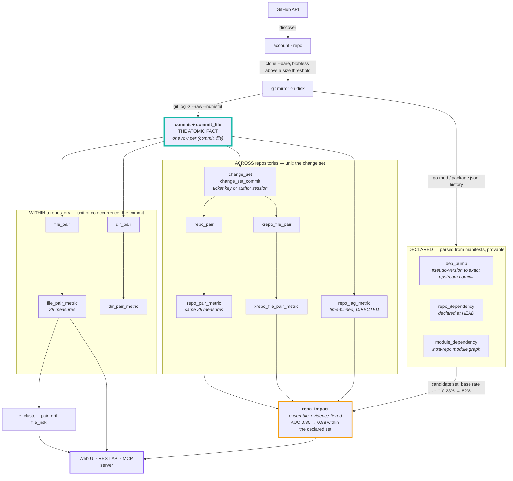
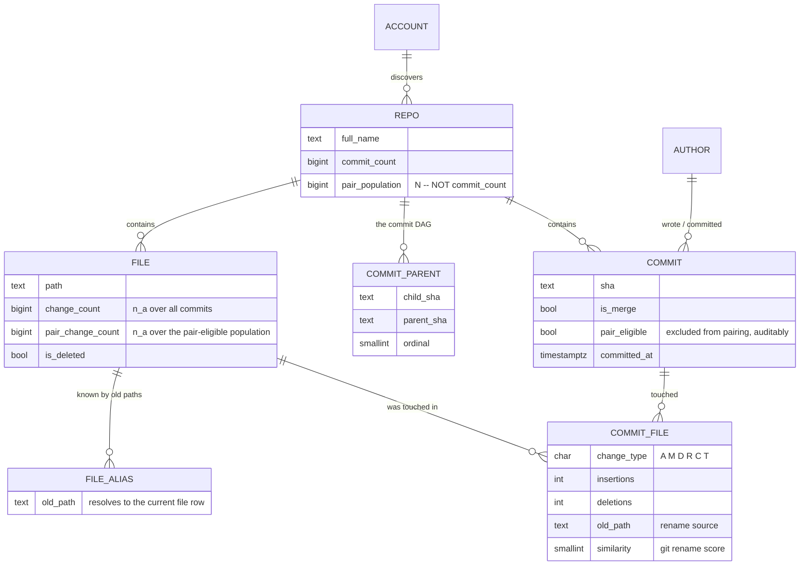
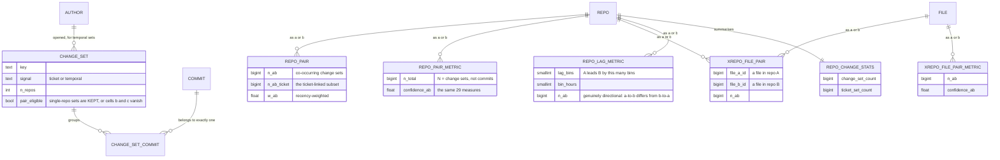
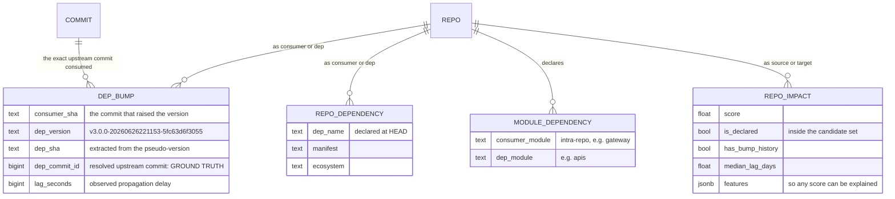
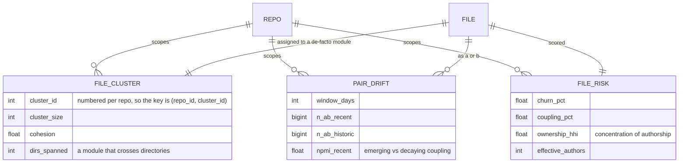
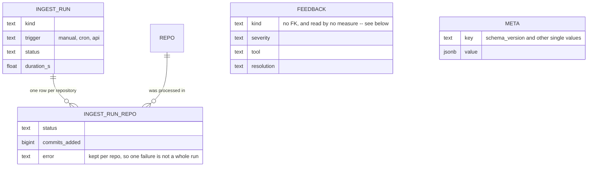

# Git Synapse — design

How the system is put together and why. The [README](README.md) covers what it
does and how to run it; this is the reasoning underneath, including every
database table and the decisions that materially change the numbers.

---

## Contents

| | |
|---|---|
| [How it works](#how-it-works) | the pipeline, end to end |
| [Store the atom, derive the rest](#store-the-atom-derive-the-rest) | the schema's one rule, and every core table |
| [Cross-repository coupling](#cross-repository-coupling-the-change-set) | why a commit is the wrong unit, and what replaces it |
| [Direction: the lagged table](#direction-the-lagged-table) | making coupling directional |
| [Ground truth](#ground-truth-and-what-it-revealed) | the one thing here that is proven, not inferred |
| [The mining layer](#the-mining-layer) | de-facto modules, drift, risk |
| [Choices that affect the numbers](#choices-that-materially-affect-the-numbers) | where a default changes the answer |
| [What is incremental](#what-is-incremental-and-what-isnt) | what a refresh actually redoes |
| [Bookkeeping](#bookkeeping) · [Portability](#portability) · [Layout](#layout) | operations and structure |
| [Adding a measure](#adding-a-measure) | extending the registry |

---

## How it works



Two repositories never share a commit, so cross-repo coupling cannot reuse the
commit as its unit. It uses a **change set** instead — commits grouped by ticket
key or by one author's work session — and the *same* 29 measures then apply
untouched. Those are separate tables, not the same ones widened:

| | Within a repository | Across repositories |
|---|---|---|
| Unit of co-occurrence | one commit | one change set |
| Repo level | — | `repo_pair` → `repo_pair_metric` |
| File level | `file_pair` → `file_pair_metric` | `xrepo_file_pair` → `xrepo_file_pair_metric` |
| Directory level | `dir_pair` → `dir_pair_metric` | — |
| Direction | `P(B\|A)` vs `P(A\|B)` | `repo_lag_metric`, genuinely time-lagged |

**The dependency graph is a third, independent stream.** `dep_bump`,
`repo_dependency` and `module_dependency` are *parsed from manifests*, not
inferred from co-change — a Go pseudo-version names the exact upstream commit it
was cut from, which makes those rows ground truth rather than correlation. They
are not used to replace the statistics but to **restrict the candidate set**:
ranking within declared pairs lifts the base rate from 0.23% to 82%, and the
ensemble from AUC 0.80 to 0.88.


### Store the atom, derive the rest

The design constraint driving the schema is that **no aggregate is
authoritative**. The only thing that cannot be recomputed is `commit_file`: one
row per (commit, file), with change type, line counts, rename source and
similarity.

Everything else — marginals, joint counts, all 29 measures, directory rollups,
change sets, lagged tables, impact scores, clusters, drift, risk — is a
materialised cache. Consequences:



Everything below is derived from those and can be dropped and rebuilt:


- Adding a 30th measure is one function plus one registry entry, then
  `git-synapse score`. No re-clone, no re-parse.
- Changing the fan-out cap, support threshold, session gap, ticket pattern or
  lag bin width is a re-aggregate, not a re-ingest.
- The contingency cells `(n_ab, n_a, n_b, N)` sit beside every score, so any
  number in the UI traces back to four counts and then to actual commits.


### Cross-repository coupling: the change set

The tables are separate from the within-repo ones, not the same ones widened.
**Behavioural** — inferred from what moved together:



**Declared** — parsed from manifests, and where the two streams meet:



`DEP_BUMP.dep_commit_id` is the one edge in this schema that is **proven rather
than inferred**: a Go pseudo-version embeds the upstream commit it was cut from,
so the row states "this commit consumed that commit" as a fact, with a measured
lag. Everything else here is a correlation.

Two repositories never share a commit, so "changed together" needs a wider unit.
Every pair-eligible commit lands in exactly one **change set**, which makes them a
partition and `N` unambiguous:

1. **ticket** — the subject carries an issue key (`ACME-2330`). All commits sharing
   it form one change set. Precise: 1,709 keys span more than one repository here.
   But coverage is uneven — `telemetry` is 37% keyed, `signer` is 0%.
2. **temporal** — otherwise, consecutive commits by one author with no gap longer
   than `SESSION_GAP_HOURS`. This reaches repos with no commit-message
   convention, at the cost of noise from unrelated same-afternoon work.

`repo_pair.n_ab_ticket` records how much of each pair's evidence came from
explicit ticket links rather than timing, so the UI can show "12 of 47
ticket-backed" and a reader can discount the rest.

**Single-repo change sets are kept deliberately.** It is tempting to store only
multi-repo ones, but the contingency table needs the cells where A changed
*without* B. Dropping them would make every change set multi-repo, drive those
cells to zero, and inflate every score toward 1.0.


### Direction: the lagged table

The symmetric tables cannot express propagation, which is the pattern that
matters for a dependency chain:

```
signer  merged 2026-06-26 22:11
packager  bumped 2026-06-26 22:45   (+34 min)
runtime  bumped 2026-06-27 00:36   (+2h25m)
```

So time is binned, each repository becomes a binary vector over bins, and for an
ordered pair (A, B) at lag *k* the 2×2 table is formed between A's vector and B's
vector **shifted by k**. All 29 measures then apply unchanged but become
directional — `A→B` scoring far above `B→A` is exactly the statement "A's changes
precede B's".

The whole computation is one matrix product per lag: with a binary matrix `M`
of shape (repos, bins), the joint counts for every ordered pair are
`M @ shift(M, k).T`. 266 repositories over 21,326 six-hour bins across eight lags
takes ~12 seconds.


### Ground truth, and what it revealed

A Go pseudo-version embeds the upstream commit it was cut from:

```
github.com/acme/signing/v3 v3.0.0-20260626221153-5fc63d6f3055
                                                  ^^^^^^^^^^^^
```

So a `go.mod` diff is a **dated, directional, provable** propagation edge.
Recovering 6,388 of them gave a labelled set to validate against — and the answer
was not flattering to pure statistics:

| Approach | AUC | Directional accuracy |
|---|---|---|
| Best single measure over all ordered pairs | 0.80 | **0.63** |
| Declared dependencies alone | — precise, but 4 of telemetry's 11 never co-change | — |
| **Ensemble ranked within the declared set, in sample** | **0.884** | — |
| **The same, held out in time** (features pre-2025, labels after) | **0.685** | — |

There is no cross-validation figure here on purpose. The ensemble is an
unweighted mean of fixed measures with no fitted parameters, so folds train
nothing and the spread across them is subsample noise, not generalisation error.
The honest generalisation number is the held-out-in-time row above.

Two caveats on the in-sample figure, both measured. Every declared candidate has
at least one bump, so the label is "bumped once or more than once" -- a
bump-frequency question, not purely a coupling one. And a coupling-free baseline,
the consumer repository's raw commit count, reaches 0.803 on the same task
against the ensemble's 0.859, so activity confounding is present inside the
declared set too, not only outside it. 

**A high AUC is not the same as a useful answer.** The measure that tops the
global table is Russell-Rao — `a / N`, pure joint frequency — which scores 0.80 by
ranking *both repositories are busy* while managing only 0.63 on which way the
arrow points. That is **activity confounding**, and it is why the discovery tier
deliberately excludes every frequency-weighted measure.

Restricting candidates to declared dependencies lifts the base rate from 0.23% to
82% — a ~350× prior — before any measure is evaluated.

This is why every cross-repo row carries an **evidence tier**, and why the UI
never mixes them in one sorted column:

| Tier | Meaning | Trust |
|---|---|---|
| `declared` | the consumer declares it in a manifest | validated, AUC 0.86 in sample |
| `bump-backed` | an actual version bump was observed | ground truth |
| `discovery` | statistical only | unvalidated — verify before acting |

Discovery uses a deliberately different measure set (NPMI, phi, Ochiai — all
normalised by both marginals) because the frequency-weighted measures are exactly
what let a busy repository look coupled to everything.


### The mining layer



- **De-facto modules** — label propagation over the file-coupling graph. The
  valuable output is its *disagreement* with the directory tree: 1,389 clusters
  here span more than one top-level folder.
- **Coupling drift** — the same association recomputed on a recent window and the
  preceding history. A pair coupled three years ago but not since is a finished
  refactor, and reporting it as current coupling is an easy way to mislead an
  agent.
- **Ownership risk** — Herfindahl concentration over each author's share of a
  file's commits, giving an *effective* contributor count. Three authors at
  98/1/1 has a bus factor near 1, not 3.


### Choices that materially affect the numbers

- **Population.** `N` is `repo.pair_population` — commits *eligible to contribute
  a pair* — not the total commit count. Marginals use the same population, so
  `n_ab > n_a` is impossible by construction.
- **Fan-out cap** (`MAX_FILES_PER_COMMIT`, default 60). A commit touching k files
  produces k(k−1)/2 pairs. Bulk reformats would dominate every count while
  carrying no design signal, so they are stored in full but flagged
  `pair_eligible = FALSE` — excluded, auditable, reversible.
- **Change-set width cap** (`MAX_REPOS_PER_CHANGESET`, default 8). An org-wide
  dependabot sweep touching 61 repositories is not a design signal.
- **Lag bin width** (`LAG_BIN_HOURS`, default 6). At 24 hours, directional
  accuracy drops from 0.70 to 0.64 and a 34-minute propagation is invisible.
- **Merges** are skipped: they restate their parents' changes.
- **Renames** keep a file's identity — history is walked oldest-first, so a moved
  file keeps one id and one continuous history.
- **Infeasible tables are clamped.** A 2×2 table only exists when
  `max(0, n_a + n_b − N) ≤ n_ab ≤ min(n_a, n_b)`. Without clamping, a bad
  aggregation yields things like φ = −7.9.
- **Corrupt commit dates cannot set the time origin.** Four epoch-dated commits
  once stretched the lag axis from 2,200 bins to 20,687, inflating `N` tenfold.

---


## What is incremental, and what isn't

The nightly job updates everything automatically. It is not uniformly
*incremental*, and the distinction matters if you are reasoning about cost.

| Stage | Incremental? | How it is gated |
|---|---|---|
| git fetch | **yes** | fetch into an existing mirror, never re-clone |
| commit parsing | **yes** | every branch tip stored in `repo.last_ingested_refs`; only new commits are read |
| aggregate + score | **yes** | per repo, `last_aggregate_at < last_ingest_at` |
| manifest bumps | **yes** | per repo, `last_depbump_sha <> head_sha` |
| declared dependencies | **yes** | same sha watermark; per-repo delete-and-reinsert, so a *removed* dependency still disappears |
| change sets | **yes** | only the tickets and authors touched by new commits are re-partitioned |
| lagged coupling | **skipped when unchanged** | input fingerprint over pair-eligible commits |
| impact prediction | **skipped when unchanged** | fingerprint over its three input tables |
| mining | **yes** | per repo, `last_mining_at < last_aggregate_at` |

Two stages are deliberately *recomputed whole* rather than delta-merged when
their inputs do move:

- **Lagged coupling** — the computation *is* one matrix product per lag. A delta
  would still multiply the changed repository's row against every other
  repository across every bin, so there is nothing cheaper to do. 12 s.
- **Cross-repo marginals and scores** — adding any change set shifts the
  population `N`, and `N` appears in every pair's contingency table. Recomputing
  is ~4 s and provably consistent; delta-merging would let stored values drift
  from the true ones.

Verified by fingerprinting: an incremental pass over unchanged data reproduces
the change-set table byte-for-byte, and re-scoring a repository is bit-identical.

Two watermark bugs found while validating this, both of which silently defeated
the gating:

- `last_ingest_at` advances on every run whether or not commits land, so a
  timestamp comparison re-scanned all 187 manifest-bearing repos nightly. Now
  keyed on `head_sha`.
- 73 commits have neither an author nor a ticket key, so they can never join a
  change set — but they were counted as pending work, which made the change-set
  early return unreachable.

Force a complete rebuild after changing a tuning knob:

```bash
docker compose run --rm cli ingest --force-full     # everything
docker compose run --rm cli crossrepo --force       # after SESSION_GAP_HOURS / TICKET_PATTERN
docker compose run --rm cli mine --force            # after a mining threshold
```


## Bookkeeping

Four tables the analysis never reads, kept so a run is auditable:



**`feedback` is deliberately unreferenced.** Letting sessions write into the
coupling data would close a confirmation loop — Git Synapse suggests a pair, the
agent edits both files, the commit strengthens the pair — and the statistic would
drift from measuring the codebase to measuring its own past advice.


## Portability

The stack is four containers and two volumes. To move it to another machine — Linux, or
anywhere with a container runtime:

```bash
git clone <this repo> && cd git-synapse
cp .env.example .env && $EDITOR .env     # add GITHUB_TOKEN
docker compose up -d
docker compose run --rm cli ingest --all
```

Nothing is host-specific. To carry the data across instead of re-ingesting:

```bash
docker compose exec -T postgres pg_dump -U git_synapse git_synapse | gzip > git-synapse.sql.gz   # export
gunzip -c git-synapse.sql.gz | docker compose exec -T postgres psql -U git_synapse git_synapse   # import
```

The mirrors do not need to move — a fresh `ingest` re-clones them, and the watermarks in
the database make it incremental.

---


## Adding a measure

1. Add a vectorised function to `src/git_synapse/stats/measures.py`.
2. Add a `MeasureSpec` to `src/git_synapse/stats/registry.py`.
3. Add the column to `file_pair_metric` and `dir_pair_metric` in `schema.sql`.
4. `docker compose run --rm cli score`.

The API, MCP server, CLI and UI all enumerate from the registry, so nothing else changes.

---


## Layout

```
src/git_synapse/
  stats/       contingency tables + the 29 measures + registry   (pure, no I/O)
  db/          schema.sql, connection pool, COPY helpers
  ingest/      github discovery, git mirroring, log parser, loader, pipeline
  analysis/    aggregation, scoring, read queries
               crossrepo.py  change sets, repo pairs, cross-repo file pairs
               lagged.py     directed time-lagged coupling (matrix products)
               depbump.py    manifest-bump ground truth + declared deps
               predict.py    the evidence-tiered impact ensemble
               mining.py     de-facto modules, drift, ownership risk
               validate.py   AUC / precision / directional accuracy
  api/         FastAPI app and routes
  mcp/         MCP server
  scheduler/   daily refresh
  cli.py       Typer CLI
web/           index.html + app.js + graph.js + style.css   (no build step)
skills/
  git-synapse-mcp/    SKILL.md   -- standalone: how an agent should use the MCP server
docker/        Dockerfile (one image, four services)
tests/
```
