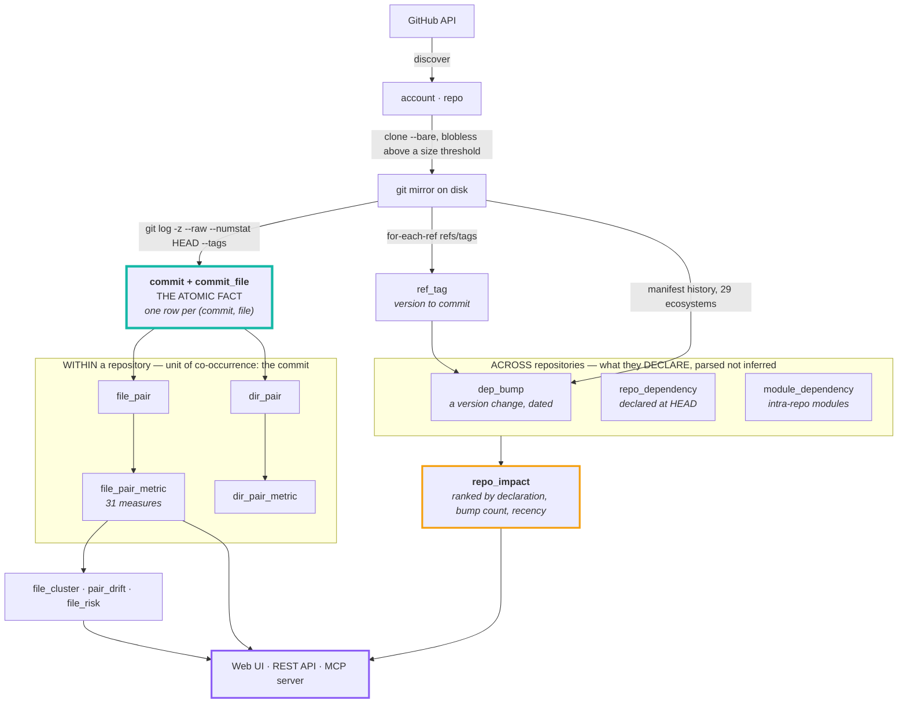
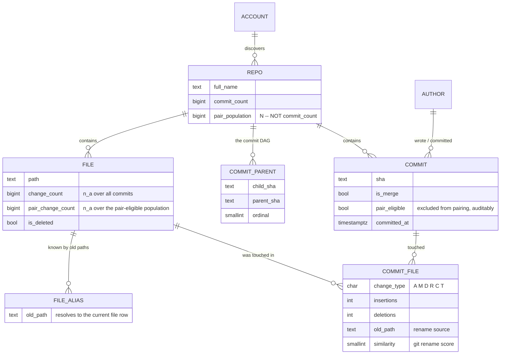
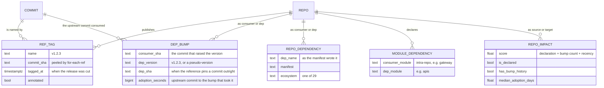
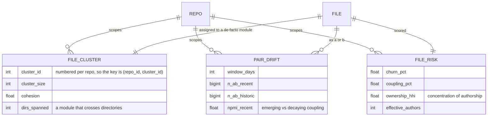
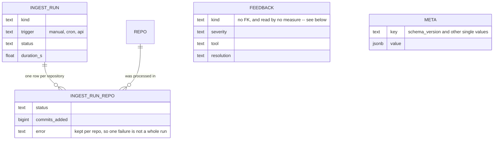

# Git Synapse — design

How the system is put together and why. The [README](README.md) covers what it
does and how to run it; this is the reasoning underneath, including every
database table and the decisions that materially change the numbers.

---

## Contents

| | |
|---|---|
| [Every table at a glance](#every-table-at-a-glance) | all 33, one line each |
| [How it works](#how-it-works) | the pipeline, end to end |
| [Store the atom, derive the rest](#store-the-atom-derive-the-rest) | the schema's one rule, and every core table |
| [Cross-repository coupling](#cross-repository-coupling-what-repositories-declare) | why co-change cannot span repositories, and what does |
| [Ground truth](#ground-truth-and-what-it-revealed) | the one thing here that is proven, not inferred |
| [The mining layer](#the-mining-layer) | de-facto modules, drift, risk |
| [Choices that affect the numbers](#choices-that-materially-affect-the-numbers) | where a default changes the answer |
| [**From a declared version to a commit**](#from-a-declared-version-to-a-commit) | the four tiers, and what each is allowed to claim |
| [**What the backtest is measured against**](#what-the-backtest-is-measured-against) | the baselines, and why a weak one is worse than none |
| [What is incremental](#what-is-incremental-and-what-isnt) | what a refresh actually redoes |
| [Where repositories come from](#where-repositories-come-from) | one field, any git host, and why a repository URL costs one request |
| [**How the UI is addressed**](#how-the-ui-is-addressed) | places nest in the path, analyses scope with a query |
| [**Who may read this**](#who-may-read-this) | sign-in, roles, tokens, and the switch that turns it off |
| [**What callers asked for**](#what-callers-asked-for) | the call log, and what it deliberately does not do |
| [Bookkeeping](#bookkeeping) · [Portability](#portability) · [Layout](#layout) | operations and structure |
| [Adding a measure](#adding-a-measure) | extending the registry |

---

## Every table at a glance

Thirty-three tables. The first group is the only one that cannot be recomputed;
everything derived from it is a materialised cache, and the last two groups hold
operational state that belongs to the deployment rather than to the corpus.

**Identity and the atom** — the source of truth

| Table | What it holds |
|---|---|
| `account` | A **source**: an owner on a host, tracked whole or by an explicit list of repositories. Carries the provider and host, the optional per-source access token (encrypted), and the filters that apply only when nothing was named. Discovery reads this, so onboarding is a write rather than a redeploy. |
| `repo` | One row per repository: everything the host reported, ingest state, and the watermarks each stage resumes from. Identity is `(host, full_name)` — `owner/name` is unique on one host and nowhere wider. |
| `author` | Author identity, deduplicated by lowercased email. |
| `file` | One row per canonical path per repo, carrying both marginal counts. A rename folds into the existing row rather than creating a new one. |
| `file_alias` | Historical paths that resolve to a current `file` row, so a file renamed three times keeps one identity and one history. |
| `commit` | One row per commit per repo, from the shipping branch *and* every release tag, carrying `pair_eligible` — whether it was allowed to produce pairs — and `is_replay`, whether its change already exists on the branch. |
| `commit_parent` | The commit DAG. Not needed by the coupling maths; kept for branch and lead-time analysis. |
| **`commit_file`** | **The atomic fact: one row per (commit, file).** Every other number in the system derives from this table joined to `commit`. |

**Derived within one repository** — unit of co-occurrence: the commit

| Table | What it holds |
|---|---|
| `file_pair` | The joint co-change count for a file pair. Only `n_ab`; the marginals and `N` live on `file` and `repo`. |
| `file_pair_metric` | The 31 measures materialised, so the UI can sort millions of pairs by any of them without recomputing. |
| `directory` | Directory-level rollup. A directory "changed" in a commit if any file beneath it changed. |
| `file_directory` | Which directories contain a file, one row per ancestor, so the rollup is a join rather than string work. |
| `dir_pair` | Joint co-change counts between directories. |
| `dir_pair_metric` | The same 31 measures, one level up the tree. |
| `author_file` | Who has touched what, which answers "who should review this?" alongside "what else must change?" |

**Across repositories** — what they declare about each other

| Table | What it holds |
|---|---|
| `ref_tag` | Every release tag, peeled to its commit, carrying a canonical `version_key` and the shipping-branch commit it was cut from. Without the latter a release tagged on a release branch resolves to nothing, which was 116 of guava's 123 tags. |
| `dep_bump` | One version change recorded in a manifest, resolved where possible to the upstream commit it consumed, with the tier that resolution came from. Ground truth rather than correlation. |
| `repo_package` | What each repository publishes, read from its own manifests, scoped by ecosystem. Answers "which repository *is* `com.google.guava:guava`?" from a declaration rather than from whether the strings agree. |
| `repo_dependency` | What each repository declares at HEAD. **This is the answer to "which repositories depend on each other".** |
| `module_dependency` | The intra-repository module graph, for monorepos whose real structure lives in submodules rather than cross-repo edges. |
| `repo_impact` | The ranked answer to "I am changing X, what else?", carrying the evidence behind each score so any number can be explained. |

**Mining layer** — patterns over the pairs

| Table | What it holds |
|---|---|
| `file_cluster` | De-facto modules found by label propagation over the coupling graph. The value is where they *disagree* with the directory tree. |
| `pair_drift` | Whether a coupling is strengthening or decaying, by scoring the same pair on a recent and a historical window. |
| `file_risk` | Per-file risk, each component a percentile within its repository so the composite compares across repos of very different sizes. |

**Bookkeeping** — read by nothing analytical

| Table | What it holds |
|---|---|
| `ingest_run` | Job history: what ran, when, and whether it worked. |
| `ingest_run_repo` | Per-repo detail for a run, so a failure is traceable to the repository that caused it. |
| `feedback` | Defects in Git Synapse reported by the sessions using it. The only table an agent may write to, and deliberately read by no measure. |
| `meta` | Key/value for the schema version, the settings a running deployment may change, and the first-run setup token until it is used. |

**Access and audit** — who may read this, and what they asked for

| Table | What it holds |
|---|---|
| `app_user` | One row per person: email, name, role, and the scrypt hash with its own cost parameters, so the cost can be raised without invalidating anyone's password. |
| `user_session` | Live browser sessions, as the SHA-256 of the cookie. A dump yields no working credential, only the fact that a session existed. |
| `api_token` | Tokens for agents and scripts, likewise hashed. The visible prefix is kept so a person can tell their own tokens apart without the list being a set of live keys. |
| `login_attempt` | Failed sign-ins inside the lockout window, counted per address. Also carries setup-token guesses, against a sentinel no real address can match. |
| `call_log` | Every call served on both surfaces — arguments, reply, duration, rows, client. The one table that grows with *traffic* rather than with history, so it is pruned by age and by count at the end of every ingest. |

---

## How it works



Two repositories never share a commit, so cross-repo coupling cannot reuse the
commit as its unit. Grouping commits into **change sets** — by ticket key, or by
one author's work session — was the answer for a while, and it was measured and
removed: the best measure scored AUC 0.80 while managing 0.63 on which way the
arrow points, and a baseline ignoring coupling entirely matched it. Nothing is
inferred across repositories now. The unit is a declared version bump, and these
are separate tables rather than the same ones widened:

| | Within a repository | Across repositories |
|---|---|---|
| Evidence | co-change, inferred | a manifest line, declared |
| Unit | one commit | one version bump |
| File level | `file_pair` → `file_pair_metric` | — *(needs absorbed sets)* |
| Directory level | `dir_pair` → `dir_pair_metric` | — |
| Repo level | — | `repo_dependency` → `repo_impact` |
| Direction | `P(B\|A)` vs `P(A\|B)` | inherent: a consumer names its dependency |

**The dependency graph is a third, independent stream.** `dep_bump`,
`repo_dependency` and `module_dependency` are *parsed from manifests*, not
inferred from co-change — a Go pseudo-version names the exact upstream commit it
was cut from, which makes those rows ground truth rather than correlation. They
**replaced** the statistics for cross-repository work rather than merely
constraining them: restricting to declared pairs raises the base rate of a real
relationship from 0.23% to 82%, and the statistics added little once inside that
set — see [Ground truth](#ground-truth-and-what-it-revealed).


### Store the atom, derive the rest

The design constraint driving the schema is that **no aggregate is
authoritative**. The only thing that cannot be recomputed is `commit_file`: one
row per (commit, file), with change type, line counts, rename source and
similarity.

Everything else — marginals, joint counts, all 31 measures, directory rollups,
directory rollups, the dependency graph, impact scores, clusters, drift, risk — is a
materialised cache. Consequences:



Everything below is derived from those and can be dropped and rebuilt:


- Adding a 30th measure is one function plus one registry entry, then
  `git-synapse score`. No re-clone, no re-parse.
- Changing the fan-out cap, support threshold, session gap, ticket pattern or
  lag bin width is a re-aggregate, not a re-ingest.
- The contingency cells `(n_ab, n_a, n_b, N)` sit beside every score, so any
  number in the UI traces back to four counts and then to actual commits.


### Cross-repository coupling: what repositories declare

Two repositories never share a commit, so co-change cannot express a
relationship between them. The obvious repair is to widen the unit: group
commits into **change sets** by ticket key or by one author's work session,
apply the same 31 measures over that wider unit, and add a directed table built
by binning time and shifting one repository's activity against another's.

**Measured, that construction is unsound, so nothing here uses it.** Two public
repositories in the test corpus — sharing no code whatsoever — score `G² = 570`
against each other, and the profile is flat across every lag from one day to two
weeks:

```
scikit-learn -> django    lag 4   G² 393      lift over chance 1.19
                          lag 28  G² 570      lift over chance 1.23
                          lag 56  G² 492      lift over chance 1.22
```

Real propagation has a characteristic delay, so a genuine signal peaks at some
lag. A plateau is the signature of something else, and the marginals say what:
django occupies 41% of all time bins and scikit-learn 33%. Two variables that
are each "on" a third of the time co-occur constantly. Such a table detects a
**shared release era**, not propagation. Direction is unstable for the same
reason — `A → B` outscores `B → A` on one pair and the reverse on another,
tracking relative commit volume rather than causation.

So nothing here infers a cross-repository relationship from calendar time, and
there are no change sets.

#### What it uses instead

A manifest naming a dependency is **dated** (it lives in a commit),
**directional** (the consumer names the dependency, never the reverse) and
**provable** (it is a literal string, not an inference). It cannot produce an
edge between codebases that share no code, which is exactly the failure above.



Every ecosystem records the same thing in its own syntax, so references are read
from 29 of them — with real parsers (`tomllib`, `xml.etree`, PyYAML) wherever
the format has one, because a manifest that parses *almost* correctly is worse
than one that fails loudly.

Each reference is kept at its true strength, because that is exactly the
confidence of the edge it produces:

| Strength | Example | Resolves to |
|---|---|---|
| `commit` | a Go pseudo-version, a submodule, any lockfile `rev` | a commit outright — proven |
| `tag` | `v1.2.3` | a commit, via `ref_tag` |
| `range` | `^1.2.0`, `>=3,<4` | nothing; the edge exists, but pins no commit |

**What this cannot do.** It answers at repository level. "Which file in repo A
goes with which file in repo B" needs the set of upstream commits a version bump
absorbed — computable from `ref_tag` with `git rev-list --cherry-pick`, but not
built. The change-set model did answer it, unreliably; nothing provable answers
it today.

### Ground truth, and what it revealed

A Go pseudo-version embeds the upstream commit it was cut from:

```
github.com/acme/signing/v3 v3.0.0-20260626221153-5fc63d6f3055
                                                  ^^^^^^^^^^^^
```

So a `go.mod` diff is a **dated, directional, provable** propagation edge.
Recovering 6,388 of them gives a labelled set to test the statistical approach
against — and the answer is why coupling statistics do not decide this edge.

| Approach | AUC | Directional accuracy |
|---|---|---|
| Best single measure over all ordered pairs | 0.80 | **0.63** |
| A coupling-free baseline: the consumer's raw commit count | **0.80** | — |

**The measure that topped the table was Russell-Rao** — `a / N`, pure joint
frequency. It scored 0.80 by ranking *both repositories are busy*, while managing
0.63 on which way the arrow points: barely better than a coin toss on the only
part that matters. And a baseline that ignores coupling entirely, just counting
the consumer's commits, matched it at 0.80.

That is **activity confounding**, and it is the same defect that later showed up
starkly in the time-binned table: two unrelated public repositories scoring
`G² = 570` because both were busy in the same years.

Restricting candidates to declared dependencies lifts the base rate from 0.23% to
82% — a ~350× prior — before any measure is evaluated. Once a prior that strong
is available and provable, ranking correlations inside it earns little and risks
presenting a coincidence as a finding. So the graph is now declared-only, and
every row carries the evidence behind it:

| Tier | Meaning | Trust |
|---|---|---|
| `bump-backed` | an actual version bump was observed, with its date | ground truth |
| `declared` | the consumer names it in a manifest at HEAD | provable, but the edge may be inert |

There is no `discovery` tier any more. An edge either has a manifest line behind
it or it does not exist.

### The mining layer



- **De-facto modules** — label propagation over the file-coupling graph. The
  valuable output is its *disagreement* with the directory tree: 1,389 clusters
  here span more than one top-level folder.
- **Coupling drift** — the same association recomputed on a recent window and the
  preceding history. A pair coupled three years ago but not since is a finished
  refactor, and reporting it as current coupling is an easy way to mislead an
  agent.
- **Ownership risk** — Herfindahl concentration over each author's share of a
  file's commits, giving an *effective* contributor count. Three authors at
  98/1/1 has a bus factor near 1, not 3.


### Choices that materially affect the numbers

- **Population.** `N` is `repo.pair_population` — commits *eligible to contribute
  a pair* — not the total commit count. Marginals use the same population, so
  `n_ab > n_a` is impossible by construction.
- **Fan-out cap** (`MAX_FILES_PER_COMMIT`, default 60). A commit touching k files
  produces k(k−1)/2 pairs. Bulk reformats would dominate every count while
  carrying no design signal, so they are stored in full but flagged
  `pair_eligible = FALSE` — excluded, auditable, reversible.
- **"Lag" is not used as a name.** It meant two things: a time bin used to
  *infer* that two repositories were related, and the delay before a consumer
  took an upstream change. The first is gone with the statistics it served. The
  second is real -- arithmetic on two known commit dates, reported and never
  ranked on -- and is now called **adoption delay**, in the column
  (`dep_bump.adoption_seconds`), the API (`adoption_days`) and the UI
  ("Adopted after"). A renamed column has no migration in `schema.sql`:
  Postgres has no `IF EXISTS` for `RENAME COLUMN`, so on a fresh database it
  fails and takes the whole DDL batch with it, leaving no schema at all. An
  existing database is renamed once by hand.
- **Merges** are skipped, and not by choice: a merge has two parents, so *which*
  files it changed depends on which parent you compare against. Git declines to
  pick and reports no files at all, so a merge would be a commit row with nothing
  attached. Its content is already recorded in the commits it joined. This is why
  a tag pointing straight at a merge — how Prometheus marks nearly half its
  releases — has to fall back to the nearest real commit.
- **Release tags are walked too, not just the shipping branch.** A release is
  usually cut on a branch that never merges back, so its commits were never read
  and the range between two releases was uncomputable. They cost 3–8% more
  commits, and the watermark covers every tip the walk visits so they are read
  once rather than on every run.
- **A replayed change is stored but never counted** (`commit.is_replay`). A fix
  cherry-picked onto three release branches is one decision that those files
  belong together, repeated mechanically — counting it four times would inflate
  whatever gets backported, which is a release-management habit rather than a
  fact about the code. Detection is `git rev-list --cherry-mark`, which compares
  by patch id: normalised for whitespace and line offsets, so it catches a
  backport that had to shift to apply, and correctly does *not* catch one that
  had to touch extra files — that is a different change, and the extra file
  really did have to move with the others.
- **Renames** keep a file's identity — history is walked oldest-first, so a moved
  file keeps one id and one continuous history.
- **Infeasible tables are clamped.** A 2×2 table only exists when
  `max(0, n_a + n_b − N) ≤ n_ab ≤ min(n_a, n_b)`. Without clamping, a bad
  aggregation yields things like φ = −7.9.
- **Corrupt commit dates cannot set the time origin.** Four epoch-dated commits
  once stretched the lag axis from 2,200 bins to 20,687, inflating `N` tenfold.

---

### From a declared version to a commit

A manifest names versions in the package registry's namespace and git names them
in the repository's, so the two are never equal as strings: `33.4.0-jre` against
`v33.4.0`. Nothing records the link — a maintainer builds from a tag and
publishes an artifact, and no field anywhere says which commit that artifact came
from. Except in Go, where the module *is* the git tag, and in a submodule, where
a gitlink is a commit outright.

So resolution is a reconstruction, and it is done in tiers that say what each is
allowed to claim:

| Tier | How the commit was arrived at | Claims |
|---|---|---|
| `sha` | the manifest named it | this commit |
| `tag` | an exact version matched a tag | this commit |
| `floor` | a range's declared lower bound matched a tag | *at least* these commits arrived |
| `ceiling` | an upper bound with no floor, resolved to the newest release beneath it | the newest release that was permitted |

**Matching is a join on a canonical key**, computed by one parser for both a tag
name and a declared version. Trailing zeros are dropped so `1.2` and `1.2.0`
agree. A `v` prefix goes, and so does a component prefix — taken by reading the
version at the *end* of the string, which absorbs `guava-33.4.0`, `sub/v1.2.0`
and `@babel/core@7.0.0` without needing the package's name. Underscores separate
numbers as well as dots, because older Java and autotools tag `release_0_10`.

**Suffixes are an allowlist, not a strip.** `-jre` and `-android` are two builds
of one release. `-rc1` and `-beta` are separate releases with their own tags and
their own commits, and collapsing them would resolve a release candidate to the
final release while looking successful. `-SNAPSHOT` was never tagged at all.

**A name is only a repository where the ecosystem says so.** A Go module path is
host/owner/repo and an action is owner/repo, so reading a repository out of the
name is reading what it says. A registry coordinate is not: npm's `uuid` resolved
to google/uuid, a Go library, and npm's `bytes` to tokio-rs/bytes, a Rust crate,
until the fallback was scoped. Those showed up as *unresolved* rather than wrong
only because the versions could never match -- luck, not a guard. Everywhere
outside those ecosystems, a repository has to claim the name.

**A coordinate never crosses ecosystems.** `illuminate/events` is a PHP package
published by laravel/framework; `events` is an unrelated npm one. Both the full
coordinate and its last segment are indexed, because a consumer writes either --
but without the ecosystem travelling alongside, every npm dependency on `events`
would become an edge into a PHP repository. Scoping is worth some 290 spurious
edges across the corpus, and it is the difference between Rust resolving at 92%
and at 74% while credited with edges it never had.

**A range resolves to its declared floor**, which is parsed rather than guessed:
`^4.17.21` states 4.17.21 as its own lower bound, and a wildcard segment states
one too -- `5.5.*` and `1.0.x` mean 5.5 and 1.0. What was installed may have
drifted higher, but a manifest nobody edited is one where nothing had to adapt,
so the floor is the last version anyone made a decision about. A range that never
changes produces no bump, which makes silent drift invisible by construction —
correctly, since it required no adaptation.

**One guard covers every tier**: a commit written after the bump that consumed it
is impossible, so such a match is undone rather than reported. It catches a bad
key, a bad repository mapping and a moved tag without knowing which occurred.

Ranges with an upper bound and no floor are four rows in twenty thousand;
`*` and `latest` produce none at all, because a line that never changes never
bumps.

What that comes to, on dependencies between repositories in the corpus:

| Ecosystem | Bumps | Resolved | Why it lands where it does |
|---|---:|---:|---|
| Go | 2,554 | 96.7% | a pseudo-version *is* a commit id |
| Java | 433 | 95.6% | Maven names an artifact; the tag has to be found |
| Rust | 863 | 92.4% | `Cargo.lock` pins exactly, then tag lookup |
| JS/TS | 2,302 | 90.0% | lockfile pins exactly; `package.json` alone is a range |
| PHP | 642 | 79.3% | Composer writes wildcards constantly, and old branches are deleted |
| Python | 70 | 100% | libraries declare a floor and almost never edit it, so there is little to record |

Python's fourteen rows are the honest finding rather than a gap: a library
declares `Werkzeug>=3.0` and leaves it alone for years, so nothing is recorded --
and by the floor argument above, nothing needed to adapt either.

---

### What the backtest is measured against

A benchmark is only as honest as its opponent, and this one has been wrong twice.
The baselines are now a ladder of people who could answer *"what else changes?"*
without any history at all. Every rung is free, so whatever Git Synapse adds on
top of the highest one has to have come from the commit log and nowhere else.

| Rung | What it has seen | How it answers |
|---|---|---|
| **Tourist** | nothing | the repository's busiest files |
| **Intern** | where the file sits | its folder-mates, busiest first |
| **Apprentice** | the naming conventions too | the file's test, then its folder |
| **New Hire** | the whole codebase, none of its past | greps names *and* bodies, then widens |

The **New Hire** is the opponent that matters, because it is what a coding agent
actually does. Given the seed file it derives search terms from the path and from
the symbols the file declares, matches them against both file names and file
contents, then widens the search using what the first round returned — the
read-a-result-and-search-again step that finds a caller in another directory that
no naming or folder rule would ever suggest.

Four things make it a fair opponent rather than a strawman:

- **It searches the parent tree.** Grepping the commit's own tree lets a file
  edited *by* that commit answer for it, because it already contains the
  reference the change introduced. That is leakage, and it is tested for.
- **Vendored, generated and minified paths are excluded from both halves.**
  Matching their names while refusing to read their contents would credit the
  baseline for a rule the grep never ran.
- **Distinct terms are counted, not raw hits.** A file mentioning one word four
  hundred times is a big file; a file mentioning three of the seed's symbols is a
  real candidate.
- **The sample is uniform.** It is far too slow to run on every prompt, so it is
  reservoir-sampled and searched after the replay. Sampling with a fixed
  probability and stopping at a cap drew the whole sample from the oldest
  commits, and understated the opponent by fourteen points on guava.

Lift is never divided by the New Hire's rate. Lift is a ratio, and dividing a
rate measured over every prompt by one measured over a few hundred mixes two
estimators, so the figure would move with the draw rather than with the product.
The New Hire instead feeds the only number that says whether this product answers
anything nobody else could: **the share of prompts that neither the free rules
nor the search solved, which a measure still answers.**

Two seeding modes, because they ask different questions:

| Mode | Prompts per commit | What it isolates |
|---|---|---|
| `all` | one per changed file | the product's own question, and the larger sample |
| `obscure` | one, seeded with the least-changed file | starting from a quiet corner, where no hub makes the rest easy to guess |

What it still does not measure: the seed file is given, so finding the *first*
file from a bug report — the hard half of an agent's job — is skipped, and the
seed is always a file that genuinely changed. That flatters both sides equally,
but it means the absolute hit rates are higher than practice.

---


## What is incremental, and what isn't

The nightly job updates everything automatically. It is not uniformly
*incremental*, and the distinction matters if you are reasoning about cost.

| Stage | Incremental? | How it is gated |
|---|---|---|
| git fetch | **yes** | fetch into an existing mirror, never re-clone |
| commit parsing | **yes** | every branch tip stored in `repo.last_ingested_refs`; only new commits are read |
| aggregate + score | **yes** | per repo, `last_aggregate_at < last_ingest_at` |
| manifest bumps | **yes** | per repo, `last_depbump_sha <> head_sha` |
| declared dependencies | **yes** | same sha watermark; per-repo delete-and-reinsert, so a *removed* dependency still disappears |
| change sets | **yes** | only the tickets and authors touched by new commits are re-partitioned |
| impact graph | **skipped when unchanged** | fingerprint over repo_dependency and dep_bump |
| impact prediction | **skipped when unchanged** | fingerprint over its three input tables |
| mining | **yes** | per repo, `last_mining_at < last_aggregate_at` |

Two stages are deliberately *recomputed whole* rather than delta-merged when
their inputs do move:

- **Lagged coupling** — the computation *is* one matrix product per lag. A delta
  would still multiply the changed repository's row against every other
  repository across every bin, so there is nothing cheaper to do. 12 s.
- **Cross-repo marginals and scores** — adding any change set shifts the
  population `N`, and `N` appears in every pair's contingency table. Recomputing
  is ~4 s and provably consistent; delta-merging would let stored values drift
  from the true ones.

Verified by fingerprinting: an incremental pass over unchanged data reproduces
the change-set table byte-for-byte, and re-scoring a repository is bit-identical.

Two watermark bugs found while validating this, both of which silently defeated
the gating:

- `last_ingest_at` advances on every run whether or not commits land, so a
  timestamp comparison re-scanned all 187 manifest-bearing repos nightly. Now
  keyed on `head_sha`.
- 73 commits have neither an author nor a ticket key, so they can never join a
  change set — but they were counted as pending work, which made the change-set
  early return unreachable.

Force a complete rebuild after changing a tuning knob:

```bash
docker compose run --rm cli ingest --force-full     # everything
docker compose run --rm cli crossrepo --force       # after SESSION_GAP_HOURS / TICKET_PATTERN
docker compose run --rm cli mine --force            # after a mining threshold
```


## Bookkeeping

Four tables the analysis never reads, kept so a run is auditable:



**`feedback` is deliberately unreferenced.** Letting sessions write into the
coupling data would close a confirmation loop — Git Synapse suggests a pair, the
agent edits both files, the commit strengthens the pair — and the statistic would
drift from measuring the codebase to measuring its own past advice.


## Portability

The stack is four containers and two volumes. To move it to another machine — Linux, or
anywhere with a container runtime:

```bash
git clone <this repo> && cd git-synapse
cp .env.example .env && $EDITOR .env     # add GITHUB_TOKEN
docker compose up -d
docker compose run --rm cli ingest --all
```

Nothing is host-specific. To carry the data across instead of re-ingesting:

```bash
docker compose exec -T postgres pg_dump -U git_synapse git_synapse | gzip > git-synapse.sql.gz   # export
gunzip -c git-synapse.sql.gz | docker compose exec -T postgres psql -U git_synapse git_synapse   # import
```

The mirrors do not need to move — a fresh `ingest` re-clones them, and the watermarks in
the database make it incremental.

---


## Adding a measure

1. Add a vectorised function to `src/git_synapse/stats/measures.py`.
2. Add a `MeasureSpec` to `src/git_synapse/stats/registry.py`.
3. Add the column to `file_pair_metric` and `dir_pair_metric` in `schema.sql`.
4. `docker compose run --rm cli score`.

The API, MCP server, CLI and UI all enumerate from the registry, so nothing else changes.

---


## Where repositories come from

Coupling is computed from `git log`. That is the whole input: *this commit
touched this file*, which every git host yields identically. Everything a
provider API adds — stars, languages, the fork and archived flags, the list of
repositories under an owner — is convenience layered on top of something
already sufficient.

That ordering is the design, and it decides the fallback. `GitProvider` needs
no API at all and builds a record from the URL alone, so a self-hosted server
nobody has written a client for still clones, parses, aggregates, scores and
mines identically. The alternative — refuse what cannot be introspected —
refuses exactly the deployments this is most useful in. GitHub, GitLab and
Bitbucket have clients; a record from anywhere else is sparse rather than
guessed, because `is_fork = false` when we do not know is a value a filter
downstream will act on.

**Adding something is one field.** A person has the URL in their clipboard —
the page they were just looking at. Asking them to decompose it into a login, a
kind, an allowlist and three toggles is asking them to do work the string
already contains, so `sources.parse` does it instead: the browser URL, the
clone URL, the ssh remote, a deep link trimmed back to the repository it is
inside, and a bare `owner/repo` because that is how people write it in prose.

**A repository URL costs one request.** This is the property the whole design
turns on. `microsoft` holds 8,296 repositories; enumerating it takes 83 pages,
which is enough to trip GitHub's secondary rate limit, and it would happen
again on every nightly refresh. So a short allowlist is *fetched by name* — and
the filters are not applied to it either, since naming a repository is already
an explicit answer that a fork toggle could only contradict.

Past `NAME_FETCH_MAX` names that rule inverts, and following it blindly is how
the cheap case becomes the expensive one: fetching by name costs one request
per name, a listing one per hundred repositories the owner has. A source naming
122 of google's repositories is 122 requests a night against a listing's two.
So a long allowlist lists once and filters, which loses only for an owner with
more than 2,500 repositories.

**An owner URL is a question, not an instruction.** It comes back as a list to
tick rather than being added whole, because "add microsoft" almost never means
8,296 repositories.

**And it arrives a page at a time.** Every host caps a listing at a hundred and
silently ignores a larger number — asking GitHub for 500 returns 100 and a
"there is more" link — so 8,296 repositories is 83 requests and roughly
twenty-five seconds. As one blocking call that is twenty-five seconds of blank
screen, so the first hundred are drawn immediately and the rest arrive behind
the reader, who is already reading. The pages are walked in sequence rather
than at once: the budget is hourly, and eighty-three requests fired
simultaneously is how a host decides you are a robot. A page that fails stops
the walk and keeps what arrived, because a partial list somebody can act on
beats an error where a list was.

The count shown is the owner's own, taken from the `rel="last"` link, GitLab's
`X-Total` header or Bitbucket's `size` field — all of which are already in the
response. Where a host will not say, it stays unknown: reporting how many have
been fetched as the total would state our own progress as a fact about somebody
else's organisation. Forks and archived repositories are listed but not
pre-selected: a fork's history is its parent's, and an archive cannot change
again, so both are usually noise — but "usually" is not "never", which is why
they are shown at all. *Track everything under this owner* is a separate offer
because it is the one intent an allowlist cannot express: everything, including
what is created tomorrow.

The list is keyed on the repository's path *under the owner*, not its name.
GitLab groups nest, so `gitlab-org` holds both `gitlab-org/gitlab-runner` and
`gitlab-org/ci-cd/gitlab-runner` — two different projects with one name. Keying
on the name ticks both boxes for one choice and writes one allowlist entry that
then matches both.

**The host is half of every identity.** `repo` is unique on `(host,
full_name)`, `account` on `(login, host)`, and the mirror path carries the host
for anything that is not github.com. An internal GitLab group commonly mirrors
the company's public organisation name, and merging two repositories' histories
into one row is the worst failure this system has: nothing would look wrong.

**Nothing is asked of a host twice in five minutes.** Paste, look, adjust,
look again is one person's normal back-and-forth, and on an anonymous GitHub
that is three of the sixty requests available that hour. Owner listings are
cached for `LISTING_TTL_SECONDS`; single repositories are not, because one
request is cheap enough that a stale answer is the worse trade. A lookup
carrying a token never reads the anonymous answer, since a credential changes
what is visible. A refusal is never cached — it would outlive the budget that
caused it.

There is no way around the budget itself. GitHub's unauthenticated limit is per
IP, not per tool, so reaching for `curl` buys nothing; the only levers are
asking less often, which is the cache, and asking as somebody, which is a
token. What the refusal can do is stop being unactionable: GitHub's
`rate_limit` endpoint is
itself exempt from the limit, so the message says how much is left and when it
refills, which is the difference between waiting a minute and waiting an hour.

**A lookup a person is watching is impatient.** An ingest run has all night and
should wait a rate limit out; a request someone is watching has seconds, and
sleeping sixty of them inside the handler is indistinguishable from a hang. So
the preview path raises instead — and says which of two situations it is,
because "rate limited" alone sends someone to wait out something a token would
fix. A refused *listing* is still not a dead end: taking the whole owner needs
no list, so that door is offered rather than the request simply failing.

**A token is only embedded in a clone URL on the host that issued it**, with
the username that host expects — `x-access-token`, `oauth2`, `x-token-auth`,
which are not interchangeable. Without that check, the deployment-wide GitHub
token is handed to whatever server a self-hosted repository happens to live on.

**A credential on the host reaches the containers through a file, not the
environment.** They cannot read a keychain or a `gh` login, and an environment
variable is captured once at start-up — which is wrong for anything short-lived,
because the process keeps presenting a credential that expired hours ago and
every fetch 401s until somebody restarts it. `current_token()` re-reads the file
on every use instead, so rotating it needs no restart. It is written in place
rather than renamed: a rename is atomic but swaps the inode, and the containers
see the path vanish for a couple of seconds across the mount, so readers guard
against a torn read by checking the token's shape instead.

An SSH key is not a candidate. It authenticates `git`, and listing repositories
is the REST API, which does not accept one — which is why a machine that clones
private repositories perfectly well can still be unable to list an
organisation.

### The one secret that must be readable again

Everything else here is stored as a hash: a session cookie, an API token, a
password. That works because those are only ever *checked*. An access token for
a private repository cannot be, because `git clone` needs the actual
characters.

So the guarantee weakens from "a dump yields nothing" to "a dump *alone* yields
nothing": the ciphertext is in Postgres and the key is in the environment, so a
backup or a replica leaks neither on its own. That is a real reduction, which
is why it is opt-in — with no `GS_SECRET_KEY` configured, storing a token is
refused rather than silently downgraded, and the deployment-wide credentials
remain the only way in.

Fernet from `cryptography`, which was already installed here, rather than
anything written for the occasion: encryption is the one kind of code that
fails silently and completely. A passphrase is accepted and stretched with
scrypt, because the alternative is people losing `openssl rand` output and the
feature going unused. Anything unreadable — a rotated key, a row from another
deployment — decrypts to empty rather than raising: the caller's fallback is
the environment credential, which works, while an exception would take a whole
discovery run down over one source.

## Who may read this

Everything here is derived from public repositories, but the deployment is not
public: it says which repositories an organisation tracks, where its coupling
is weakest, and which files one person alone understands. So there is a door.

**Two roles, and no third.** A `member` reads everything, which is the whole
application. An `admin` may also add and remove people and change the access
policy. A third role nobody can describe is a role nobody applies consistently.

**No new dependency.** Passwords are hashed with `hashlib.scrypt` — memory-hard
and in the standard library — with the cost parameters stored alongside each
hash, so they can be raised later without invalidating anyone's password. A
password library would be the conventional choice and also a supply-chain edge
on a tool whose whole argument is that dependencies propagate.

**Neither secret is stored.** A session cookie is kept as its SHA-256, and so
is an API token: a database dump yields no working credential, only the fact
that one existed. A token's first characters are kept so a person can tell
their tokens apart without the list being a set of live keys.

**The first administrator is created at the console, not in the environment.**
`ADMIN_PASSWORD` in a compose file sits in a shell history, a process listing
and every copy of that file. Instead, a deployment with no users is open — there
is nobody to sign in as, and requiring it would lock the first administrator out
of the screen that creates them — and the setup endpoint refuses as soon as one
account exists, so it cannot mint a second administrator later.

**That open window is closed by a setup token.** Being open means the screen
that creates the administrator is reachable by whoever reaches the port, so
without a second factor the first stranger to load the page owns the
deployment. On a cold database the API mints a 32-byte token, stores it, and
prints it once to its own log; `/auth/setup` will not create the account
without it. The token proves the caller can read the console of the thing they
just started, which is the same access being an administrator will later imply.

Three details are load-bearing. It is *stored*, not generated per process, so
four workers racing on a cold database converge on one value rather than
printing three that will not work — the `INSERT … ON CONFLICT DO NOTHING` is
the arbitration. It is *deleted* the moment the account is created, so a
claimed deployment holds no standing secret that nothing will ever check again,
and a restart announces nothing. And `ADMIN_SETUP_TOKEN` overrides it for a
deployment that claims the account from a script rather than a terminal — that
one is never echoed to the log, since whoever set it already has it.

Guessing it is rate-limited on the same budget as a password. A 32-byte token
will not fall to a brute-force run, but the endpoint is reachable during the
one window in a deployment's life when nothing is signed in, and an unbounded
loop against it is free noise in the log at best. The attempts are counted
against the sentinel `setup`, which the email pattern can never match, so
hammering the setup screen cannot lock a real person out.

**A password cannot be guessed at machine speed.** scrypt costs about 70ms an
attempt, which throttles one attacker on one thread and does nothing about a
thousand in parallel, so ten failures against an address make it wait fifteen
minutes — answered 429, not 401, because the credentials were never examined.
Counted per address rather than per client: an attacker cannot spread attempts
across addresses to keep working on one, at the cost that they can lock a
colleague out for fifteen minutes. On an internal dashboard that is an
annoyance; a public one would want a per-client budget too.

**Anyone may mint a token.** It carries its maker's identity and role, so it can
do exactly what they can do and no more, and it stops working when their account
is deactivated or removed. That is what makes them safe to hand out: an agent
calling the API *is* the person who set it up.

**An administrator may switch the door off**, per surface, for the dashboard and
for MCP. A laptop demo and a shared internal dashboard are different things, and
only the person running it knows which this is. Two properties hold either way:
administering the deployment always needs an account, because there is otherwise
nobody to attribute the act to; and a stored mode that is not one of the two
falls **closed**, so a typo cannot turn into a public dashboard.

The MCP server is gated by wrapping its ASGI app rather than calling `run()`,
because a switch that changes nothing is worse than no switch. stdio is
deliberately exempt: it is a subprocess on the caller's own machine, which
already has whatever access a token would grant.

Changing a password or deactivating an account **ends that person's sessions**.
Leaving them alive would make both changes advisory — whoever knew the old
password is still signed in, which is the situation the change was meant to end.
Demoting or deactivating the last administrator is refused, since the way back
is otherwise the database.

## What callers asked for

Two surfaces consume this product — agents over MCP, and this UI over HTTP.
Neither leaves a trace on its own, which leaves *"is anything actually using
this?"* and *"what did it ask for, and what did it get back?"* unanswerable.
`call_log` records every call on both surfaces: the arguments as given, the
reply as returned, how long it took, how many rows came back, and which client
asked.

One interception point per surface, not one per entry point. MCP overrides
`call_tool`, the single dispatch every tool passes through, so a tool added
later is recorded without anyone remembering to. HTTP uses one middleware, and
records the route *template* — `/api/repos/{repo_id}`, not the concrete path —
so a thousand repositories are one row in a ranking rather than a thousand rows
nobody can read.

Three properties make the log safe to leave on:

**It never blocks a caller.** A row goes to a bounded queue and one daemon
thread batches the inserts. A page that got slower because it was being
measured would be a bad trade, and one that could wedge on a database blip
would be worse. When the queue fills, rows are dropped **and counted**, and the
count is shown beside the totals — an under-report that says so is honest; a
silent one is not.

**It bounds what it stores.** The body is kept whole up to 64 KB
(`CALL_LOG_BODY_BYTES`) and truncated beyond, with the true size and row count
recorded either way, because "how much came back" is usually the question. It
is the one table that grows with *traffic* rather than with history, so it is
pruned by age and by count at the end of every ingest.

**It does not read itself.** `/api/calls*` is excluded, or opening the Activity
page would generate the traffic it displays and could never show a quiet
system.

**It lists tools nobody has called.** A table built from calls can only show
tools that were called, so with two of fourteen exercised the page showed two
and read as *"this server has two tools"*. The MCP process publishes its
inventory at startup — written by the process that owns it, rather than the API
importing another container's module to answer the question — and idle tools
appear with a `never called` badge. That row is the useful one: it says which
tools are dead weight. The inventory is dropped under "errors only", where a
tool that has never run has never failed either and would read as passing.

Reading it is the same drill-down as everywhere else: Overview ranks tools and
routes, Activity lists the individual calls, and one call opens the arguments it
was given and the reply that went back. Every filter — surface, status, window
— reaches all three, summary included: a filter that narrows the list while
every figure above it stays put reads as broken rather than empty.

## How the UI is addressed

The failure mode a UI like this falls into is a tab per noun: files, pairs,
folders, impact, risk, drift, each also reachable from the repository page, so
every question has two homes and no click can be predicted. What stops it is
not restraint but a rule that decides the question without taste:

> **Places nest in the path. Analyses scope with a query.**

A file is *in* a repository, which is *in* an account: that nests, so it is a
path. "Risk" is a question you can ask of any scope: that does not nest, so it
is a filter. Two tabs carry the whole application, split on something a reader
can check rather than on taste:

| Tab | Owns |
|---|---|
| **Repositories** | the things — repositories, folders, files, pairs — and what is *in* them |
| **Insights** | every analysis derived from history — impact, risk, drift, modules |
| **Overview** | is this deployment healthy, and is anything using it |
| **Activity** | every call served, and what it returned |

Overview reads top to bottom as an operator would ask it: what data is here,
did the last ingest work, what shape is it, what has history produced, and is
anything calling. The charts are inline SVG rather than a library — the UI has
no build step, and a bar chart and a bar list are a few dozen lines each.

Eight distributions sit under *Shape of the data*, each stating its own answer
rather than leaving it to be read off a picture. Every one is a thumbnail:
clicking it opens `/insights/shape/{metric}`, where the same chart is drawn at
full size with every bucket listed and its share, and buckets that map to
something openable are links. All eight together are at `/insights/shape`.

Each distribution is **defined once** — how to shape the rows, how to scale
them, what the chart claims, and where a bucket leads. The card and the full
view render the same definition, so the small one cannot drift into saying
something the large one does not.

Bars carry a hue ramp from teal to violet across the chart, so a distribution
reads as one object rather than six colours cycling, and neighbouring bars stay
distinguishable. They use a log axis where the distribution is a power law — half the coupling
pairs sit in the first bucket, so on a linear axis one bar filled the card and
the rest were two pixels tall and indistinguishable. The axis says `log` on the
chart: read as linear it makes the tail look far larger than it is. The columns
are HTML rather than SVG, because the SVG version stretched a 100-unit viewBox
to the card width with `preserveAspectRatio="none"`, which scales text
non-uniformly and drew every axis label horizontally squashed.

How much a chart says depends on the room it has, measured rather than assumed:
a card column is 32px and fits `143k`, a half-width panel 28 to 46, the full
view 66 and fits `142.9k`. Past nine columns the precise figure does not fit at
any size this app draws, so the tight form is used; past twelve, values are
dropped and the ends become an axis line — a per-column label was rendering
`2026` as `026`. Five horizontal rows are what a card holds; the rest aggregate
into a *more* row rather than being sliced in half by the card's own clipping.

A splash covers the first paint — the mark drawing itself, which is about as
long as the first query takes — and is **removed**, not hidden, once a view
renders, successfully or not: it is fixed and full-screen, and an overlay that
stops swallowing clicks only because of a class is one bug away from hiding the
whole application. A navigation slower than 140ms raises a progress bar; faster
than that it shows nothing, because a spinner that flashes is worse than none.

| Chart | What it says on this corpus |
|---|---|
| Commits per year | 21 years of history, still moving |
| Evidence behind a coupling | **51% of pairs rest on two co-changes** — why min support exists |
| Repositories by size | 6 repositories hold 30% of all commits |
| Languages | 23 across 163 repositories |
| Files per commit | 5% touch 12 files or more — why the fan-out is capped |
| Authors per file | 47% have been touched by one author only |
| How fast a bump is adopted | 62% landed within two months |
| When repositories last changed | how much of the corpus has gone quiet |

The distribution page carries no stat strip. Buckets, total, largest and scale
were all already on the chart or in the table beneath it, and a figure that
opens nothing is a dead end — restating them put decoration between the reader
and the diagram they came for.

They come from one endpoint, not eight: these are full-table aggregates and
together they are the most expensive read the landing page makes (~550ms). The
hourly activity bars include the empty hours, because a chart drawn only from
hours that had traffic closes the gaps and turns an outage into a smooth line.
| Sources · Measures · Jobs · Feedback | configuration, reference, operations |

Overview answers one question — is this deployment healthy, and is anything
using it — and carries nothing that another tab owns. A shortened copy of the
repository list, or the run history, or header buttons duplicating the nav one
line above, would each be a worse version of the page that owns it.

```
/sources                                    /insights            -> /insights/impact
/sources/7                                  /insights/impact       ?repo=5
/repos                                      /insights/impact/5/12  one edge, with bump evidence
/repos/5                                    /insights/impact/graph nodes are repositories
/repos/5/tree/src/main/java                 /insights/risk         ?repo=5
/repos/5/files/src/main/java/Cache.java     /insights/drift        ?repo=5
/repos/5/pairs/36/91                        /insights/graph        the map, all repos
                                            /insights/graph        ?repo=5  its files
                                            /insights/modules      ?repo=5
```

Four consequences worth stating, because each is easy to get wrong:

**Folders and files are addressed by path, not by id.** Ids renumber on a
re-ingest, so a link keyed on one silently comes to mean a different file —
worse than failing, because nothing looks wrong. `directory` is
`UNIQUE (repo_id, path)` and `/api/files/resolve` follows the rename alias
table, so a link to a path that has since moved still lands on the file it
became, and the address is then corrected to the current path.

**A lens result always lands back in the hierarchy.** Clicking a file in
Insights opens `/repos/5/files/…`, because that is where the file lives. It
reads as a jump only if clicking a *repository* lands somewhere other than that
repository, which is the trap the rule exists to close.

**A list of repositories is grouped by the source that owns them.** A
repository is *in* an account, so `/repos` draws one collapsed line per
`(owner, host)` — the pair, not the owner alone, because two hosts can carry
the same owner name — ordered by commits, and opens the table only when a group
is expanded. 240 undifferentiated rows read as a bag of names and lose the one
relation the hierarchy is built on. The groups stay shut on arrival and each
builds its table on first open, so the page is an index rather than sixty-six
stacked tables; the filter searches `owner/name`, so typing a source name finds
everything under it, and anything matching is opened — a search must never hide
its own results behind a disclosure triangle. Inside one source, `/sources/7`
is already the group, so it lists its repositories flat.

**Insights opens on a map.** `/insights/graph` is the first section and the
landing: with nothing scoped it draws every repository, and choosing one in
Scope zooms to that repository's files. A picture of the corpus is a better
first answer than a table that must be configured before it says anything.
Neither graph owns data — each draws couplings computed elsewhere — so they are
one section with two zoom levels rather than two tabs.

**Figures belong to the section that uses them.** A shared frame is the wrong
place for tiles: six corpus-wide figures above whichever section is open, plus
the five or six that section carries, is twelve numbers before any content and
most of them irrelevant to the page. Each section carries only its own, and long
explanations sit in a collapsed `<details>` under the thing they explain.

**The measure bar appears only where a measure orders something.** It ranks
pairs, so it belongs on a repository's pairs, a file's partners, a pair
breakdown and a folder's coupled folders. On a risk table, an ingest log or a
list of repositories it ranks nothing and reads as a stray control, so it is not
drawn there. A UI test asserts its presence page by page, because the bar is
global state and the page that stops ranking things is the one that forgets.

**There is no unprovable tier.** Every row in `repo_impact` is written from a
dependency declared in a manifest, or from a version bump observed and resolved
to the upstream commit it consumed — the `edges` CTE in `predict.rebuild` has
exactly those two branches, so `is_declared OR has_bump_history` is true by
construction, not by coincidence. There is no third, statistically-inferred
branch, because inference measured AUC 0.63 on which way the arrow points —
matching a baseline that ignores coupling entirely.

Because the tier cannot occur, nothing offers to filter it. A "validated only /
include discovery" toggle on the graph, a `validated_only` parameter on the API,
a hop filter on `impact_chains` or an `include_discovery` flag on the MCP tool
would each be a no-op implying a doubt the data does not carry. A test asserts
the invariant against the corpus rather than restating it in prose.

The one place a *rule* stands in for an observation is version resolution, and
it is labelled per row: 3.2% of bumps resolve to an exact `sha`, 79.7% to a
`tag`, and 17.1% to a `floor` — a range like `^1.2` taken at its lowest
satisfying version. That is deterministic and stated, not inferred, and the
`resolution` column travels with every bump so a reader can tell which.

**Directory coupling excludes containment.** A directory changes in a commit if
any file beneath it changed, so an ancestor co-changes with its descendant by
definition: `src/com` scored 1.000 against `src/com/google` on every measure,
and the root — which changes in every commit — scored 1.000 against everything.
Those rows crowded out the real partners, which for `src/com/google/javascript`
turn out to be the matching `test/…` subtrees.

A third check runs in real Chrome. jsdom does no layout and loads no
stylesheet, so `smoke.mjs` is structurally blind to two whole classes of defect:
a component sitting flush against the next one, and an element whose `hidden`
attribute is beaten by an author `display` rule — `.measure-bar` is
`display:flex`, so setting the property hides nothing on screen while every
assertion on it passes. `tests/ui/layout.mjs` measures real boxes: the gap between
every pair of stacked blocks, the computed display of anything hidden from
script, and horizontal overflow. The page rhythm is 16px, with two deliberate
exceptions — a breadcrumb sits 12px above its title, and a section title sits
24px below the previous block but 10px above its own card, because a heading
belongs to what follows it.

It also checks that **every card leads somewhere**. A summary always has a
fuller view behind it, and a card giving no sign of one is a dead end the reader
has to guess past. Cards carry an optional target, marked with a quiet arrow,
and a table row is styled as a link only when it actually navigates — a pointer
cursor on a row that goes nowhere makes a dead table look exactly like a live
one. Two cards are static by design — the GitHub token panel, which explains why
it is not editable here, and the fixed-settings table — and the check names
them, so the exception is on the record rather than a gap it tolerates.

**A card has one destination, not two.** Inside a card that opens a fuller view,
a chart is a thumbnail of a whole, so clicking any part of it opens that whole
rather than jumping sideways: bars in a preview carry no target of their own,
and the card's own click wins. Only at `/insights/shape/{metric}`, where the
whole is already drawn, does a bucket link to what it counts — *Go* under
Languages opens the Go repositories. The two halves of that rule are one
mechanism: `shapeChart` strips the per-bar target unless the caller asks for it,
and a card yields its click only to an element that is genuinely a link and
genuinely inside it — otherwise an inert bar or an unclickable table row
swallows the click and the card appears broken. `layout.mjs` clicks the arrow,
clicks a bar, and asserts the same URL.

**A long list is searched, not scrolled.** Three controls outgrew a native
`select`: the repository picker at 164 options, the measure catalogue at 31, the
language filter at 22. `searchSelect` keeps a select's shape — a trigger showing
the current value, a grouped list below — and adds the one thing a select cannot
have: a filter field. It is a combobox in the ARIA sense, so a screen reader and
the keyboard both work, and Escape and click-outside dismiss it.

Repositories are grouped **by account**, because a repository name is unique
only inside one: this corpus holds two `core` and two `framework`, and a flat
list gives no way to tell them apart. The group label is the account for the
same reason a breadcrumb exists — the name alone is not an address.

A scope selector, where a section offers one, holds its choice. A section that
reads corpus-wide aggregates offers none at all and says so, because a control
that navigates to `?repo=N` and then snaps back to *All repositories* reads as
the page refusing the choice rather than as the choice not applying.

It also checks that **rows are full**. `auto-fit` picks as many columns as fit,
which is right for content of unknown length and wrong for a fixed set: it
would choose five columns for seven charts and leave a thousand pixels of gap
in the second row, or seven for eight stat tiles, orphaning the eighth. Both
grids use explicit column counts that divide their contents — four charts across,
and stat strips at four, dropping to three when a strip holds exactly six,
matched with `:has(> .stat:nth-child(6):last-child)` so the code building the
strip needs no class. Every chart body is one fixed height, because a grid row
stretches its cards to the tallest and a short one was carrying 104px of
nothing.

Two more tests hold the shape. `tests/test_ui_links.py` checks every `href` and
`go()` target in `app.js` against the client's own route table and against the
server's `SPA_ROUTES`: renaming a route otherwise leaves dead links behind that
no suite notices, because rendering a route never follows a link out of it.
`tests/ui/smoke.mjs` then walks
account → repository → folder → file by *clicking*, asserting the breadcrumb
grows a rung at each step.

## Layout

```
src/git_synapse/
  stats/       contingency tables + the 31 measures + registry   (pure, no I/O)
  db/          schema.sql, connection pool, COPY helpers
  ingest/      discovery, git mirroring, log parser, loader, pipeline
               sources.py    what a pasted URL means
               providers.py  GitHub, GitLab, Bitbucket, and plain git
  analysis/    aggregation, scoring, read queries
               depbump.py    manifest-bump ground truth + declared deps
               predict.py    the declared dependency graph, ranked
               manifests.py  dependency references, 29 ecosystems
               mining.py     de-facto modules, drift, ownership risk
               calls.py      the call log: one queue, one flusher
               settings.py   settings a running deployment can change
  api/         FastAPI app and routes
  mcp/         MCP server
  scheduler/   daily refresh
  auth.py      scrypt hashing, sessions, API tokens, access policy
  vault.py     the one secret that has to be readable again
  cli.py       Typer CLI
web/           index.html + app.js + graph.js + style.css   (no build step)
skills/
  git-synapse-mcp/    SKILL.md   -- standalone: how an agent should use the MCP server
docker/        Dockerfile (one image, four services)
tests/
  ui/          smoke.mjs (jsdom, walks every route)
               layout.mjs (headless Chrome, measures real boxes)
```
