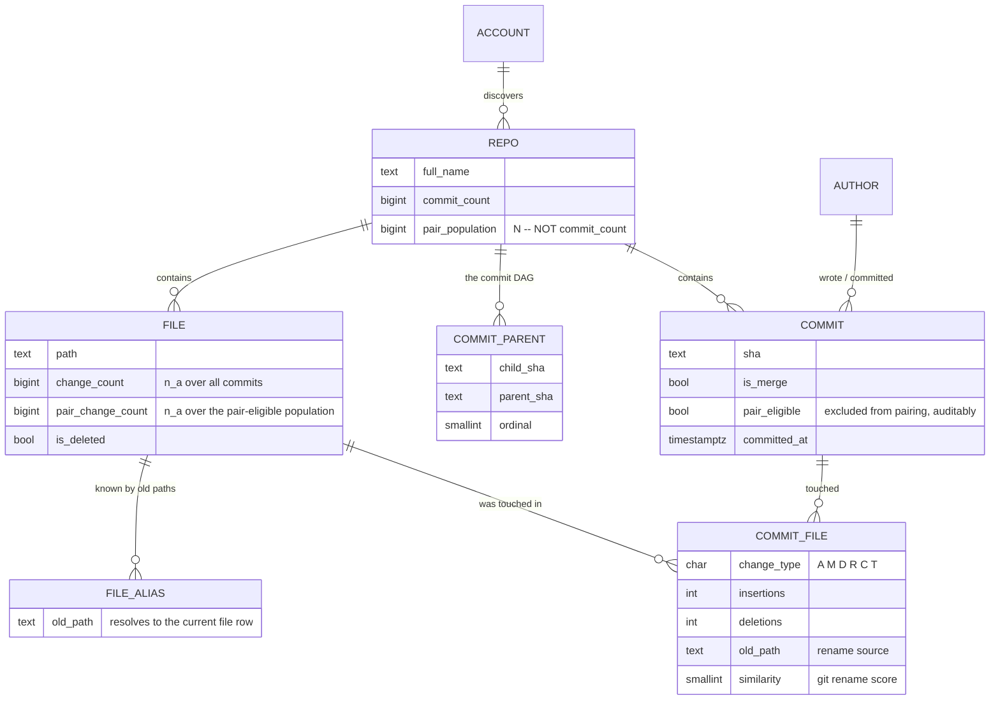
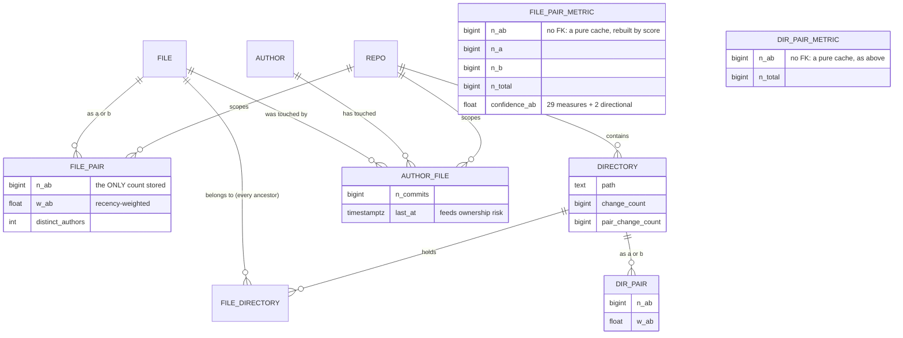
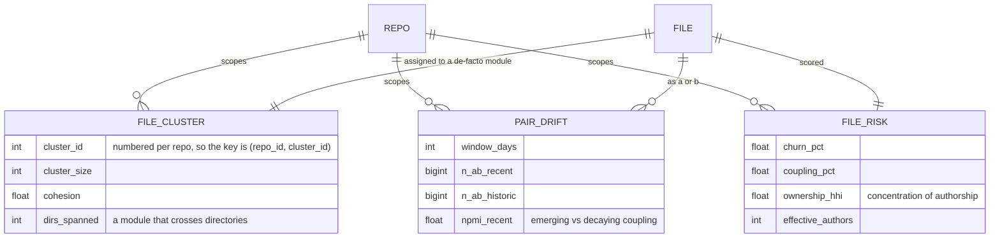
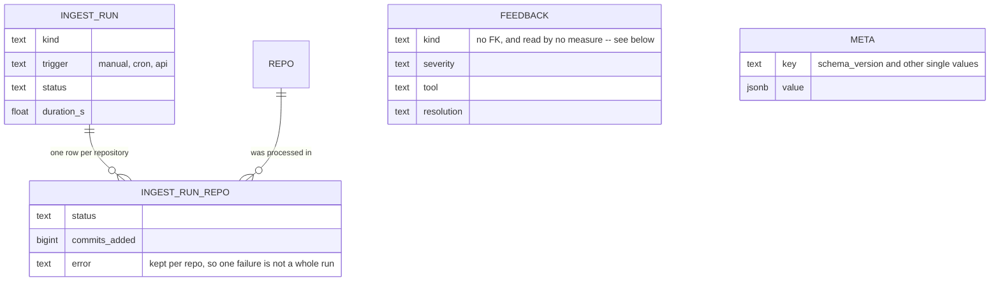

# Git Synapse — design

How the system is put together and why. The [README](README.md) covers what it
does and how to run it; this is the reasoning underneath, including every
database table and the decisions that materially change the numbers.

---

## Contents

| | |
|---|---|
| [Every table at a glance](#every-table-at-a-glance) | all 28, one line each |
| [How it works](#how-it-works) | the pipeline, end to end |
| [Store the atom, derive the rest](#store-the-atom-derive-the-rest) | the schema's one rule, and every core table |
| [Cross-repository coupling](#cross-repository-coupling-what-repositories-declare) | why co-change cannot span repositories, and what does |
| [Ground truth](#ground-truth-and-what-it-revealed) | the one thing here that is proven, not inferred |
| [The mining layer](#the-mining-layer) | de-facto modules, drift, risk |
| [Choices that affect the numbers](#choices-that-materially-affect-the-numbers) | where a default changes the answer |
| [**From a declared version to a commit**](#from-a-declared-version-to-a-commit) | the four tiers, and what each is allowed to claim |
| [**What the backtest is measured against**](#what-the-backtest-is-measured-against) | the baselines, and why a weak one is worse than none |
| [What is incremental](#what-is-incremental-and-what-isnt) | what a refresh actually redoes |
| [**How the UI is addressed**](#how-the-ui-is-addressed) | places nest in the path, analyses scope with a query |
| [**What callers asked for**](#what-callers-asked-for) | the call log, and what it deliberately does not do |
| [Bookkeeping](#bookkeeping) · [Portability](#portability) · [Layout](#layout) | operations and structure |
| [Adding a measure](#adding-a-measure) | extending the registry |

---

## Every table at a glance

Twenty-eight tables. The first group is the only one that cannot be recomputed;
everything after it is a materialised cache.

**Identity and the atom** — the source of truth

| Table | What it holds |
|---|---|
| `account` | An organisation or user to scan. Discovery reads this, so onboarding is a write rather than a redeploy. |
| `repo` | One row per repository: the full GitHub record, ingest state, and the watermarks each stage resumes from. |
| `author` | Author identity, deduplicated by lowercased email. |
| `file` | One row per canonical path per repo, carrying both marginal counts. A rename folds into the existing row rather than creating a new one. |
| `file_alias` | Historical paths that resolve to a current `file` row, so a file renamed three times keeps one identity and one history. |
| `commit` | One row per commit per repo, from the shipping branch *and* every release tag, carrying `pair_eligible` — whether it was allowed to produce pairs — and `is_replay`, whether its change already exists on the branch. |
| `commit_parent` | The commit DAG. Not needed by the coupling maths; kept for branch and lead-time analysis. |
| **`commit_file`** | **The atomic fact: one row per (commit, file).** Every other number in the system derives from this table joined to `commit`. |

**Derived within one repository** — unit of co-occurrence: the commit

| Table | What it holds |
|---|---|
| `file_pair` | The joint co-change count for a file pair. Only `n_ab`; the marginals and `N` live on `file` and `repo`. |
| `file_pair_metric` | The 29 measures materialised, so the UI can sort millions of pairs by any of them without recomputing. |
| `directory` | Directory-level rollup. A directory "changed" in a commit if any file beneath it changed. |
| `file_directory` | Which directories contain a file, one row per ancestor, so the rollup is a join rather than string work. |
| `dir_pair` | Joint co-change counts between directories. |
| `dir_pair_metric` | The same 29 measures, one level up the tree. |
| `author_file` | Who has touched what, which answers "who should review this?" alongside "what else must change?" |

**Across repositories** — what they declare about each other

| Table | What it holds |
|---|---|
| `ref_tag` | Every release tag, peeled to its commit, carrying a canonical `version_key` and the shipping-branch commit it was cut from. Without the latter a release tagged on a release branch resolves to nothing, which was 116 of guava's 123 tags. |
| `dep_bump` | One version change recorded in a manifest, resolved where possible to the upstream commit it consumed, with the tier that resolution came from. Ground truth rather than correlation. |
| `repo_package` | What each repository publishes, read from its own manifests, scoped by ecosystem. Answers "which repository *is* `com.google.guava:guava`?" from a declaration rather than from whether the strings agree. |
| `repo_dependency` | What each repository declares at HEAD. **This is the answer to "which repositories depend on each other".** |
| `module_dependency` | The intra-repository module graph, for monorepos whose real structure lives in submodules rather than cross-repo edges. |
| `repo_impact` | The ranked answer to "I am changing X, what else?", carrying the evidence behind each score so any number can be explained. |

**Mining layer** — patterns over the pairs

| Table | What it holds |
|---|---|
| `file_cluster` | De-facto modules found by label propagation over the coupling graph. The value is where they *disagree* with the directory tree. |
| `pair_drift` | Whether a coupling is strengthening or decaying, by scoring the same pair on a recent and a historical window. |
| `file_risk` | Per-file risk, each component a percentile within its repository so the composite compares across repos of very different sizes. |

**Bookkeeping** — read by nothing analytical

| Table | What it holds |
|---|---|
| `ingest_run` | Job history: what ran, when, and whether it worked. |
| `ingest_run_repo` | Per-repo detail for a run, so a failure is traceable to the repository that caused it. |
| `feedback` | Defects in Git Synapse reported by the sessions using it. The only table an agent may write to, and deliberately read by no measure. |
| `meta` | Key/value for the schema version and similar single values. |

---

## How it works


Two repositories never share a commit, so cross-repo coupling cannot reuse the
commit as its unit. Grouping commits into **change sets** — by ticket key, or by
one author's work session — was the answer for a while, and it was measured and
removed: the best measure scored AUC 0.80 while managing 0.63 on which way the
arrow points, and a baseline ignoring coupling entirely matched it. Nothing is
inferred across repositories now. The unit is a declared version bump, and these
are separate tables rather than the same ones widened:

| | Within a repository | Across repositories |
|---|---|---|
| Evidence | co-change, inferred | a manifest line, declared |
| Unit | one commit | one version bump |
| File level | `file_pair` → `file_pair_metric` | — *(needs absorbed sets)* |
| Directory level | `dir_pair` → `dir_pair_metric` | — |
| Repo level | — | `repo_dependency` → `repo_impact` |
| Direction | `P(B\|A)` vs `P(A\|B)` | inherent: a consumer names its dependency |

**The dependency graph is a third, independent stream.** `dep_bump`,
`repo_dependency` and `module_dependency` are *parsed from manifests*, not
inferred from co-change — a Go pseudo-version names the exact upstream commit it
was cut from, which makes those rows ground truth rather than correlation. They
**replaced** the statistics for cross-repository work rather than merely
constraining them: restricting to declared pairs raises the base rate of a real
relationship from 0.23% to 82%, and the statistics added little once inside that
set — see [Ground truth](#ground-truth-and-what-it-revealed).


### Store the atom, derive the rest

The design constraint driving the schema is that **no aggregate is
authoritative**. The only thing that cannot be recomputed is `commit_file`: one
row per (commit, file), with change type, line counts, rename source and
similarity.

Everything else — marginals, joint counts, all 29 measures, directory rollups,
directory rollups, the dependency graph, impact scores, clusters, drift, risk — is a
materialised cache. Consequences:



Everything below is derived from those and can be dropped and rebuilt:




- Adding a 30th measure is one function plus one registry entry, then
  `git-synapse score`. No re-clone, no re-parse.
- Changing the fan-out cap, support threshold, session gap, ticket pattern or
  lag bin width is a re-aggregate, not a re-ingest.
- The contingency cells `(n_ab, n_a, n_b, N)` sit beside every score, so any
  number in the UI traces back to four counts and then to actual commits.


### Cross-repository coupling: what repositories declare

Two repositories never share a commit, so co-change cannot express a
relationship between them. This used to be solved by widening the unit: commits
grouped into **change sets** by ticket key or by one author's work session, with
the same 29 measures applied over that wider unit, plus a directed table built
by binning time and shifting one repository's activity against another's.

**That construction was measured and found unsound.** Two public repositories in
the test corpus — sharing no code whatsoever — scored `G² = 570` against each
other, and the profile was flat across every lag from one day to two weeks:

```
scikit-learn -> django    lag 4   G² 393      lift over chance 1.19
                          lag 28  G² 570      lift over chance 1.23
                          lag 56  G² 492      lift over chance 1.22
```

Real propagation has a characteristic delay, so a genuine signal peaks at some
lag. A plateau is the signature of something else, and the marginals say what:
django occupied 41% of all time bins and scikit-learn 33%. Two variables that
are each "on" a third of the time co-occur constantly. The table was detecting a
**shared release era**, not propagation. Direction was unstable for the same
reason — `A → B` outscored `B → A` on one pair and the reverse on another,
tracking relative commit volume rather than causation.

So it is gone, along with change sets, and nothing infers a cross-repository
relationship from calendar time any more.

#### What replaced it

A manifest naming a dependency is **dated** (it lives in a commit),
**directional** (the consumer names the dependency, never the reverse) and
**provable** (it is a literal string, not an inference). It cannot produce an
edge between codebases that share no code, which is exactly the failure above.


Every ecosystem records the same thing in its own syntax, so references are read
from 29 of them — with real parsers (`tomllib`, `xml.etree`, PyYAML) wherever
the format has one, because a manifest that parses *almost* correctly is worse
than one that fails loudly.

Each reference is kept at its true strength, because that is exactly the
confidence of the edge it produces:

| Strength | Example | Resolves to |
|---|---|---|
| `commit` | a Go pseudo-version, a submodule, any lockfile `rev` | a commit outright — proven |
| `tag` | `v1.2.3` | a commit, via `ref_tag` |
| `range` | `^1.2.0`, `>=3,<4` | nothing; the edge exists, but pins no commit |

**What this cannot do.** It answers at repository level. "Which file in repo A
goes with which file in repo B" needs the set of upstream commits a version bump
absorbed — computable from `ref_tag` with `git rev-list --cherry-pick`, but not
built. The change-set model did answer it, unreliably; nothing provable answers
it today.

### Ground truth, and what it revealed

A Go pseudo-version embeds the upstream commit it was cut from:

```
github.com/acme/signing/v3 v3.0.0-20260626221153-5fc63d6f3055
                                                  ^^^^^^^^^^^^
```

So a `go.mod` diff is a **dated, directional, provable** propagation edge.
Recovering 6,388 of them gave a labelled set to test the statistical approach
against — and the answer is why that approach is no longer here.

| Approach | AUC | Directional accuracy |
|---|---|---|
| Best single measure over all ordered pairs | 0.80 | **0.63** |
| A coupling-free baseline: the consumer's raw commit count | **0.80** | — |

**The measure that topped the table was Russell-Rao** — `a / N`, pure joint
frequency. It scored 0.80 by ranking *both repositories are busy*, while managing
0.63 on which way the arrow points: barely better than a coin toss on the only
part that matters. And a baseline that ignores coupling entirely, just counting
the consumer's commits, matched it at 0.80.

That is **activity confounding**, and it is the same defect that later showed up
starkly in the time-binned table: two unrelated public repositories scoring
`G² = 570` because both were busy in the same years.

Restricting candidates to declared dependencies lifts the base rate from 0.23% to
82% — a ~350× prior — before any measure is evaluated. Once a prior that strong
is available and provable, ranking correlations inside it earns little and risks
presenting a coincidence as a finding. So the graph is now declared-only, and
every row carries the evidence behind it:

| Tier | Meaning | Trust |
|---|---|---|
| `bump-backed` | an actual version bump was observed, with its date | ground truth |
| `declared` | the consumer names it in a manifest at HEAD | provable, but the edge may be inert |

There is no `discovery` tier any more. An edge either has a manifest line behind
it or it does not exist.

### The mining layer



- **De-facto modules** — label propagation over the file-coupling graph. The
  valuable output is its *disagreement* with the directory tree: 1,389 clusters
  here span more than one top-level folder.
- **Coupling drift** — the same association recomputed on a recent window and the
  preceding history. A pair coupled three years ago but not since is a finished
  refactor, and reporting it as current coupling is an easy way to mislead an
  agent.
- **Ownership risk** — Herfindahl concentration over each author's share of a
  file's commits, giving an *effective* contributor count. Three authors at
  98/1/1 has a bus factor near 1, not 3.


### Choices that materially affect the numbers

- **Population.** `N` is `repo.pair_population` — commits *eligible to contribute
  a pair* — not the total commit count. Marginals use the same population, so
  `n_ab > n_a` is impossible by construction.
- **Fan-out cap** (`MAX_FILES_PER_COMMIT`, default 60). A commit touching k files
  produces k(k−1)/2 pairs. Bulk reformats would dominate every count while
  carrying no design signal, so they are stored in full but flagged
  `pair_eligible = FALSE` — excluded, auditable, reversible.
- **"Lag" is not used as a name.** It meant two things: a time bin used to
  *infer* that two repositories were related, and the delay before a consumer
  took an upstream change. The first is gone with the statistics it served. The
  second is real -- arithmetic on two known commit dates, reported and never
  ranked on -- and is now called **adoption delay**, in the column
  (`dep_bump.adoption_seconds`), the API (`adoption_days`) and the UI
  ("Adopted after"). A renamed column has no migration in `schema.sql`:
  Postgres has no `IF EXISTS` for `RENAME COLUMN`, so on a fresh database it
  fails and takes the whole DDL batch with it, leaving no schema at all. An
  existing database is renamed once by hand.
- **Merges** are skipped, and not by choice: a merge has two parents, so *which*
  files it changed depends on which parent you compare against. Git declines to
  pick and reports no files at all, so a merge would be a commit row with nothing
  attached. Its content is already recorded in the commits it joined. This is why
  a tag pointing straight at a merge — how Prometheus marks nearly half its
  releases — has to fall back to the nearest real commit.
- **Release tags are walked too, not just the shipping branch.** A release is
  usually cut on a branch that never merges back, so its commits were never read
  and the range between two releases was uncomputable. They cost 3–8% more
  commits, and the watermark covers every tip the walk visits so they are read
  once rather than on every run.
- **A replayed change is stored but never counted** (`commit.is_replay`). A fix
  cherry-picked onto three release branches is one decision that those files
  belong together, repeated mechanically — counting it four times would inflate
  whatever gets backported, which is a release-management habit rather than a
  fact about the code. Detection is `git rev-list --cherry-mark`, which compares
  by patch id: normalised for whitespace and line offsets, so it catches a
  backport that had to shift to apply, and correctly does *not* catch one that
  had to touch extra files — that is a different change, and the extra file
  really did have to move with the others.
- **Renames** keep a file's identity — history is walked oldest-first, so a moved
  file keeps one id and one continuous history.
- **Infeasible tables are clamped.** A 2×2 table only exists when
  `max(0, n_a + n_b − N) ≤ n_ab ≤ min(n_a, n_b)`. Without clamping, a bad
  aggregation yields things like φ = −7.9.
- **Corrupt commit dates cannot set the time origin.** Four epoch-dated commits
  once stretched the lag axis from 2,200 bins to 20,687, inflating `N` tenfold.

---

### From a declared version to a commit

A manifest names versions in the package registry's namespace and git names them
in the repository's, so the two are never equal as strings: `33.4.0-jre` against
`v33.4.0`. Nothing records the link — a maintainer builds from a tag and
publishes an artifact, and no field anywhere says which commit that artifact came
from. Except in Go, where the module *is* the git tag, and in a submodule, where
a gitlink is a commit outright.

So resolution is a reconstruction, and it is done in tiers that say what each is
allowed to claim:

| Tier | How the commit was arrived at | Claims |
|---|---|---|
| `sha` | the manifest named it | this commit |
| `tag` | an exact version matched a tag | this commit |
| `floor` | a range's declared lower bound matched a tag | *at least* these commits arrived |
| `ceiling` | an upper bound with no floor, resolved to the newest release beneath it | the newest release that was permitted |

**Matching is a join on a canonical key**, computed by one parser for both a tag
name and a declared version. Trailing zeros are dropped so `1.2` and `1.2.0`
agree. A `v` prefix goes, and so does a component prefix — taken by reading the
version at the *end* of the string, which absorbs `guava-33.4.0`, `sub/v1.2.0`
and `@babel/core@7.0.0` without needing the package's name. Underscores separate
numbers as well as dots, because older Java and autotools tag `release_0_10`.

**Suffixes are an allowlist, not a strip.** `-jre` and `-android` are two builds
of one release. `-rc1` and `-beta` are separate releases with their own tags and
their own commits, and collapsing them would resolve a release candidate to the
final release while looking successful. `-SNAPSHOT` was never tagged at all.

**A name is only a repository where the ecosystem says so.** A Go module path is
host/owner/repo and an action is owner/repo, so reading a repository out of the
name is reading what it says. A registry coordinate is not: npm's `uuid` resolved
to google/uuid, a Go library, and npm's `bytes` to tokio-rs/bytes, a Rust crate,
until the fallback was scoped. Those showed up as *unresolved* rather than wrong
only because the versions could never match -- luck, not a guard. Everywhere
outside those ecosystems, a repository has to claim the name.

**A coordinate never crosses ecosystems.** `illuminate/events` is a PHP package
published by laravel/framework; `events` is an unrelated npm one. Both the full
coordinate and its last segment are indexed, because a consumer writes either --
but without the ecosystem travelling alongside, every npm dependency on `events`
became an edge into a PHP repository. Scoping removed some 290 such edges across
the corpus and lifted Rust from 74% to 92%, having previously been credited with
edges it never had.

**A range resolves to its declared floor**, which is parsed rather than guessed:
`^4.17.21` states 4.17.21 as its own lower bound, and a wildcard segment states
one too -- `5.5.*` and `1.0.x` mean 5.5 and 1.0. What was installed may have
drifted higher, but a manifest nobody edited is one where nothing had to adapt,
so the floor is the last version anyone made a decision about. A range that never
changes produces no bump, which makes silent drift invisible by construction —
correctly, since it required no adaptation.

**One guard covers every tier**: a commit written after the bump that consumed it
is impossible, so such a match is undone rather than reported. It catches a bad
key, a bad repository mapping and a moved tag without knowing which occurred.

Ranges with an upper bound and no floor are four rows in twenty thousand;
`*` and `latest` produce none at all, because a line that never changes never
bumps.

What that comes to, on dependencies between repositories in the corpus:

| Ecosystem | Bumps | Resolved | Why it lands where it does |
|---|---:|---:|---|
| Go | 2,554 | 96.7% | a pseudo-version *is* a commit id |
| Java | 433 | 95.6% | Maven names an artifact; the tag has to be found |
| Rust | 863 | 92.4% | `Cargo.lock` pins exactly, then tag lookup |
| JS/TS | 2,302 | 90.0% | lockfile pins exactly; `package.json` alone is a range |
| PHP | 642 | 79.3% | Composer writes wildcards constantly, and old branches are deleted |
| Python | 70 | 100% | libraries declare a floor and almost never edit it, so there is little to record |

Python's fourteen rows are the honest finding rather than a gap: a library
declares `Werkzeug>=3.0` and leaves it alone for years, so nothing is recorded --
and by the floor argument above, nothing needed to adapt either.

---

### What the backtest is measured against

A benchmark is only as honest as its opponent, and this one has been wrong twice.
The baselines are now a ladder of people who could answer *"what else changes?"*
without any history at all. Every rung is free, so whatever Git Synapse adds on
top of the highest one has to have come from the commit log and nowhere else.

| Rung | What it has seen | How it answers |
|---|---|---|
| **Tourist** | nothing | the repository's busiest files |
| **Intern** | where the file sits | its folder-mates, busiest first |
| **Apprentice** | the naming conventions too | the file's test, then its folder |
| **New Hire** | the whole codebase, none of its past | greps names *and* bodies, then widens |

The **New Hire** is the opponent that matters, because it is what a coding agent
actually does. Given the seed file it derives search terms from the path and from
the symbols the file declares, matches them against both file names and file
contents, then widens the search using what the first round returned — the
read-a-result-and-search-again step that finds a caller in another directory that
no naming or folder rule would ever suggest.

Four things make it a fair opponent rather than a strawman:

- **It searches the parent tree.** Grepping the commit's own tree lets a file
  edited *by* that commit answer for it, because it already contains the
  reference the change introduced. That is leakage, and it is tested for.
- **Vendored, generated and minified paths are excluded from both halves.**
  Matching their names while refusing to read their contents would credit the
  baseline for a rule the grep never ran.
- **Distinct terms are counted, not raw hits.** A file mentioning one word four
  hundred times is a big file; a file mentioning three of the seed's symbols is a
  real candidate.
- **The sample is uniform.** It is far too slow to run on every prompt, so it is
  reservoir-sampled and searched after the replay. Sampling with a fixed
  probability and stopping at a cap drew the whole sample from the oldest
  commits, and understated the opponent by fourteen points on guava.

Lift is never divided by the New Hire's rate. Lift is a ratio, and dividing a
rate measured over every prompt by one measured over a few hundred mixes two
estimators, so the figure would move with the draw rather than with the product.
The New Hire instead feeds the only number that says whether this product answers
anything nobody else could: **the share of prompts that neither the free rules
nor the search solved, which a measure still answers.**

Two seeding modes, because they ask different questions:

| Mode | Prompts per commit | What it isolates |
|---|---|---|
| `all` | one per changed file | the product's own question, and the larger sample |
| `obscure` | one, seeded with the least-changed file | starting from a quiet corner, where no hub makes the rest easy to guess |

What it still does not measure: the seed file is given, so finding the *first*
file from a bug report — the hard half of an agent's job — is skipped, and the
seed is always a file that genuinely changed. That flatters both sides equally,
but it means the absolute hit rates are higher than practice.

---


## What is incremental, and what isn't

The nightly job updates everything automatically. It is not uniformly
*incremental*, and the distinction matters if you are reasoning about cost.

| Stage | Incremental? | How it is gated |
|---|---|---|
| git fetch | **yes** | fetch into an existing mirror, never re-clone |
| commit parsing | **yes** | every branch tip stored in `repo.last_ingested_refs`; only new commits are read |
| aggregate + score | **yes** | per repo, `last_aggregate_at < last_ingest_at` |
| manifest bumps | **yes** | per repo, `last_depbump_sha <> head_sha` |
| declared dependencies | **yes** | same sha watermark; per-repo delete-and-reinsert, so a *removed* dependency still disappears |
| change sets | **yes** | only the tickets and authors touched by new commits are re-partitioned |
| impact graph | **skipped when unchanged** | fingerprint over repo_dependency and dep_bump |
| impact prediction | **skipped when unchanged** | fingerprint over its three input tables |
| mining | **yes** | per repo, `last_mining_at < last_aggregate_at` |

Two stages are deliberately *recomputed whole* rather than delta-merged when
their inputs do move:

- **Lagged coupling** — the computation *is* one matrix product per lag. A delta
  would still multiply the changed repository's row against every other
  repository across every bin, so there is nothing cheaper to do. 12 s.
- **Cross-repo marginals and scores** — adding any change set shifts the
  population `N`, and `N` appears in every pair's contingency table. Recomputing
  is ~4 s and provably consistent; delta-merging would let stored values drift
  from the true ones.

Verified by fingerprinting: an incremental pass over unchanged data reproduces
the change-set table byte-for-byte, and re-scoring a repository is bit-identical.

Two watermark bugs found while validating this, both of which silently defeated
the gating:

- `last_ingest_at` advances on every run whether or not commits land, so a
  timestamp comparison re-scanned all 187 manifest-bearing repos nightly. Now
  keyed on `head_sha`.
- 73 commits have neither an author nor a ticket key, so they can never join a
  change set — but they were counted as pending work, which made the change-set
  early return unreachable.

Force a complete rebuild after changing a tuning knob:

```bash
docker compose run --rm cli ingest --force-full     # everything
docker compose run --rm cli crossrepo --force       # after SESSION_GAP_HOURS / TICKET_PATTERN
docker compose run --rm cli mine --force            # after a mining threshold
```


## Bookkeeping

Four tables the analysis never reads, kept so a run is auditable:



**`feedback` is deliberately unreferenced.** Letting sessions write into the
coupling data would close a confirmation loop — Git Synapse suggests a pair, the
agent edits both files, the commit strengthens the pair — and the statistic would
drift from measuring the codebase to measuring its own past advice.


## Portability

The stack is four containers and two volumes. To move it to another machine — Linux, or
anywhere with a container runtime:

```bash
git clone <this repo> && cd git-synapse
cp .env.example .env && $EDITOR .env     # add GITHUB_TOKEN
docker compose up -d
docker compose run --rm cli ingest --all
```

Nothing is host-specific. To carry the data across instead of re-ingesting:

```bash
docker compose exec -T postgres pg_dump -U git_synapse git_synapse | gzip > git-synapse.sql.gz   # export
gunzip -c git-synapse.sql.gz | docker compose exec -T postgres psql -U git_synapse git_synapse   # import
```

The mirrors do not need to move — a fresh `ingest` re-clones them, and the watermarks in
the database make it incremental.

---


## Adding a measure

1. Add a vectorised function to `src/git_synapse/stats/measures.py`.
2. Add a `MeasureSpec` to `src/git_synapse/stats/registry.py`.
3. Add the column to `file_pair_metric` and `dir_pair_metric` in `schema.sql`.
4. `docker compose run --rm cli score`.

The API, MCP server, CLI and UI all enumerate from the registry, so nothing else changes.

---


## What callers asked for

Two surfaces consume this product — agents over MCP, and this UI over HTTP —
and until recently neither left a trace, so *"is anything actually using this?"*
had no answer, and *"what did it ask for, and what did it get back?"* had none
either. `call_log` records every call on both surfaces: the arguments as given,
the reply as returned, how long it took, how many rows came back, and which
client asked.

One interception point per surface, not one per entry point. MCP overrides
`call_tool`, the single dispatch every tool passes through, so a tool added
later is recorded without anyone remembering to. HTTP uses one middleware, and
records the route *template* — `/api/repos/{repo_id}`, not the concrete path —
so a thousand repositories are one row in a ranking rather than a thousand rows
nobody can read.

Three properties make the log safe to leave on:

**It never blocks a caller.** A row goes to a bounded queue and one daemon
thread batches the inserts. A page that got slower because it was being
measured would be a bad trade, and one that could wedge on a database blip
would be worse. When the queue fills, rows are dropped **and counted**, and the
count is shown beside the totals — an under-report that says so is honest; a
silent one is not.

**It bounds what it stores.** The body is kept whole up to 64 KB
(`CALL_LOG_BODY_BYTES`) and truncated beyond, with the true size and row count
recorded either way, because "how much came back" is usually the question. It
is the one table that grows with *traffic* rather than with history, so it is
pruned by age and by count at the end of every ingest.

**It does not read itself.** `/api/calls*` is excluded, or opening the Callers
page would generate the traffic it displays and could never show a quiet
system.

**It lists tools nobody has called.** A table built from calls can only show
tools that were called, so with two of fourteen exercised the page showed two
and read as *"this server has two tools"*. The MCP process publishes its
inventory at startup — written by the process that owns it, rather than the API
importing another container's module to answer the question — and idle tools
appear with a `never called` badge. That row is the useful one: it says which
tools are dead weight. The inventory is dropped under "errors only", where a
tool that has never run has never failed either and would read as passing.

Reading it is the same drill-down as everywhere else: Overview ranks tools and
routes, Callers lists the individual calls, and one call opens the arguments it
was given and the reply that went back. Every filter — surface, status, window
— reaches all three; the summary originally ignored them, so the list narrowed
while every figure above it stayed put, which reads as broken rather than
empty.

## How the UI is addressed

The application had ten tabs, and five of them were views onto two things —
files and pairs — at different scopes. The repository page alone reimplemented
seven of the ten distinct things in the app, five of which were also a top-level
tab. Every question had two homes, so no click could be predicted.

One rule replaced them:

> **Places nest in the path. Analyses scope with a query.**

A file is *in* a repository, which is *in* an account: that nests, so it is a
path. "Risk" is a question you can ask of any scope: that does not nest, so it
is a filter. Two tabs carry the whole application, split on something a reader
can check rather than on taste:

| Tab | Owns |
|---|---|
| **Repositories** | the things — repositories, folders, files, pairs — and what is *in* them |
| **Insights** | every analysis derived from history — impact, risk, drift, modules |
| **Overview** | is this deployment healthy, and is anything using it |
| **Callers** | every call served, and what it returned |
| Accounts · Measures · Jobs · Feedback | configuration, reference, operations |

Overview used to carry a shortened copy of the repository list, the mining
figures and the run history, plus three header buttons duplicating the nav one
line above — half the page was a worse version of another tab. It now answers
one question: corpus scale, ingest health, and who is calling.

```
/accounts                                   /insights            -> /insights/impact
/accounts/7                                 /insights/impact       ?repo=5
/repos                                      /insights/impact/5/12  one edge, with bump evidence
/repos/5                                    /insights/impact/graph nodes are repositories
/repos/5/tree/src/main/java                 /insights/risk         ?repo=5
/repos/5/files/src/main/java/Cache.java     /insights/drift        ?repo=5
/repos/5/pairs/36/91                        /insights/graph        the map, all repos
                                            /insights/graph        ?repo=5  its files
                                            /insights/modules      ?repo=5
```

Three consequences worth stating, because each was a defect before:

**Folders and files are addressed by path, not by id.** Ids renumber on a
re-ingest, so a link keyed on one silently comes to mean a different file —
worse than failing, because nothing looks wrong. `directory` is
`UNIQUE (repo_id, path)` and `/api/files/resolve` follows the rename alias
table, so a link to a path that has since moved still lands on the file it
became, and the address is then corrected to the current path.

**A lens result always lands back in the hierarchy.** Clicking a file in
Insights opens `/repos/5/files/…`, because that is where the file lives. This
only reads as a jump if clicking a *repository* went somewhere other than the
repository — which is exactly the bug that prompted the restructure.

**Insights opens on a map.** `/insights/graph` is the first section and the
landing: with nothing scoped it draws every repository, and choosing one in
Scope zooms to that repository's files. A picture of the corpus is a better
first answer than a table that must be configured before it says anything.
Neither graph owns data — each draws couplings computed elsewhere — so they are
one section with two zoom levels rather than two tabs.

**Figures belong to the section that uses them.** The Insights frame used to
render six corpus-wide tiles above whichever section was open, which then
rendered five or six of its own: twelve numbers before any content, most of
them irrelevant to the page. Each section now carries only its own, and long
explanations sit in a collapsed `<details>` under the thing they explain.

**The measure bar appears only where a measure orders something.** It ranks
pairs, so it belongs on the overview, a repository's pairs, a file's partners,
a pair breakdown and a folder's coupled folders. On a risk table, an ingest log
or a list of repositories it ranks nothing and reads as a stray control.

**There is no unprovable tier.** Every row in `repo_impact` is written from a
dependency declared in a manifest, or from a version bump observed and resolved
to the upstream commit it consumed — the `edges` CTE in `predict.rebuild` has
exactly those two branches, so `is_declared OR has_bump_history` is true by
construction, not by coincidence. The statistical discovery path was removed
after it measured AUC 0.63 on which way the arrow points, matching a baseline
that ignored coupling entirely.

Because the tier cannot occur, nothing offers to filter it: the graph's
"validated only / include discovery" toggle, the API's `validated_only`
parameter, `impact_chains`' hop filter and the MCP tool's `include_discovery`
flag were all no-ops implying a doubt the data does not carry. A test asserts
the invariant against the corpus rather than restating it in prose.

The one place a *rule* stands in for an observation is version resolution, and
it is labelled per row: 3.2% of bumps resolve to an exact `sha`, 79.7% to a
`tag`, and 17.1% to a `floor` — a range like `^1.2` taken at its lowest
satisfying version. That is deterministic and stated, not inferred, and the
`resolution` column travels with every bump so a reader can tell which.

**Directory coupling excludes containment.** A directory changes in a commit if
any file beneath it changed, so an ancestor co-changes with its descendant by
definition: `src/com` scored 1.000 against `src/com/google` on every measure,
and the root — which changes in every commit — scored 1.000 against everything.
Those rows crowded out the real partners, which for `src/com/google/javascript`
turn out to be the matching `test/…` subtrees.

A third check runs in real Chrome. jsdom does no layout and loads no
stylesheet, so `smoke.mjs` is structurally blind to two things that both
shipped: a component sitting flush against the next one, and an element whose
`hidden` attribute is beaten by an author `display` rule — `.measure-bar` is
`display:flex`, so hiding it changed nothing on screen while every assertion on
the property passed. `tests/ui/layout.mjs` measures real boxes: the gap between
every pair of stacked blocks, the computed display of anything hidden from
script, and horizontal overflow. The page rhythm is 16px, with two deliberate
exceptions — a breadcrumb sits 12px above its title, and a section title sits
24px below the previous block but 10px above its own card, because a heading
belongs to what follows it.

Two more tests hold the shape. `tests/test_ui_links.py` checks every `href` and
`go()` target in `app.js` against the client's own route table and against the
server's `SPA_ROUTES` — a commit that renamed the routes once left eleven dead
links behind, and the suite stayed green because the smoke test renders routes
without ever following a link. `tests/ui/smoke.mjs` then walks
account → repository → folder → file by *clicking*, asserting the breadcrumb
grows a rung at each step.

## Layout

```
src/git_synapse/
  stats/       contingency tables + the 29 measures + registry   (pure, no I/O)
  db/          schema.sql, connection pool, COPY helpers
  ingest/      github discovery, git mirroring, log parser, loader, pipeline
  analysis/    aggregation, scoring, read queries
               depbump.py    manifest-bump ground truth + declared deps
               predict.py    the declared dependency graph, ranked
               manifests.py  dependency references, 29 ecosystems
               mining.py     de-facto modules, drift, ownership risk
  api/         FastAPI app and routes
  mcp/         MCP server
  scheduler/   daily refresh
  cli.py       Typer CLI
web/           index.html + app.js + graph.js + style.css   (no build step)
skills/
  git-synapse-mcp/    SKILL.md   -- standalone: how an agent should use the MCP server
docker/        Dockerfile (one image, four services)
tests/
```
