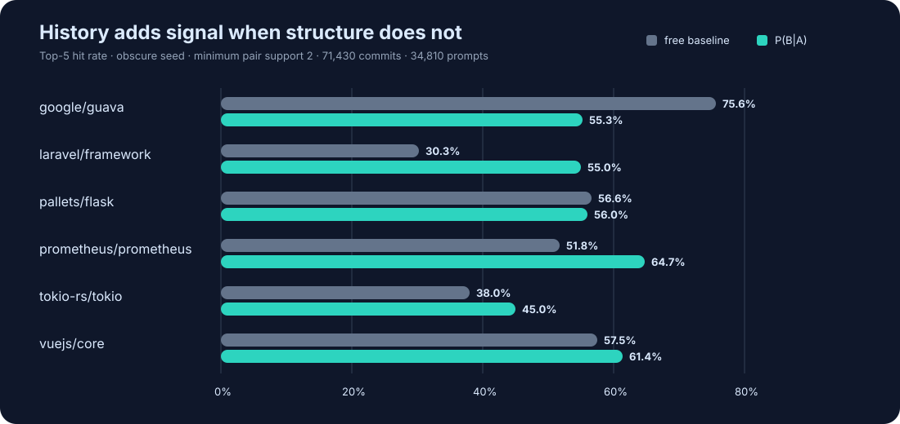

<div align="center">


# Git Synapse

**Know what else has to change.**


**[Read the guide →](https://kirankn8.github.io/git-synapse/)**

</div>

<p align="center">
  
</p>

## The problem

You change a field on a model. Somewhere there is a worker and a frontend that
need to change too. Whoever knew that has moved teams, or is on holiday, or
simply forgot — so you find out in review, in staging, or a week later.

It already happened before. The last few times that file changed, the same
files and the same two repositories got a commit within days. Nobody wrote it
down because nobody had to: it is sitting in your commit history.

## What it does

Git Synapse reads that history and answers one question: **if I change this,
what else usually changes?**

- **In the same repository** — the test, the serializer, the migration you were
  about to forget, each with the number of times it really did change alongside.
- **In your other repositories** — which service tends to follow, and how long
  it usually takes.
- **With its evidence** — every answer carries the counts behind it, so you can
  tell a real pattern from two files that are merely busy.

## Try it

```bash
git clone https://github.com/kirankn8/git-synapse.git
cd git-synapse
cp .env.example .env
docker compose up -d
```

Open `http://localhost:8080`, paste a repository URL on the **Sources** page,
and it starts importing. Public repositories need no token, and there is no
sign-in to set up — the dashboard is simply there, with a banner saying so.

Putting it somewhere other people can reach? Set `ADMIN_EMAIL` and
`ADMIN_PASSWORD` in `.env` and restart. That is the whole of access control.

Everything else — Kubernetes, tokens, troubleshooting — is in the
**[setup guide](https://kirankn8.github.io/git-synapse/)**.

## From your coding agent

An agent only ever sees the repository you opened, which is exactly the blind
spot. Git Synapse exposes what it knows over an **MCP server and a skill file**,
so the agent can check its own work: after the change is written, before it
reports it done.

```bash
claude mcp add --transport http git-synapse http://localhost:8081/mcp
```

Cursor, VS Code, opencode and Claude Desktop are in the
[guide](https://kirankn8.github.io/git-synapse/#mcp).

Connecting the server gives the agent the tools; the skill tells it *when* to
reach for them and — more importantly — when a result is noise. For Claude
Code:

```bash
mkdir -p ~/.claude/skills/git-synapse-mcp
curl -fsSL https://raw.githubusercontent.com/kirankn8/git-synapse/main/skills/git-synapse-mcp/SKILL.md \
  -o ~/.claude/skills/git-synapse-mcp/SKILL.md
```

For any other agent, paste
[`SKILL.md`](skills/git-synapse-mcp/SKILL.md) into whatever instructions file it
reads.

## How it works

No language server, no AST, no build, no model. Two ideas, both from git.

**Inside a repository**, the only fact used is *this commit touched this file*.
Files that keep landing in the same commit build up support. Sweeping commits
are capped so a mass rename cannot invent a relationship, renames are followed
so a file keeps its history, and rebased or cherry-picked duplicates are
dropped by patch id rather than counted twice.

**Between repositories**, it reads your manifests *out of the history itself* —
`go.mod`, `package.json`, `Cargo.toml`, `pom.xml`, `Chart.yaml` and about
thirty more — at every commit that changed them. One repository naming another
is a **declared** edge; each time that pin moves is an **observed** bump. Both
ends are commits, so the gap between them is measurable: upstream commit, then
the downstream commit that adopted it. The median of those gaps is how "usually
follows within three days" is known. A bump whose upstream is newer than its
consumer is discarded rather than believed.

## Does it actually work?

Sometimes, and it is worth knowing when it does not. Replaying 71,439 commits
from six public projects, ranking five guesses per commit using only earlier
history: **57.5%** of the time the right file was in the five, against **46.8%**
for the best non-historical rule.

<p align="center">
  
</p>

It loses to plain naming conventions in Guava and ties in Flask. The honest
claim is narrower than "it beats the alternatives": history helps when layout
and naming do not already reveal the relationship. Full method and every number
in **[docs/benchmark.md](docs/benchmark.md)**.

<details>
<summary><b>The fourteen MCP tools</b></summary>

### Fourteen tools

| Tool | Use |
|---|---|
| `coupled_files` | Find files that commonly change with this file. |
| `explain_pair` | Inspect the full evidence and all measures for a pair. |
| `file_history` | Inspect recent commits and authors for a file. |
| `search_files` | Find a file by path substring. |
| `repo_hotspots` | Find the repository's highest-churn files. |
| `coupled_directories` | Find directories that change with a directory. |
| `module_context` | Resolve a monorepo file through its manifest graph. |
| `upstream_repos` | Find repositories where a change may belong first. |
| `impact_of_change` | Find downstream repositories likely to need updates. |
| `coupling_chain` | Follow multi-hop upstream or downstream impact. |
| `explain_repo_pair` | Explain a declared dependency and its observed bumps. |
| `list_repositories` | List repositories in the indexed corpus. |
| `list_measures` | List measures and their caveats. |
| `report_gap` | Report missing or incorrect data for review. |

### The workflow

The useful moment is not before the agent starts — it does not yet know what it
will touch. It is after the change is written and before it reports it finished:
`coupled_files` on each edited file to see whether anything that usually moves
with it is missing from the diff, then `impact_of_change` for the repositories
likely to need a follow-up. Use `explain_pair` when a suggestion needs evidence.
Treat every result as review guidance, not a rule.

</details>

## CLI and development

The CLI does the two things the server cannot do for itself. Discovery,
ingest, scoring and mining are the scheduler's job and need no command.

```bash
docker compose run --rm cli account add my-org   # start scanning a source
docker compose run --rm cli account list         # what is being scanned
docker compose run --rm cli reset                # drop ingested data, keep the schema
```

Tests, linting and the development loop are described in
[DESIGN.md](DESIGN.md).

## License

[GNU AGPL v3.0](LICENSE). Commercial use is permitted under its terms. A
separate commercial license, hosted service and support are available for
organisations that need proprietary modifications or closed redistribution.
