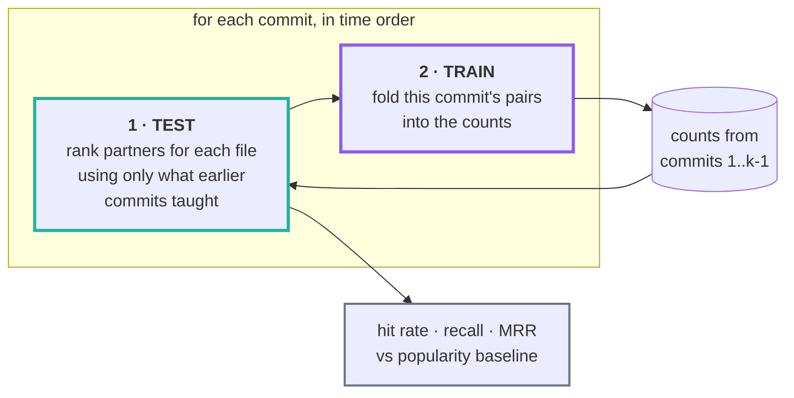

<div align="center">


# Git Synapse

**Change-coupling statistics over git history —<br>so coding agents know what else must change.**


</div>

> When you edit `resource_cluster_aws.go`, history says `resource_cluster_gcp.go` changes
> too — **74% of the time, across 49 shared commits.**

Git Synapse computes that from the commit history of an entire GitHub organisation and
serves it to coding agents over **MCP**, to humans over an **interactive web UI**, and to
scripts over **REST**.

It never parses your code. The atomic fact is *this commit touched this file*, and
everything else is derived from it — which is why it works on any language, in any
repository, with no per-language support to add.

<picture>
  <source media="(prefers-color-scheme: dark)" srcset="docs/benchmark-dark.svg">
  
</picture>

<div align="center"><sub><b>Backtested, not asserted.</b> Every prediction scored against
only the commits that preceded it — <a href="#does-it-actually-help">how this is measured</a>.</sub></div>

### Contents

| | |
|---|---|
| [What it does](#what-it-does) · [The 31 measures](#the-31-measures) | the idea, and the statistics behind it |
| [**Does it actually help?**](#does-it-actually-help) | the backtest that judges the product, not the corpus |
| [Quick start](#quick-start) · [Which repositories get scanned](#which-repositories-get-scanned) · [Hosts](#hosts) | running it |
| [Using it from a coding agent](#using-it-from-a-coding-agent-mcp) · [The web UI](#the-web-ui) · [Who may read it](#who-may-read-it) | the interfaces, and the door in front of them |
| [CLI](#cli) · [Configuration](#configuration) · [Development](#development) | operating it |
| [**DESIGN.md**](DESIGN.md) | how it works inside: the schema, every table, the trade-offs |

---

## What it does

Git Synapse mirrors every repository in one or more GitHub organisations, reduces
their histories
to a single atomic fact table — *this commit touched this file* — and derives
coupling at three levels:

| Level | Question | Unit of co-occurrence |
|---|---|---|
| **File** | "I'm editing `auth.go`, what else?" | the same commit |
| **Cross-repo** | "I'm changing `runtime`, where does this really belong?" | a declared dependency |
| **Transitive** | "does `signer` reach `runtime`, and how?" | composed path over declared edges |

Commits come from the branch that ships **and from every release tag**, because a
release is usually cut on a branch that never merges back — so its commits were
otherwise never read, and the range between two releases was uncomputable. A
change replayed onto a release branch is stored but not counted: a fix
cherry-picked onto three branches is one decision repeated, not three
observations. Git decides which is which, by patch id.

### Turning a declared version into a commit

A manifest names versions in the package registry's namespace and git names them
in the repository's, so `33.4.0-jre` and `v33.4.0` are never equal as strings.
Both reduce to one canonical key, and a release tagged off the shipping branch
resolves through the commit it was cut from. Across six ecosystems, on
dependencies between repositories in the corpus:

| Ecosystem | Bumps | Resolved to a commit |
|---|---:|---:|
| Go | 2,031 | **96.4%** |
| Java (Maven) | 365 | **95.1%** |
| Rust (Cargo) | 625 | **92.2%** |
| JS/TS (npm) | 2,225 | **88.0%** |
| PHP (Composer) | 642 | **79.3%** |
| Python | 14 | 100% |

Go and PHP bracket the range for a structural reason: a Go pseudo-version *is* a
commit id, while Composer and Maven name a registry artifact that records no
commit at all, so the link has to be reconstructed from a tag.

### The 31 measures

Every measure is a pure function of the same 2×2 contingency table. For two items
A and B over N observations: **a** = both changed, **b** = only A, **c** = only B,
**d** = neither.

| Family | Measures |
|---|---|
| **Similarity & overlap** | Jaccard, Dice, Sørensen, Ochiai, Simpson (overlap), Braun-Blanquet, Kulczynski, Fager |
| **Matching coefficients** | Russell-Rao, Sokal-Michener, Rogers-Tanimoto, Hamann, Faith |
| **Information theoretic** | Mutual Information, PMI, NPMI, PPMI |
| **Significance tests** | Chi-square, Log-likelihood ratio (G²), T-score, Z-score, Poisson, Hypergeometric (Fisher exact) |
| **Correlation** | Phi, Cramér's V, Yule's Q, Yule's Y, Michael |
| **Probability & lift** | Association strength |

Plus two directional extras — `P(B|A)` and `P(A|B)` — which are not symmetric and
are usually the most actionable numbers of all.

The same 31 columns are computed at every level, because widening the unit of
co-occurrence is all that changes. Cross-repository relationships do not use them
at all: they come from what a manifest declares, which is provable rather than
inferred.

**They disagree, and that is the point.** On a real repository, ranked by each:

```
npmi                   ->   1.000  (n_ab=  3)  50-testing.md <-> 03-resource-patterns.md
jaccard                ->   1.000  (n_ab=  3)  50-testing.md <-> 03-resource-patterns.md
association_strength   -> 347.500  (n_ab=  2)  cluster_cloudstack.md.tmpl <-> resource.tf
log_likelihood_ratio   -> 668.946  (n_ab=177)  go.sum <-> go.mod
fager                  ->   0.923  (n_ab=177)  go.sum <-> go.mod
```

The first three show textbook **rare-item bias**: a pair seen twice, always
together, maxes out any unpenalised measure. Log-likelihood weights the evidence
and finds the real answer; Fager's penalty pulls in the same direction here, but
it is driven by the *commoner* file, so it bounds small-sample optimism rather
than removing it — a single co-change between two files that each changed once
still scores 0.5. The UI labels every biased measure.

Which of them actually predicts is not a matter of opinion here: the
[backtest](#does-it-actually-help) measures it against history, and `P(B|A)`
won every repository tested, which is why it is the default.

## Does it actually help?

Every other number here describes your corpus. This one describes **the product**,
and it is the honest one to look at first:

```bash
docker compose run --rm cli backtest
```

It replays history commit by commit. Before each commit is revealed it asks
*"given one file this commit touched, would we have named the others?"* — scoring
against only the counts accumulated from **earlier** commits, then folding that
commit in. A pair never contributes evidence to its own prediction, which is the
entire difficulty in evaluating a co-change model.



The arrow only ever points forwards: commit *k* is scored before it is learned
from, so no pair can vouch for itself.

```
              backtest: 769,484 prompts over 173,034 commits (top-5)
 measure                        hit rate       95% CI   lift  unsolved    MRR
 Apprentice -- the file's          53.0%  52.9%-53.1%      -         -      -
 test, then its folder
 Intern -- the file's              45.2%  45.0%-45.3%      -         -      -
 folder-mates, busiest first
 New Hire -- greps names and       41.5%  36.8%-46.4%      -         -      -
 bodies, follows leads (n=400)
 Tourist -- the repository's       40.6%  40.5%-40.7%      -         -      -
 busiest files
 confidence_ab                     61.6%  61.5%-61.7%  1.16x     45.9%  0.508
```

### What it is measured against

A benchmark is only as honest as its opponent, and the easy opponent here is
*the repository's busiest files* — which nobody has ever used to decide what to
open. Beating it inflates every lift reported, so it is the floor rather than
the rival.

The baselines are a ladder of people who could answer the question with **no
history at all**. Every rung is free, so whatever Git Synapse adds on top of the
highest one has to have come from the commit log and nowhere else.

| Rung | What it has seen | How it answers |
|---|---|---|
| **Tourist** | nothing | the repository's busiest files |
| **Intern** | where the file sits | its folder-mates, busiest first |
| **Apprentice** | the naming conventions too | the file's test, then its folder |
| **New Hire** | the whole codebase, none of its past | greps names *and* bodies, then widens |

The **New Hire** is the opponent that matters, because it is what a coding agent
actually does: derive search terms from the file's path and the symbols it
declares, grep both file names and file contents, then widen the search using
what came back. It searches the **parent** tree, so it never sees the change it
is being asked to predict. [How it works, and what it still cannot do](DESIGN.md#what-the-backtest-is-measured-against).

### Measured result

Replayed over **173,034 commits** — 769,484 predictions across 163 repositories,
six organisations and eight languages, every one scored only against earlier
history ([chart above](#git-synapse)):

| Repository | Language | Hardest free baseline | `P(B\|A)` | Lift | Recovers what it missed |
|---|---|---|---:|---:|---:|
| laravel/framework | PHP | Apprentice 34.8% | **55.5%** | **1.60x** | 47.7% |
| pytype | Python | Apprentice 46.7% | **65.5%** | **1.40x** | 52.6% |
| flatbuffers | C++ | Intern 46.1% | **62.9%** | **1.36x** | 58.4% |
| tokio | Rust | Intern 42.9% | **57.8%** | **1.35x** | 52.6% |
| prometheus | Go | Intern 52.8% | **68.1%** | **1.29x** | 52.3% |
| vuejs/core | TypeScript | Apprentice 57.0% | **70.4%** | **1.24x** | 53.2% |
| closure-compiler | JavaScript | Apprentice 54.6% | **65.8%** | **1.21x** | 47.8% |
| googletest | C++ | Apprentice 57.8% | **69.8%** | **1.21x** | 54.4% |
| flask | Python | Tourist 52.3% | **63.4%** | **1.21x** | 52.6% |
| cadvisor | Go | Apprentice 50.5% | **59.0%** | **1.17x** | 41.3% |
| go-github | Go | Apprentice 77.0% | 73.0% | 0.95x | 44.6% |
| zx | JavaScript | Tourist 78.9% | 73.2% | 0.93x | 58.4% |
| brotli | TypeScript | Apprentice 70.2% | 60.0% | **0.86x** | 27.5% |
| guava | Java | Apprentice 77.3% | 65.5% | **0.85x** | 34.6% |

The baseline column names **whichever free rule scored highest**, because that is
what lift divides by. It is usually the Apprentice, but not always: on small
repositories where a handful of files carry most of the churn, naming the busiest
files wins outright — the Tourist takes `zx` at 78.9%.

**The honest claim is narrower than a lift column suggests.** An agent that knows
a file's test lives beside it already answers most prompts, and on a meticulously
organised codebase it answers nearly all of them. On **guava, Git Synapse loses
outright** — 0.85x, and under `--seeding obscure` it falls further. That result
stays in this table because it is the clearest statement of when this tool is not
worth querying.

**What decides the lift is the discipline of the codebase, not the language.**
The two repositories where history loses — guava and go-github — are the two most
convention-regular here, and their Apprentice scores 77%. Where layout has
drifted from naming, as in laravel and tokio, the Apprentice manages 35-37% and
history is most of the answer.

Where it earns its place is the last column: **the prompts where the file that
had to change shares no name, no folder and no visible mention with the file you
are editing.** There is nothing to grep for, and history is the only thing left.
Across the corpus that is 361,413 of 769,484 prompts, and `P(B|A)` answers 45.9%
of them.

Hold the New Hire to the same test and the picture is the same. Of 400 uniformly
sampled prompts, **141 were solved by neither the free rules nor the search**, and
`P(B|A)` answered 49.6% of those (41.5%-57.8%). That is the residue this product
exists for: prompts where reading the code, however well, surfaces nothing.

Counts are kept per repository, never pooled. Two files in different repositories
cannot co-occur, so a shared population hands a baseline candidates it can never
hit — which does not weaken it honestly, it breaks it. Pool the same 38
repositories and the baseline collapses to 9%, reporting a 6.84x lift that is an
artefact of the pooling.

Two things the backtest settled that opinion had not:

- **`P(B|A)` wins every repository**, which is why it is the default. It is the
  quantity the question actually asks for — *given A changed, how often did B?*
  The symmetric measures answer "is this association surprising", a better
  question for discovery and a worse one for prediction.
- **What decides the lift is not the language, it is the discipline of the
  codebase.** Guava and go-github are the two most convention-regular corpora
  here and the only two where Git Synapse loses. Where layout has drifted from
  naming — pytype, flatbuffers — it wins clearly.

Three things are reported next to the hit rate, because recall alone is a vanity
metric:

| | Why it is there |
|---|---|
| **Lift over the hardest baseline** | Never over a sampled one: dividing a rate measured over every prompt by one measured over a few hundred mixes two estimators. **Lift ≤ 1.0 means the statistics earned nothing.** |
| **95% confidence interval** | So a gap between two measures is not mistaken for a real difference the sample cannot support. |
| **`rare-item bias` flag** | Some measures top the table *because* they are biased. The registry knows which, and says so. |

Below 300 prompts the run refuses to draw a conclusion and labels itself
*indicative only*. Intervals assume independent prompts; several prompts drawn
from one commit are not independent, so the true interval is a little wider than
the one printed.

Why the materialised tables cannot be used for this: `file_pair_metric` is computed
over **all** history, so any query against it has already seen the future. The
backtest recomputes from the atomic `commit_file` rows with a time cutoff — which
is exactly what ["store the atom, derive the rest"](DESIGN.md#store-the-atom-derive-the-rest)
buys you.

```bash
cli backtest --repo my-service        # one repository
cli backtest --measure npmi,jaccard   # specific measures
cli backtest --top 10 --min-support 3 # 10 suggestions, stronger evidence
```

## Quick start

Requires only a container runtime. No host Python, git, or Postgres.

```bash
cp .env.example .env      # add a GITHUB_TOKEN with `repo` scope
docker compose up -d      # postgres + api + scheduler + mcp
```

Then open **http://localhost** (or `:8080`). A deployment with no accounts
shows a first-run screen instead of the dashboard, which asks for a one-time
**setup token** the API printed when it started:

```bash
docker compose logs api | grep -A3 'setup token'
```

Paste it in with your email, name and a password, and you are the
administrator. The token stops being accepted the moment the account exists.

Now add something to scan. On the **Sources** page there is one field: paste a
URL.

```
https://github.com/microsoft/vscode      that repository, one API call
https://github.com/microsoft             pick from a list of what is under it
https://gitlab.com/gitlab-org/gitlab     GitLab
https://bitbucket.org/atlassian/aui      Bitbucket
git@github.com:you/private.git           an ssh remote
https://git.internal.corp/team/svc.git   a host with no API at all
```

A **repository** URL adds that repository and never enumerates its owner —
which matters, because `microsoft` is 8,296 repositories and asking for one of
them should cost one request, not eighty-three pages, every night. An **owner**
URL fetches what is under it and shows a list to tick, with a *track everything
under this owner* option for the case an allowlist cannot express: everything,
including repositories created later.

Every host returns at most 100 repositories per request — `per_page=500` gets
you 100 and a "there's more" link — so a large owner is fetched a page at a
time: the first hundred appear at once and the rest fill in behind you, with
the count updating as they land.

Forks and archived repositories are listed but not pre-selected. A fork's
history is its parent's history, so tracking both files every commit twice and
ranks a second copy of every coupling as though it were independent evidence.

Or from the CLI:

```bash
docker compose run --rm cli account add my-org
docker compose run --rm cli account add my-org --only vscode,TypeScript
docker compose run --rm cli account add someone --kind user
docker compose run --rm cli ingest --all
```

### Which repositories get scanned

Sources live in the database, not the environment, so onboarding one is a write
rather than a redeploy. A source is an **owner on a host** — an organisation, a
user, a GitLab group, a Bitbucket workspace — and it is either *everything under
that owner* or *these specific repositories*.

| Per source | Effect |
|---|---|
| `only_repos` | The chosen repositories. When set, they are fetched **by name**, so the owner is never enumerated — and no filter is applied on top, because naming a repository is already an explicit answer. |
| `skip_repos` | Denylist, for a source that tracks a whole owner. |
| include forks / archived / private | Only apply to a whole-owner source. Forks off, since a fork's history is its parent's. |
| enabled | Pause a source without deleting what it has already produced. |

The host is part of a source's identity, and of each repository's. `acme` on
github.com and `acme` on an internal GitLab are two different places, and an
internal group commonly carries the same name as the company's public
organisation — merging their histories into one row would be undetectable from
the outside.

Removing a source **keeps** its repositories and everything mined from them —
the statistics are the expensive part, and they stay valid whether or not the
source that discovered them is still listed. Those repositories simply stop
being refreshed.

### Hosts

| Host | What works |
|---|---|
| **GitHub** (and Enterprise) | Everything: one repository, whole-owner listing, full metadata. |
| **GitLab** (and self-hosted) | Everything, including nested groups — `gitlab-org/security/gitlab` is one project, addressed by its full path. |
| **Bitbucket** | Everything; an owner is a workspace. |
| **Anything else** | Cloned, parsed, aggregated, scored and mined identically. No listing and no stars or fork flags, because there is no API to ask — which is the point: coupling is derived from `git log`, so a self-hosted server nobody has written a client for is still fully usable. Paste each repository's URL. |

Listing a *public* owner still costs API requests, and GitHub's
unauthenticated budget is 60 an hour per IP — which is per IP, not per tool, so
reaching for `curl` buys nothing. Two things soften it: listings are cached for
five minutes, so looking twice costs once, and a refusal reports how much
budget is left and when it refills rather than just saying no. A token is the
only way to actually raise it.

Credentials are all optional; a public repository on any host clones without
one. `GITHUB_TOKEN`, `GITLAB_TOKEN`, `BITBUCKET_USER` + `BITBUCKET_TOKEN` are
the deployment-wide ones. A token is only ever embedded in a clone URL on the
host that issued it.

### Using the credential this machine already has

The containers cannot read your keychain or your `gh` login — they are
containers. The credential is handed over through a file instead, which the
compose file mounts and which is re-read on **every** request, so refreshing it
needs no restart and a short-lived token can rotate under a running stack.

```bash
make token          # finds a credential and writes it where the stack reads it
```

It tries, in order: `$GIT_SYNAPSE_TOKEN_CMD` (any command that prints a token),
`gh auth token`, `git credential fill` (the platform keychain), then
`$GITHUB_TOKEN`. If none answers it says so and leaves any existing file alone,
rather than truncating a working token because a helper was briefly
unavailable. Whatever it finds is shape-checked first, so a helper's error
message never reaches GitHub as a credential and come back as a mystifying 401.

**An SSH key does not help here.** It authenticates `git`, and listing
repositories is the REST API, which does not accept one — which is why a
machine that clones private repositories perfectly well can still be unable to
list an organisation. `gh auth login` once is the usual fix; `make token` then
finds it.

### Private repositories

A host answers "does not exist" and "exists but you cannot see it" identically,
on purpose — so the UI cannot tell you which it is, and says both, naming the
variable that separates them.

Two ways in, in order of precedence:

1. **A token on the source itself.** Paste it into *Private repository?* on the
   Sources page. It is stored encrypted, shown afterwards only as `ghp_…mnop`,
   and used instead of the deployment-wide credential — one organisation's
   read-only token has no business being used against another's private
   repositories.

   This needs **`GS_SECRET_KEY`** set to any passphrase, which is what the
   ciphertext is keyed on. Without it, storing a token is refused rather than
   silently downgraded: the ciphertext lives in Postgres and the key lives in
   the environment, so a dump, a backup or a replica leaks nothing on its own.

2. **The deployment-wide token** in the environment, which applies to every
   source on that host that has none of its own.

`GITHUB_ORG` is a seed, not a setting: if it is set and no accounts are
configured, it is adopted once as an account on the first discovery run, and
ignored from then on. Configure accounts in the UI or the CLI; the environment
variable exists so a deployment can be brought up with one already listed.

### Nicer URL, and keeping it running (macOS)

```bash
make hostname-install     # maps http://git-synapse -> 127.0.0.1  (asks for sudo)
make daemon-install       # LaunchAgent: starts Colima + the stack at login
make daemon-status        # agent state, recent log, next scheduled runs
```

`hostname-install` appends one line to `/etc/hosts`, so the UI is just
**http://git-synapse** — the API publishes port 80 as well as 8080.

`daemon-install` matters more than it looks. Compose's `restart: unless-stopped`
brings containers back whenever the Docker daemon returns, but **Colima is a
per-user VM that does not start at login**, so after a reboot the whole stack —
scheduler included — stays down. The LaunchAgent starts Colima, waits for the
Docker socket, brings the stack up, and confirms the API answers. It re-checks
every 5 minutes and exits silently when everything is already healthy, so it also
recovers from Colima being stopped by hand. Verified by stopping all four
containers: restored and healthy in 8 seconds.

| Service | Port | Purpose |
|---|---|---|
| `api` | 80, 8080 | REST API + web UI (`/api/docs` for OpenAPI) |
| `mcp` | 8081 | MCP server over streamable HTTP at `/mcp` |
| `postgres` | 55432 | Database |
| `scheduler` | — | Two-tier refresh, see below |

### Refresh schedule

| Tier | Default | What it does |
|---|---|---|
| **fast** (`REFRESH_CRON`) | `0 * * * *` | Fetch known repos, rebuild whatever moved. No GitHub API calls. |
| **discovery** (`DISCOVER_CRON`) | `0 3 * * *` | Additionally re-list the org to pick up new, renamed or archived repos. |

Split because the two halves cost very differently: the fast tier is almost
entirely git fetches, while discovery is the only part that spends API quota —
and new repositories do not appear hourly. A tick is skipped outright if the
previous one is still running, so a slow run can never overlap the next.

Hourly because a run re-fetches every mirror and rewrites the pair tables:
measured at 683–1662 s over 163 repositories, so a quarter-hourly tick spent
most of its time overlapping itself to pick up a handful of commits. Set
`REFRESH_CRON=*/15 * * * *` if you want it snappier — nothing assumes the
interval, and the misfire grace is derived from it rather than fixed.

### Measured on a 272-repository organisation

| | |
|---|---|
| Repositories ingested | **272 / 272**, 0 failures |
| Initial full ingest | **337 s** (8 workers) |
| Nightly incremental run (everything) | **216 s** |
| Commits analysed | 298,800+ |
| Atomic `(commit × file)` facts | 4,274,784 |
| Files tracked | 1,177,848 (124,774 renames followed) |
| File coupling pairs scored | 1,629,560 × 31 measures |
| Manifest-bump ground truth | 6,388 edges, 4,074 resolved to an exact commit |
| Declared dependency edges | 532 across 29 ecosystems |
| De-facto modules | 4,394 (1,389 cross-directory) |
| Risk-scored files | 1,147,836 |
| Mirrors on disk | 11.1 GB |
| Database | 8.5 GB |
| API latency | 10–70 ms typical, 220 ms worst |

---

## How it works

The atomic fact is one row per `(commit, file)`; everything else — marginals,
joint counts, all 31 measures, cross-repo pairs, the dependency graph — is
derived from it and can be dropped and rebuilt.

**→ [DESIGN.md](DESIGN.md)** covers the pipeline, all 34 tables with entity
diagrams, why cross-repo needs a different unit of co-occurrence, what is
incremental, and the choices that materially change the numbers.

## Teaching an agent to use it

A model handed the MCP tools does not automatically know when to reach for them,
or — more importantly — **when not to act on a result**. Naive use of coupling
data makes an agent worse, not better.

One standalone file covers it: **`skills/git-synapse-mcp/SKILL.md`**. Plain markdown,
visible folder, no companions.

```bash
make skills-install     # symlink into ~/.claude/skills so it loads in every repo
make skills-uninstall
```

A symlink, not a copy, so editing `skills/` updates it everywhere. This matters
because a skill only loads when the agent starts in a directory that can see it —
and the point is to use it while coding in `telemetry` or `runtime`, not here.

The same guidance is also embedded in the MCP server's own `instructions`, which
clients receive on `initialize`. That covers an agent that has only wired up the
MCP server and never sees this repository at all.

Every tool name, parameter and response field the file cites is checked against
the live server, and every statistic in it against the live database.

## Using it from a coding agent (MCP)

The MCP server runs on port 8081. Register it with Claude Code:

```bash
claude mcp add --transport http git-synapse http://localhost:8081/mcp
```

If the MCP surface requires sign-in — the default — the agent needs a token.
Mint one under the avatar menu → **API tokens** and register the server with it:

```bash
claude mcp add --transport http git-synapse http://localhost:8081/mcp \
  --header "Authorization: Bearer gss_..."
```

An administrator can set the MCP surface to open under **Jobs → Schedule &
settings**, in which case no header is needed. The dashboard and MCP are set independently, so
an agent on the same host can be let in without opening the UI to the network.

Or run it as a subprocess over stdio:

```json
{
  "mcpServers": {
    "git-synapse": {
      "command": "docker",
      "args": ["compose", "-f", "/abs/path/to/git-synapse/docker-compose.yml",
               "run", "--rm", "-T", "cli",
               "python", "-m", "git_synapse.mcp.server", "--transport", "stdio"]
    }
  }
}
```

### Fourteen tools

**Within a repository**

| Tool | Purpose |
|---|---|
| `coupled_files` | What changes with this file, ranked, with confidence. |
| `explain_pair` | Full 2×2 table, all 31 measures, and the commits as evidence. |
| `file_history` | Recent commits and top authors for a file. |
| `search_files` | Find a file by path substring. |
| `repo_hotspots` | Churn leaders — how to orient in an unfamiliar repo. |
| `coupled_directories` | The same question one level up: which packages or subsystems change with this one. |
| `module_context` | In a monorepo, the file's own module and both directions of the manifest graph around it. |

**Across repositories**

| Tool | Purpose |
|---|---|
| `upstream_repos` | **The one that prevents incomplete changes.** Repos whose changes *precede* this one — where a fix may actually belong. |
| `impact_of_change` | The forward direction: what a change here forces others to update. |
| `coupling_chain` | Multi-hop paths, e.g. `signer → packager → runtime`, with composed confidence. |
| `explain_repo_pair` | Declared status, every observed bump with exact upstream commits, adoption delay. |
| `list_repositories` | What is in the corpus. |
| `list_measures` | The catalogue, with caveats on each measure. |

**Reporting back**

| Tool | Purpose |
|---|---|
| `report_gap` | Tell Git Synapse its own data or tooling is wrong. The only tool that writes, and nothing derived reads what it writes — see the **Feedback** tab. |

### The workflow it exists for

An agent asked to fix a registry bug opens `runtime`, finds the symptom, and
patches it there. The defect was actually in `signer`, two hops upstream. That
was a real occurrence, and it is what these tools prevent:

```
upstream_repos("runtime") ->
   0.912  packager    declared   85 bumps   lag=0.11d
   0.872  signer    declared   18 bumps   lag=1.01d

coupling_chain("runtime", direction="upstream") ->
   runtime <- packager <- signer     confidence 0.600

explain_repo_pair("signer", "packager") ->
   packager declares signer in go.mod; has bumped it 29 times
   bump dcc6bc6092 <- signer@5fc63d6f3055   lag 0.02d
```

That last line is the ground truth: `dcc6bc6092` is packager's merge commit and
`5fc63d6f3055` is signer's — the two PRs that actually fixed the bug, recovered
from the pseudo-version in a `go.mod` diff.

Responses carry an explicit `evidence` field (`declared` / `bump-backed` /
`discovery`) and a plain-language `interpretation`, because a model acts more
reliably on *"changes together 74% of the time — very likely needs updating too"*
than on a bare float, and needs to be told which tier it can trust.

## The web UI

Real paths (History API), not hash fragments — `/insights/risk?repo=5` is
bookmarkable and survives a refresh.

One rule decides where anything lives:

> **Places nest in the path. Analyses scope with a query.**

A file is *in* a repository, which is *in* an account, so that nests and is a
path. "Risk" is a question you can ask at any scope, so it is a filter. Two
tabs carry the application and nothing appears under both.

| Tab | Owns |
|---|---|
| **Overview** | Is this deployment healthy, and is anything using it: corpus scale, ingest health, eight distributions, who is calling. |
| **Sources** | Where repositories come from: an owner on a host, tracked whole or by an explicit list. One field adds one — paste a URL. |
| **Repositories** | The *things* — repositories, folders, files, pairs — and what is in them. Filter by language, visibility, status, then drill all the way down. |
| **Insights** | Every analysis derived from history: **Map**, **Distributions**, **Cross-repo impact**, **Risk & bus factor**, **Coupling drift**, **De-facto modules**. Each takes an optional `?repo=`. |
| **Activity** | Every call served on both surfaces, what it was given and what came back. |
| **Measures** | The catalogue: formula, guidance, caveats. |
| **Jobs** | Run history, the refresh schedule, and the access policy. |
| **Feedback** | What agents reported back about the answers they were given. |

Inside **Repositories**, the path keeps descending and the breadcrumb keeps up:

```
/repos/5                                     one repository
/repos/5/tree/src/main/java                  a folder in it
/repos/5/files/src/main/java/Cache.java      a file in that folder
/repos/5/pairs/36/91                         the 2×2 table, 31 measures, and the commits behind them
```

**Everything clickable drills down.** A row opens what it names, a figure opens
what it counts, a card opens the fuller view behind it, and a chart opens the
whole distribution it is a thumbnail of — a preview is a picture of a whole, so
clicking part of it shows the whole. Nothing is a dead end: a number with no way
in is treated as a bug, and the layout suite fails the build over one.

The measure selector in the header is global: pick Log-likelihood and every
ranking re-sorts. It appears only on pages that actually rank something. Long
dropdowns — 164 repositories, 31 measures, 22 languages — are searchable
comboboxes; repositories are grouped by account, because a repository name is
only unique inside one. Press `/` to focus search.

No build step, no framework, no CDN — three static files served by FastAPI.

### Who may read it

Everything here is derived from public repositories, but a deployment is not
public: it says which repositories an organisation tracks, where its coupling is
weakest, and which files one person alone understands. So it is behind a
sign-in.

The avatar in the top right opens **People** (`/people`) and **API tokens**
(`/tokens`).

- **Everyone who is signed in reads everything.** There are no per-repository
  permissions; the split is between reading and administering. Two roles, and
  no third: a `member` reads, an `admin` also adds people and sets policy.
- **Only an administrator adds or removes people**, on **People**. Everyone can
  see who has an account; only an admin can change the list. Demoting or
  deactivating the last administrator is refused, since the way back is
  otherwise the database.
- **Anyone may mint an API token** for agents and scripts, on **API tokens**. A
  token carries its maker's identity and role, so it can do exactly what they
  can and no more, and it dies with their account.

  ```bash
  curl -H 'Authorization: Bearer gss_...' http://localhost:8080/api/repos
  ```

- **An administrator may switch sign-in off per surface** — dashboard and MCP
  independently — under **Jobs → Schedule & settings**. A laptop demo and a
  shared internal dashboard are different things, and only the person running it
  knows which this is. Administering always needs an account either way, because
  there is otherwise nobody to attribute the act to.

Passwords are hashed with `scrypt`; session cookies and API tokens are stored as
their SHA-256, so a database dump yields no working credential. Ten failed
attempts against an address make it wait fifteen minutes.

## CLI

```bash
docker compose run --rm cli <command>
```

| Command | Purpose |
|---|---|
| `account add LOGIN` | Add an org (`--kind user` for a user). `--no-forks`, `--no-archived`, `--no-private`, `--only`, `--skip`. |
| `account list` / `remove ID` / `enable ID [--off]` | Inspect, drop or pause an account. |
| `discover` | List every configured account's repos and the mirror mode each would use. Clones nothing. |
| `ingest --all` | Full pipeline. `--repo NAME` to limit, `-j N` for concurrency, `--force-full` to ignore watermarks. |
| `aggregate` | Rebuild pair tables from the atomic facts. |
| `score` | Recompute the 31 measures. Run this after adding a measure. |
| `coupled REPO PATH` | The core query, from the shell. `-m` to pick a measure. |
| `measures` | Print the catalogue. |
| `status` | Corpus summary and recent runs. |
| `reset --yes` | Drop ingested data, keep the schema and the mirrors. |
| `depbump` | Extract manifest-bump edges; prints observed adoption delays. |
| `impact REPO` | What else to look at when changing a repo (`-d upstream\|downstream`). |
| `chains REPO` | Transitive coupling chains. |
| `xcoupled REPO` | Which other repositories change together with this one. |
| `mine` | Rebuild de-facto modules, coupling drift and file risk. |
| `backtest` | Replay history and report whether the suggestions would have helped. |

```
$ docker compose run --rm cli coupled terraform-provider-acme \
    acme/resource_cluster_aws.go -m log_likelihood_ratio

  log_likelihood_ratio  P(also|this)  n_ab      G2  file
                237.24           74%    49  237.2  acme/resource_cluster_gcp.go
                211.36           76%    50  211.4  acme/resource_cluster_azure.go
                181.63           74%    49  181.6  acme/resource_cluster_vsphere.go
```

---

### Housekeeping targets

| Target | Purpose |
|---|---|
| `make skills-install` / `-uninstall` | Symlink `skills/git-synapse-mcp` into `~/.claude/skills` |
| `make hooks-install` / `-uninstall` | Date every new commit to the nearest weekend ([below](#weekend-commit-dates)) |
| `make hostname-install` / `-uninstall` | Map / unmap `http://git-synapse` in `/etc/hosts` |
| `make daemon-install` / `-uninstall` | Install / remove the macOS LaunchAgent |
| `make daemon-status` | Agent state, daemon log tail, next scheduled runs |
| `make logs` | Tail all service logs |
| `make psql` | Open a psql shell |
| `make nuke` | Stop everything and delete the database and mirrors |

### Refusing a push that breaks the build

`make hooks-install` also installs `pre-push`, which runs both halves before a
push leaves the machine: the backend suite with its 100% coverage gate, and the
UI smoke test that renders every route against the live API.

The backend half runs against a **throwaway database**, never the running one.
Both reasons were found by writing it: the scheduler holds the ingest advisory
lock, so every pipeline test is skipped and reports as a failure; and the suite
writes repositories and accounts, which has no business happening in a live
corpus.

A check it cannot run is reported loudly rather than passed over, because a hook
that skips everything is worse than no hook -- it reads as approval. Override
with `--no-verify`.

### Weekend commit dates

`make hooks-install` points `core.hooksPath` at `scripts/hooks`, whose
`post-commit` hook re-dates each new commit to the nearest weekend. Commit on a
Wednesday afternoon and it lands on the preceding Sunday, same clock time; both
the author and committer dates move together.

| You commit | It is dated |
|---|---|
| Mon / Tue / Wed | the preceding Sunday |
| Thu / Fri | the preceding Sunday |
| Sat / Sun | unchanged |

A hook cannot set `GIT_AUTHOR_DATE` for the commit that invoked it — the
environment it exports dies with the hook process — so it amends instead. That is
safe because the commit is local and unpushed at that point, and it means the
date is settled before a push ever happens: **when you push makes no difference.**

Two details worth knowing:

- **Never the future.** Thursday's *nearest* weekend is the coming Saturday, but
  dating a commit ahead of the moment it was made is worse than moving it further,
  so the hook falls back to the preceding weekend.
- **Replays are left alone.** During a rebase, cherry-pick or revert the hook
  exits immediately; those commits already have settled dates.

Skip it for one commit with `GIT_SYNAPSE_NO_WEEKEND=1 git commit ...`, or turn it
off entirely with `make hooks-uninstall`. Neither changes existing history.

## Configuration

All configuration is environment variables; see `.env.example` for the annotated list.
The ones that change the numbers:

| Variable | Default | Effect |
|---|---|---|
| `MAX_FILES_PER_COMMIT` | 60 | Fan-out cap for pair eligibility. |
| `MIN_PAIR_SUPPORT` | 2 | Co-changes required to persist a pair. |
| `INCLUDE_MERGES` | false | Merge commits restate their parents' changes. |
| `RENAME_SIMILARITY` | 50 | Rename threshold (%) for fully-cloned repos. |
| `BLOBLESS_THRESHOLD_KB` | 2 GiB | Above this, mirror without blobs. |
| `RECENCY_HALF_LIFE_DAYS` | 365 | Half-life for the recency-weighted `w_ab`. |
| `REFRESH_CRON` | `0 3 * * *` | Daily refresh schedule. |
| `INGEST_CONCURRENCY` | 8 | Repositories processed in parallel. |
| `CHAIN_MIN_CONFIDENCE` | 0.15 | Per-hop floor when following chains. |

After changing an ingest knob: `docker compose run --rm cli aggregate`.
After changing a dependency knob: `depbump`, then `impact`.

Access is deliberately **not** configured here. There is no `ADMIN_PASSWORD`: it
would sit in a shell history, in the compose file, and in every process listing
on the host. The first administrator is created at the console instead, and who
may read the deployment is changed from the UI, where it takes effect without a
restart.

The one exception is for claiming an account from a script rather than a
terminal:

| Variable | Effect |
|---|---|
| `ADMIN_SETUP_TOKEN` | Use this value as the first-run setup token instead of minting one and printing it to the log. Ignored once anyone has an account, and never echoed back — whoever set it already has it. |
| `GS_SECRET_KEY` | Any passphrase. Encrypts the per-source access tokens people paste into the UI. Unset, storing one is refused rather than downgraded, and the host credentials below stay the only way to reach a private repository. |

Credentials for the hosts themselves, all optional — a public repository clones
without any of them:

| Variable | Host |
|---|---|
| `GITHUB_TOKEN` (or `GITHUB_TOKEN_FILE`) | GitHub. `repo` scope for private repositories; without one, GitHub allows 60 requests an hour, which one listing of a large organisation spends. |
| `GITLAB_TOKEN` | GitLab, `read_api`. |
| `BITBUCKET_USER` + `BITBUCKET_TOKEN` | Bitbucket app passwords are basic auth, so the username is required too. |

---

## Development

```bash
python3.12 -m venv .venv && .venv/bin/pip install -r requirements.txt pytest
docker compose up -d postgres
POSTGRES_HOST=127.0.0.1 POSTGRES_PORT=55432 PYTHONPATH=src .venv/bin/python -m pytest -q
```

Integration tests skip cleanly when no database is reachable.

| Test file | Covers |
|---|---|
| `test_measures.py` | All 31 measures against hand-computed values, plus bounds, symmetry, degenerate tables, and independence limits. |
| `test_store.py` | Loader: flush boundaries, idempotent re-ingest, rename identity, fan-out cap. |
| `test_analysis.py` | The whole pipeline: a synthetic history with a known answer, aggregated and scored through real SQL, compared against the measures computed directly. |
| `test_backtest.py` | The backtest itself, most of it pinning down leakage: a pair first seen in the commit being scored must be unpredictable, and predictable once taught. |
| `test_manifests.py` | Dependency references across 29 ecosystems, each classified at its true strength, and prose never read as a dependency. |
| `test_api.py` | Every endpoint, including the door: who may read what, the first-run setup token, rate limiting, and tokens. |
| `test_sources.py` · `test_providers.py` · `test_add_source.py` | What a pasted URL means, what each host answers, and what adding one costs — including that a repository URL never enumerates its owner. |
| `test_vault.py` | The one secret that must be readable again: sealed, unreadable-fails-empty, and refused outright with no key. |
| `tests/ui/smoke.mjs` | Boots the real front-end in jsdom against a running API and walks 39 routes, following every link it finds. Needs Node; see its README. |
| `tests/ui/layout.mjs` | The same UI in headless Chrome, where boxes have positions: spacing, ragged rows, clipped charts, dead-end cards, and that a chart lands where its card's arrow does. jsdom does no layout and loads no stylesheet, so it cannot see any of this. |

Adding a measure, and the reasoning behind the schema, are in **[DESIGN.md](DESIGN.md)**.
