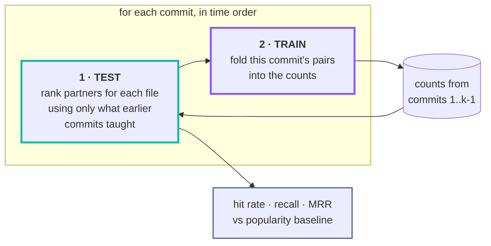
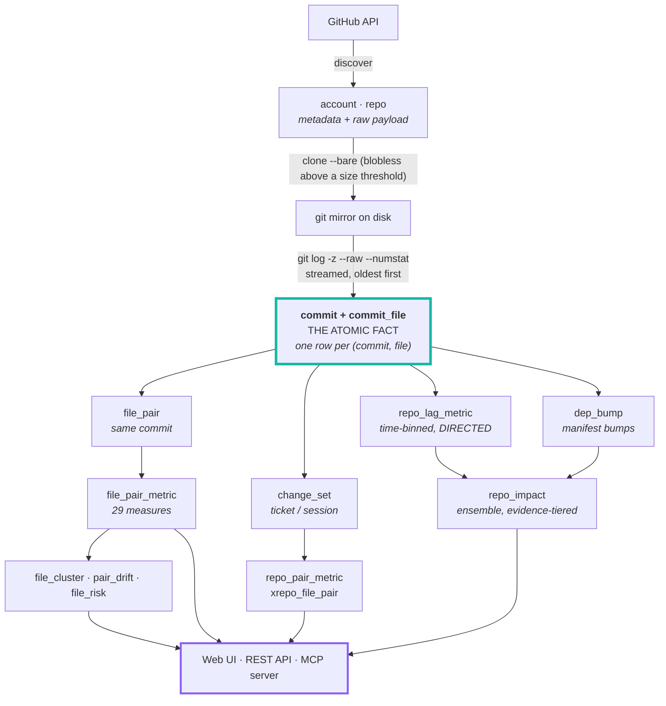
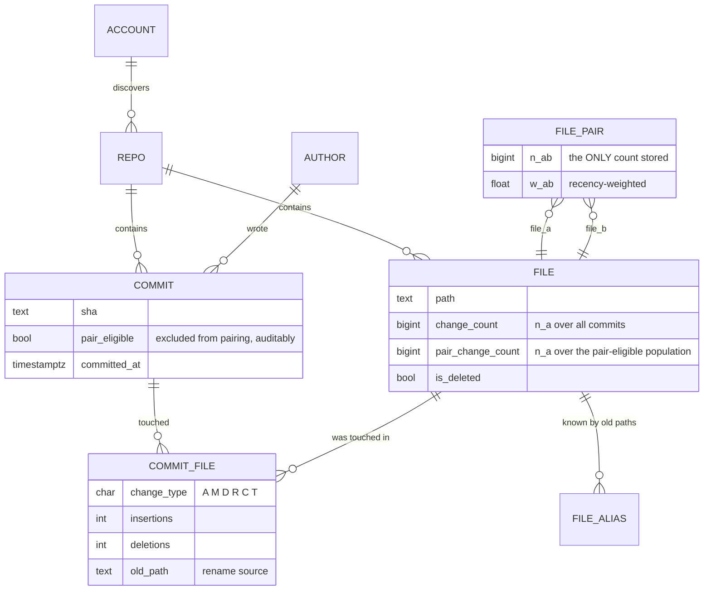

<div align="center">


# Git Synapse

**Change-coupling statistics over git history —<br>so coding agents know what else must change.**


</div>

> When you edit `resource_cluster_aws.go`, history says `resource_cluster_gcp.go` changes
> too — **74% of the time, across 49 shared commits.**

Git Synapse computes that from the commit history of an entire GitHub organisation and
serves it to coding agents over **MCP**, to humans over an **interactive web UI**, and to
scripts over **REST**.

It never parses your code. The atomic fact is *this commit touched this file*, and
everything else is derived from it — which is why it works on any language, in any
repository, with no per-language support to add.

### Contents

| | |
|---|---|
| [What it does](#what-it-does) · [The 29 measures](#the-29-measures) | the idea, and the statistics behind it |
| [**Does it actually help?**](#does-it-actually-help) | the backtest that judges the product, not the corpus |
| [Quick start](#quick-start) · [Which repositories get scanned](#which-repositories-get-scanned) | running it |
| [How it works](#how-it-works) · [What is incremental](#what-is-incremental-and-what-isnt) | the design |
| [Using it from a coding agent](#using-it-from-a-coding-agent-mcp) · [The web UI](#the-web-ui) | the interfaces |
| [CLI](#cli) · [Configuration](#configuration) · [Development](#development) | operating it |

---

## What it does

Git Synapse mirrors every repository in a GitHub organisation, reduces their histories
to a single atomic fact table — *this commit touched this file* — and derives
coupling at three levels:

| Level | Question | Unit of co-occurrence |
|---|---|---|
| **File** | "I'm editing `auth.go`, what else?" | the same commit |
| **Cross-repo** | "I'm changing `runtime`, where does this really belong?" | the same *change set* |
| **Transitive** | "does `signer` reach `runtime`, and how?" | composed path over validated edges |

### The 29 measures

Every measure is a pure function of the same 2×2 contingency table. For two items
A and B over N observations: **a** = both changed, **b** = only A, **c** = only B,
**d** = neither.

| Family | Measures |
|---|---|
| **Similarity & overlap** | Jaccard, Dice, Sørensen, Ochiai, Simpson (overlap), Braun-Blanquet, Kulczynski, Fager |
| **Matching coefficients** | Russell-Rao, Sokal-Michener, Rogers-Tanimoto, Hamann, Faith |
| **Information theoretic** | Mutual Information, PMI, NPMI, PPMI |
| **Significance tests** | Chi-square, Log-likelihood ratio (G²), T-score, Z-score, Poisson, Hypergeometric (Fisher exact) |
| **Correlation** | Phi, Cramér's V, Yule's Q, Yule's Y, Michael |
| **Probability & lift** | Association strength |

Plus two directional extras — `P(B|A)` and `P(A|B)` — which are not symmetric and
are usually the most actionable numbers of all.

The same 31 columns are computed at every level, because widening the unit of
co-occurrence is all that changes. Swap *commit* for *change set* and the whole
measure registry applies to cross-repo coupling untouched.

**They disagree, and that is the point.** On a real repository, ranked by each:

```
npmi                   ->   1.000  (n_ab=  3)  50-testing.md <-> 03-resource-patterns.md
jaccard                ->   1.000  (n_ab=  3)  50-testing.md <-> 03-resource-patterns.md
association_strength   -> 347.500  (n_ab=  2)  cluster_cloudstack.md.tmpl <-> resource.tf
log_likelihood_ratio   -> 668.946  (n_ab=177)  go.sum <-> go.mod
fager                  ->   0.923  (n_ab=177)  go.sum <-> go.mod
```

The first three show textbook **rare-item bias**: a pair seen twice, always
together, maxes out any unpenalised measure. Log-likelihood and Fager — which
weight evidence — find the real answer. The UI labels every biased measure, and
`/validation` reports which ones actually predict reality.

## Does it actually help?

Every other number here describes your corpus. This one describes **the product**,
and it is the honest one to look at first:

```bash
docker compose run --rm cli backtest
```

It replays history commit by commit. Before each commit is revealed it asks
*"given one file this commit touched, would we have named the others?"* — scoring
against only the counts accumulated from **earlier** commits, then folding that
commit in. A pair never contributes evidence to its own prediction, which is the
entire difficulty in evaluating a co-change model.



The arrow only ever points forwards: commit *k* is scored before it is learned
from, so no pair can vouch for itself.

```
 measure            hit rate       95% CI   lift  recall    MRR
 Most-changed          43.4%  35.5%-51.5%      -   0.146      -
 files (baseline)
 confidence_ab         32.2%  25.1%-40.2%  0.74x   0.118  0.253
 jaccard               31.5%  24.4%-39.5%  0.73x   0.101  0.243
 npmi                  30.1%  23.2%-38.0%  0.69x   0.088  0.247
 association_stre…     28.7%  21.9%-36.6%  0.66x   0.082  0.200  rare-item bias
```

**Read that carefully: on a small repository every measure loses to the
baseline.** That is the tool being honest rather than flattering, and it is why
three things are always reported next to the hit rate:

| | Why it is there |
|---|---|
| **Lift over a popularity baseline** | A baseline that ignores coupling and just names the busiest files. Where `go.mod` and `go.sum` always move together, guessing wins. **Lift ≤ 1.0 means the statistics earned nothing.** |
| **95% confidence interval** | So a gap between two measures is not mistaken for a real difference when the sample cannot support it. |
| **`rare-item bias` flag** | Some measures top the table *because* they are biased. The registry knows which, and says so. |

Below 300 prompts the run refuses to draw a conclusion and labels itself
*indicative only*. Intervals assume independent prompts; several prompts drawn
from one commit are not independent, so the true interval is a little wider than
the one printed.

Why the materialised tables cannot be used for this: `file_pair_metric` is computed
over **all** history, so any query against it has already seen the future. The
backtest recomputes from the atomic `commit_file` rows with a time cutoff — which
is exactly what ["store the atom, derive the rest"](#store-the-atom-derive-the-rest)
buys you.

```bash
cli backtest --repo my-service        # one repository
cli backtest --measure npmi,jaccard   # specific measures
cli backtest --top 10 --min-support 3 # 10 suggestions, stronger evidence
```

## Quick start

Requires only a container runtime. No host Python, git, or Postgres.

```bash
cp .env.example .env      # add a GITHUB_TOKEN with `repo` scope
docker compose up -d      # postgres + api + scheduler + mcp
```

Then open **http://localhost** (or `:8080`) and add the organisations or user
accounts to scan on the **Accounts** page — or from the CLI:

```bash
docker compose run --rm cli account add my-org
docker compose run --rm cli account add my-org --no-forks --no-archived
docker compose run --rm cli account add someone --kind user
docker compose run --rm cli ingest --all
```

### Which repositories get scanned

Accounts live in the database, not the environment, so onboarding one is a write
rather than a redeploy. Any number can be added, and each carries its own
filters — the reason to skip forks in one org rarely applies to the next.

| Per account | Effect |
|---|---|
| `only_repos` | Allowlist. When set, **overrides every filter below**. |
| `skip_repos` | Denylist, applied after the include filters. |
| include forks / archived / private | Default on; private needs a token with `repo` scope. |
| enabled | Pause an account without deleting what it has already produced. |

Removing an account **keeps** its repositories and everything mined from them —
the statistics are the expensive part, and they stay valid whether or not the
account that discovered them is still listed. Those repositories simply stop
being refreshed.

`GITHUB_ORG` still exists, but only as a seed: if it is set and no accounts are
configured yet, it is adopted once on first discovery so an existing deployment
keeps working after upgrading. It is ignored thereafter.

### Nicer URL, and keeping it running (macOS)

```bash
make hostname-install     # maps http://git-synapse -> 127.0.0.1  (asks for sudo)
make daemon-install       # LaunchAgent: starts Colima + the stack at login
make daemon-status        # agent state, recent log, next scheduled runs
```

`hostname-install` appends one line to `/etc/hosts`, so the UI is just
**http://git-synapse** — the API publishes port 80 as well as 8080.

`daemon-install` matters more than it looks. Compose's `restart: unless-stopped`
brings containers back whenever the Docker daemon returns, but **Colima is a
per-user VM that does not start at login**, so after a reboot the whole stack —
scheduler included — stays down. The LaunchAgent starts Colima, waits for the
Docker socket, brings the stack up, and confirms the API answers. It re-checks
every 5 minutes and exits silently when everything is already healthy, so it also
recovers from Colima being stopped by hand. Verified by stopping all four
containers: restored and healthy in 8 seconds.

| Service | Port | Purpose |
|---|---|---|
| `api` | 80, 8080 | REST API + web UI (`/api/docs` for OpenAPI) |
| `mcp` | 8081 | MCP server over streamable HTTP at `/mcp` |
| `postgres` | 55432 | Database |
| `scheduler` | — | Two-tier refresh, see below |

### Refresh schedule

| Tier | Default | What it does |
|---|---|---|
| **fast** (`REFRESH_CRON`) | `*/15 * * * *` | Fetch known repos, rebuild whatever moved. ~60 s. No GitHub API calls. |
| **discovery** (`DISCOVER_CRON`) | `0 3 * * *` | Additionally re-list the org to pick up new, renamed or archived repos. |

Split because the two halves cost very differently: the fast tier is almost
entirely git fetches, while discovery is the only part that spends API quota — and
new repositories do not appear every quarter hour. A tick is skipped outright if
the previous one is still running, so a slow run can never overlap the next.

Set `REFRESH_CRON=*/5 * * * *` for near-real-time, or `0 * * * *` to be gentler.

### Measured on a 272-repository organisation

| | |
|---|---|
| Repositories ingested | **272 / 272**, 0 failures |
| Initial full ingest | **337 s** (8 workers) |
| Nightly incremental run (everything) | **216 s** |
| Commits analysed | 298,800+ |
| Atomic `(commit × file)` facts | 4,274,784 |
| Files tracked | 1,177,848 (124,774 renames followed) |
| File coupling pairs scored | 1,629,560 × 31 measures |
| Change sets | 122,062 (20,580 ticket-linked) |
| Cross-repo pairs | 1,120 repo-level, 57,918 file-level |
| Directed lagged rows | 260,817 (266 repos × 21,326 bins × 8 lags) |
| Manifest-bump ground truth | 6,388 edges, 4,074 resolved to an exact commit |
| Impact edges | 532 (125 declared, 215 bump-backed) |
| De-facto modules | 4,394 (1,389 cross-directory) |
| Risk-scored files | 1,147,836 |
| Mirrors on disk | 11.1 GB |
| Database | 8.5 GB |
| API latency | 10–70 ms typical, 220 ms worst |
| Prediction quality | **AUC 0.88** in sample within the declared candidate set; **0.69** held out in time |

---

## How it works



Everything below the atomic fact is **derived and rebuildable**.

### Store the atom, derive the rest

The design constraint driving the schema is that **no aggregate is
authoritative**. The only thing that cannot be recomputed is `commit_file`: one
row per (commit, file), with change type, line counts, rename source and
similarity.

Everything else — marginals, joint counts, all 29 measures, directory rollups,
change sets, lagged tables, impact scores, clusters, drift, risk — is a
materialised cache. Consequences:




- Adding a 30th measure is one function plus one registry entry, then
  `git-synapse score`. No re-clone, no re-parse.
- Changing the fan-out cap, support threshold, session gap, ticket pattern or
  lag bin width is a re-aggregate, not a re-ingest.
- The contingency cells `(n_ab, n_a, n_b, N)` sit beside every score, so any
  number in the UI traces back to four counts and then to actual commits.

### Cross-repository coupling: the change set

Two repositories never share a commit, so "changed together" needs a wider unit.
Every pair-eligible commit lands in exactly one **change set**, which makes them a
partition and `N` unambiguous:

1. **ticket** — the subject carries an issue key (`ACME-2330`). All commits sharing
   it form one change set. Precise: 1,709 keys span more than one repository here.
   But coverage is uneven — `telemetry` is 37% keyed, `signer` is 0%.
2. **temporal** — otherwise, consecutive commits by one author with no gap longer
   than `SESSION_GAP_HOURS`. This reaches repos with no commit-message
   convention, at the cost of noise from unrelated same-afternoon work.

`repo_pair.n_ab_ticket` records how much of each pair's evidence came from
explicit ticket links rather than timing, so the UI can show "12 of 47
ticket-backed" and a reader can discount the rest.

**Single-repo change sets are kept deliberately.** It is tempting to store only
multi-repo ones, but the contingency table needs the cells where A changed
*without* B. Dropping them would make every change set multi-repo, drive those
cells to zero, and inflate every score toward 1.0.

### Direction: the lagged table

The symmetric tables cannot express propagation, which is the pattern that
matters for a dependency chain:

```
signer  merged 2026-06-26 22:11
packager  bumped 2026-06-26 22:45   (+34 min)
runtime  bumped 2026-06-27 00:36   (+2h25m)
```

So time is binned, each repository becomes a binary vector over bins, and for an
ordered pair (A, B) at lag *k* the 2×2 table is formed between A's vector and B's
vector **shifted by k**. All 29 measures then apply unchanged but become
directional — `A→B` scoring far above `B→A` is exactly the statement "A's changes
precede B's".

The whole computation is one matrix product per lag: with a binary matrix `M`
of shape (repos, bins), the joint counts for every ordered pair are
`M @ shift(M, k).T`. 266 repositories over 21,326 six-hour bins across eight lags
takes ~12 seconds.

### Ground truth, and what it revealed

A Go pseudo-version embeds the upstream commit it was cut from:

```
github.com/acme/signing/v3 v3.0.0-20260626221153-5fc63d6f3055
                                                  ^^^^^^^^^^^^
```

So a `go.mod` diff is a **dated, directional, provable** propagation edge.
Recovering 6,388 of them gave a labelled set to validate against — and the answer
was not flattering to pure statistics:

| Approach | AUC | Directional accuracy |
|---|---|---|
| Best single measure over all ordered pairs | 0.80 | **0.63** |
| Declared dependencies alone | — precise, but 4 of telemetry's 11 never co-change | — |
| **Ensemble ranked within the declared set, in sample** | **0.884** | — |
| **The same, held out in time** (features pre-2025, labels after) | **0.685** | — |

There is no cross-validation figure here on purpose. The ensemble is an
unweighted mean of fixed measures with no fitted parameters, so folds train
nothing and the spread across them is subsample noise, not generalisation error.
The honest generalisation number is the held-out-in-time row above.

Two caveats on the in-sample figure, both measured. Every declared candidate has
at least one bump, so the label is "bumped once or more than once" -- a
bump-frequency question, not purely a coupling one. And a coupling-free baseline,
the consumer repository's raw commit count, reaches 0.803 on the same task
against the ensemble's 0.859, so activity confounding is present inside the
declared set too, not only outside it. 

**A high AUC is not the same as a useful answer.** The measure that tops the
global table is Russell-Rao — `a / N`, pure joint frequency — which scores 0.80 by
ranking *both repositories are busy* while managing only 0.63 on which way the
arrow points. That is **activity confounding**, and it is why the discovery tier
deliberately excludes every frequency-weighted measure.

Restricting candidates to declared dependencies lifts the base rate from 0.23% to
82% — a ~350× prior — before any measure is evaluated.

This is why every cross-repo row carries an **evidence tier**, and why the UI
never mixes them in one sorted column:

| Tier | Meaning | Trust |
|---|---|---|
| `declared` | the consumer declares it in a manifest | validated, AUC 0.86 in sample |
| `bump-backed` | an actual version bump was observed | ground truth |
| `discovery` | statistical only | unvalidated — verify before acting |

Discovery uses a deliberately different measure set (NPMI, phi, Ochiai — all
normalised by both marginals) because the frequency-weighted measures are exactly
what let a busy repository look coupled to everything.

### The mining layer

- **De-facto modules** — label propagation over the file-coupling graph. The
  valuable output is its *disagreement* with the directory tree: 1,389 clusters
  here span more than one top-level folder.
- **Coupling drift** — the same association recomputed on a recent window and the
  preceding history. A pair coupled three years ago but not since is a finished
  refactor, and reporting it as current coupling is an easy way to mislead an
  agent.
- **Ownership risk** — Herfindahl concentration over each author's share of a
  file's commits, giving an *effective* contributor count. Three authors at
  98/1/1 has a bus factor near 1, not 3.

### Choices that materially affect the numbers

- **Population.** `N` is `repo.pair_population` — commits *eligible to contribute
  a pair* — not the total commit count. Marginals use the same population, so
  `n_ab > n_a` is impossible by construction.
- **Fan-out cap** (`MAX_FILES_PER_COMMIT`, default 60). A commit touching k files
  produces k(k−1)/2 pairs. Bulk reformats would dominate every count while
  carrying no design signal, so they are stored in full but flagged
  `pair_eligible = FALSE` — excluded, auditable, reversible.
- **Change-set width cap** (`MAX_REPOS_PER_CHANGESET`, default 8). An org-wide
  dependabot sweep touching 61 repositories is not a design signal.
- **Lag bin width** (`LAG_BIN_HOURS`, default 6). At 24 hours, directional
  accuracy drops from 0.70 to 0.64 and a 34-minute propagation is invisible.
- **Merges** are skipped: they restate their parents' changes.
- **Renames** keep a file's identity — history is walked oldest-first, so a moved
  file keeps one id and one continuous history.
- **Infeasible tables are clamped.** A 2×2 table only exists when
  `max(0, n_a + n_b − N) ≤ n_ab ≤ min(n_a, n_b)`. Without clamping, a bad
  aggregation yields things like φ = −7.9.
- **Corrupt commit dates cannot set the time origin.** Four epoch-dated commits
  once stretched the lag axis from 2,200 bins to 20,687, inflating `N` tenfold.

---

## What is incremental, and what isn't

The nightly job updates everything automatically. It is not uniformly
*incremental*, and the distinction matters if you are reasoning about cost.

| Stage | Incremental? | How it is gated |
|---|---|---|
| git fetch | **yes** | fetch into an existing mirror, never re-clone |
| commit parsing | **yes** | every branch tip stored in `repo.last_ingested_refs`; only new commits are read |
| aggregate + score | **yes** | per repo, `last_aggregate_at < last_ingest_at` |
| manifest bumps | **yes** | per repo, `last_depbump_sha <> head_sha` |
| declared dependencies | **yes** | same sha watermark; per-repo delete-and-reinsert, so a *removed* dependency still disappears |
| change sets | **yes** | only the tickets and authors touched by new commits are re-partitioned |
| lagged coupling | **skipped when unchanged** | input fingerprint over pair-eligible commits |
| impact prediction | **skipped when unchanged** | fingerprint over its three input tables |
| mining | **yes** | per repo, `last_mining_at < last_aggregate_at` |

Two stages are deliberately *recomputed whole* rather than delta-merged when
their inputs do move:

- **Lagged coupling** — the computation *is* one matrix product per lag. A delta
  would still multiply the changed repository's row against every other
  repository across every bin, so there is nothing cheaper to do. 12 s.
- **Cross-repo marginals and scores** — adding any change set shifts the
  population `N`, and `N` appears in every pair's contingency table. Recomputing
  is ~4 s and provably consistent; delta-merging would let stored values drift
  from the true ones.

Verified by fingerprinting: an incremental pass over unchanged data reproduces
the change-set table byte-for-byte, and re-scoring a repository is bit-identical.

Two watermark bugs found while validating this, both of which silently defeated
the gating:

- `last_ingest_at` advances on every run whether or not commits land, so a
  timestamp comparison re-scanned all 187 manifest-bearing repos nightly. Now
  keyed on `head_sha`.
- 73 commits have neither an author nor a ticket key, so they can never join a
  change set — but they were counted as pending work, which made the change-set
  early return unreachable.

Force a complete rebuild after changing a tuning knob:

```bash
docker compose run --rm cli ingest --force-full     # everything
docker compose run --rm cli crossrepo --force       # after SESSION_GAP_HOURS / TICKET_PATTERN
docker compose run --rm cli mine --force            # after a mining threshold
```

## Teaching an agent to use it

A model handed the MCP tools does not automatically know when to reach for them,
or — more importantly — **when not to act on a result**. Naive use of coupling
data makes an agent worse, not better.

One standalone file covers it: **`skills/git-synapse-mcp/SKILL.md`**. Plain markdown,
visible folder, no companions.

```bash
make skills-install     # symlink into ~/.claude/skills so it loads in every repo
make skills-uninstall
```

A symlink, not a copy, so editing `skills/` updates it everywhere. This matters
because a skill only loads when the agent starts in a directory that can see it —
and the point is to use it while coding in `telemetry` or `runtime`, not here.

The same guidance is also embedded in the MCP server's own `instructions`, which
clients receive on `initialize`. That covers an agent that has only wired up the
MCP server and never sees this repository at all.

Every tool name, parameter and response field the file cites is checked against
the live server, and every statistic in it against the live database.

## Using it from a coding agent (MCP)

The MCP server runs on port 8081. Register it with Claude Code:

```bash
claude mcp add --transport http git-synapse http://localhost:8081/mcp
```

Or run it as a subprocess over stdio:

```json
{
  "mcpServers": {
    "git-synapse": {
      "command": "docker",
      "args": ["compose", "-f", "/abs/path/to/git-synapse/docker-compose.yml",
               "run", "--rm", "-T", "cli",
               "python", "-m", "git_synapse.mcp.server", "--transport", "stdio"]
    }
  }
}
```

### Twelve tools

**Within a repository**

| Tool | Purpose |
|---|---|
| `coupled_files` | What changes with this file, ranked, with confidence. |
| `explain_pair` | Full 2×2 table, all 29 measures, and the commits as evidence. |
| `file_history` | Recent commits and top authors for a file. |
| `search_files` | Find a file by path substring. |
| `repo_hotspots` | Churn leaders — how to orient in an unfamiliar repo. |

**Across repositories**

| Tool | Purpose |
|---|---|
| `upstream_repos` | **The one that prevents incomplete changes.** Repos whose changes *precede* this one — where a fix may actually belong. |
| `impact_of_change` | The forward direction: what a change here forces others to update. |
| `coupling_chain` | Multi-hop paths, e.g. `signer → packager → runtime`, with composed confidence. |
| `crossrepo_files` | Which specific file in another repo goes with this one. |
| `explain_repo_pair` | Declared status, every observed bump with exact upstream commits, propagation lag. |
| `list_repositories` | What is in the corpus. |
| `list_measures` | The catalogue, with caveats on each measure. |

### The workflow it exists for

An agent asked to fix a registry bug opens `runtime`, finds the symptom, and
patches it there. The defect was actually in `signer`, two hops upstream. That
was a real occurrence, and it is what these tools prevent:

```
upstream_repos("runtime") ->
   0.912  packager    declared   85 bumps   lag=0.11d
   0.872  signer    declared   18 bumps   lag=1.01d

coupling_chain("runtime", direction="upstream") ->
   runtime <- packager <- signer     confidence 0.600

explain_repo_pair("signer", "packager") ->
   packager declares signer in go.mod; has bumped it 29 times
   bump dcc6bc6092 <- signer@5fc63d6f3055   lag 0.02d
```

That last line is the ground truth: `dcc6bc6092` is packager's merge commit and
`5fc63d6f3055` is signer's — the two PRs that actually fixed the bug, recovered
from the pseudo-version in a `go.mod` diff.

Responses carry an explicit `evidence` field (`declared` / `bump-backed` /
`discovery`) and a plain-language `interpretation`, because a model acts more
reliably on *"changes together 74% of the time — very likely needs updating too"*
than on a bare float, and needs to be told which tier it can trust.

## The web UI

Real paths (History API), not hash fragments — `/insights` is bookmarkable and
survives a refresh. Everything is clickable; every table sorts on every column.

| View | What it shows |
|---|---|
| **Overview** | Corpus stats across all layers, strongest couplings, recent jobs. |
| **Repositories** | Filter by language, visibility, status; drill into any repo. |
| **Repository** | Hotspots, coupled pairs, files, directories, **cross-repo impact**, **de-facto modules**, **risk**, full metadata. |
| **File** | Ranked partners with directional probabilities, history, authors. |
| **Pair** | The 2×2 table as a grid, all 29 measures with bars, and the commits behind them. |
| **Impact** | Upstream/downstream per repo with evidence tiers, transitive chains, declared deps and observed bumps. |
| **Repo pair** | **Directional lag profile** — two curves whose gap *is* the directional evidence — plus shared change sets. |
| **Cross-repo** | Repo-level and file-level coupling, ticket-backed ratios, recent change sets. |
| **Insights** | Risk & bus factor, coupling drift (emerging vs decaying), de-facto modules. |
| **Validation** | AUC / precision / directional accuracy per measure, against manifest-bump ground truth. |
| **Graph** | Force-directed coupling network, at file level or repository level. |
| **Measures** | The catalogue with formula, guidance and caveats. |

The measure selector in the header is global: pick Log-likelihood and every
ranking re-sorts. Press `/` to focus search.

No build step, no framework, no CDN — three static files served by FastAPI.

## CLI

```bash
docker compose run --rm cli <command>
```

| Command | Purpose |
|---|---|
| `account add LOGIN` | Add an org (`--kind user` for a user). `--no-forks`, `--no-archived`, `--no-private`, `--only`, `--skip`. |
| `account list` / `remove ID` / `enable ID [--off]` | Inspect, drop or pause an account. |
| `discover` | List every configured account's repos and the mirror mode each would use. Clones nothing. |
| `ingest --all` | Full pipeline. `--repo NAME` to limit, `-j N` for concurrency, `--force-full` to ignore watermarks. |
| `aggregate` | Rebuild pair tables from the atomic facts. |
| `score` | Recompute the 29 measures. Run this after adding a measure. |
| `coupled REPO PATH` | The core query, from the shell. `-m` to pick a measure. |
| `measures` | Print the catalogue. |
| `status` | Corpus summary and recent runs. |
| `reset --yes` | Drop ingested data, keep the schema and the mirrors. |
| `crossrepo` | Rebuild change sets, repo pairs and cross-repo file pairs. |
| `depbump` | Extract manifest-bump edges; prints observed propagation lags. |
| `lagged` | Compute directed, time-lagged coupling. |
| `impact REPO` | What else to look at when changing a repo (`-d upstream\|downstream`). |
| `chains REPO` | Transitive coupling chains. |
| `xcoupled REPO` | Which other repositories change together with this one. |
| `mine` | Rebuild de-facto modules, coupling drift and file risk. |
| `validate` | Measure quality against manifest-bump ground truth. |
| `backtest` | Replay history and report whether the suggestions would have helped. |

```
$ docker compose run --rm cli coupled terraform-provider-acme \
    acme/resource_cluster_aws.go -m log_likelihood_ratio

  log_likelihood_ratio  P(also|this)  n_ab      G2  file
                237.24           74%    49  237.2  acme/resource_cluster_gcp.go
                211.36           76%    50  211.4  acme/resource_cluster_azure.go
                181.63           74%    49  181.6  acme/resource_cluster_vsphere.go
```

---

### Housekeeping targets

| Target | Purpose |
|---|---|
| `make skills-install` / `-uninstall` | Symlink `skills/git-synapse-mcp` into `~/.claude/skills` |
| `make hooks-install` / `-uninstall` | Date every new commit to the nearest weekend ([below](#weekend-commit-dates)) |
| `make hostname-install` / `-uninstall` | Map / unmap `http://git-synapse` in `/etc/hosts` |
| `make daemon-install` / `-uninstall` | Install / remove the macOS LaunchAgent |
| `make daemon-status` | Agent state, daemon log tail, next scheduled runs |
| `make logs` | Tail all service logs |
| `make psql` | Open a psql shell |
| `make nuke` | Stop everything and delete the database and mirrors |

### Weekend commit dates

`make hooks-install` points `core.hooksPath` at `scripts/hooks`, whose
`post-commit` hook re-dates each new commit to the nearest weekend. Commit on a
Wednesday afternoon and it lands on the preceding Sunday, same clock time; both
the author and committer dates move together.

| You commit | It is dated |
|---|---|
| Mon / Tue / Wed | the preceding Sunday |
| Thu / Fri | the preceding Sunday |
| Sat / Sun | unchanged |

A hook cannot set `GIT_AUTHOR_DATE` for the commit that invoked it — the
environment it exports dies with the hook process — so it amends instead. That is
safe because the commit is local and unpushed at that point, and it means the
date is settled before a push ever happens: **when you push makes no difference.**

Two details worth knowing:

- **Never the future.** Thursday's *nearest* weekend is the coming Saturday, but
  dating a commit ahead of the moment it was made is worse than moving it further,
  so the hook falls back to the preceding weekend.
- **Replays are left alone.** During a rebase, cherry-pick or revert the hook
  exits immediately; those commits already have settled dates.

Skip it for one commit with `GIT_SYNAPSE_NO_WEEKEND=1 git commit ...`, or turn it
off entirely with `make hooks-uninstall`. Neither changes existing history.

## Configuration

All configuration is environment variables; see `.env.example` for the annotated list.
The ones that change the numbers:

| Variable | Default | Effect |
|---|---|---|
| `MAX_FILES_PER_COMMIT` | 60 | Fan-out cap for pair eligibility. |
| `MIN_PAIR_SUPPORT` | 2 | Co-changes required to persist a pair. |
| `INCLUDE_MERGES` | false | Merge commits restate their parents' changes. |
| `RENAME_SIMILARITY` | 50 | Rename threshold (%) for fully-cloned repos. |
| `BLOBLESS_THRESHOLD_KB` | 2 GiB | Above this, mirror without blobs. |
| `RECENCY_HALF_LIFE_DAYS` | 365 | Half-life for the recency-weighted `w_ab`. |
| `REFRESH_CRON` | `0 3 * * *` | Daily refresh schedule. |
| `INGEST_CONCURRENCY` | 8 | Repositories processed in parallel. |
| `SESSION_GAP_HOURS` | 4 | Commits by one author within this gap form one change set. |
| `TICKET_PATTERN` | JIRA-style | Regex for an issue key in a commit subject. |
| `MAX_REPOS_PER_CHANGESET` | 8 | Wider change sets are excluded from pairing. |
| `LAG_BIN_HOURS` | 6 | Time-bin width for directional analysis. |
| `MIN_XREPO_SUPPORT` | 2 | Shared change sets before a cross-repo pair persists. |
| `CHAIN_MIN_CONFIDENCE` | 0.15 | Per-hop floor when following chains. |

After changing an ingest knob: `docker compose run --rm cli aggregate`.
After changing a cross-repo knob: `crossrepo`, then `lagged`, then `impact`.

---

## Portability

The stack is four containers and two volumes. To move it to another machine — Linux, or
anywhere with a container runtime:

```bash
git clone <this repo> && cd git-synapse
cp .env.example .env && $EDITOR .env     # add GITHUB_TOKEN
docker compose up -d
docker compose run --rm cli ingest --all
```

Nothing is host-specific. To carry the data across instead of re-ingesting:

```bash
docker compose exec -T postgres pg_dump -U git_synapse git_synapse | gzip > git-synapse.sql.gz   # export
gunzip -c git-synapse.sql.gz | docker compose exec -T postgres psql -U git_synapse git_synapse   # import
```

The mirrors do not need to move — a fresh `ingest` re-clones them, and the watermarks in
the database make it incremental.

---

## Development

```bash
python3.12 -m venv .venv && .venv/bin/pip install -r requirements.txt pytest
docker compose up -d postgres
POSTGRES_HOST=127.0.0.1 POSTGRES_PORT=55432 PYTHONPATH=src .venv/bin/python -m pytest -q
```

Integration tests skip cleanly when no database is reachable.

| Test file | Covers |
|---|---|
| `test_measures.py` | All 29 measures against hand-computed values, plus bounds, symmetry, degenerate tables, and independence limits. |
| `test_store.py` | Loader: flush boundaries, idempotent re-ingest, rename identity, fan-out cap. |
| `test_analysis.py` | The whole pipeline: a synthetic history with a known answer, aggregated and scored through real SQL, compared against the measures computed directly. |
| `test_crossrepo.py` | Change-set partitioning, that single-repo sets survive, that the lagged table is genuinely directional, that a corrupt date cannot stretch the time axis, and that chains never traverse an unvalidated hop. |
| `tests/ui/` | Optional headless UI smoke test — boots the real front-end in jsdom against a running API and drives all 18 routes. Needs Node; see its README. |

### Adding a measure

1. Add a vectorised function to `src/git_synapse/stats/measures.py`.
2. Add a `MeasureSpec` to `src/git_synapse/stats/registry.py`.
3. Add the column to `file_pair_metric` and `dir_pair_metric` in `schema.sql`.
4. `docker compose run --rm cli score`.

The API, MCP server, CLI and UI all enumerate from the registry, so nothing else changes.

---

## Layout

```
src/git_synapse/
  stats/       contingency tables + the 29 measures + registry   (pure, no I/O)
  db/          schema.sql, connection pool, COPY helpers
  ingest/      github discovery, git mirroring, log parser, loader, pipeline
  analysis/    aggregation, scoring, read queries
               crossrepo.py  change sets, repo pairs, cross-repo file pairs
               lagged.py     directed time-lagged coupling (matrix products)
               depbump.py    manifest-bump ground truth + declared deps
               predict.py    the evidence-tiered impact ensemble
               mining.py     de-facto modules, drift, ownership risk
               validate.py   AUC / precision / directional accuracy
  api/         FastAPI app and routes
  mcp/         MCP server
  scheduler/   daily refresh
  cli.py       Typer CLI
web/           index.html + app.js + graph.js + style.css   (no build step)
skills/
  git-synapse-mcp/    SKILL.md   -- standalone: how an agent should use the MCP server
docker/        Dockerfile (one image, four services)
tests/
```
