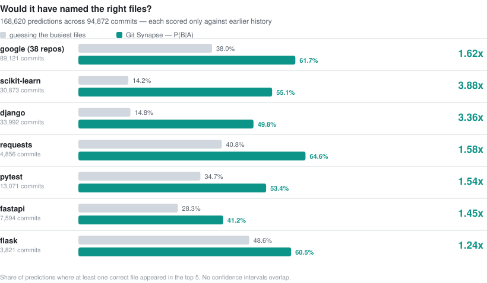
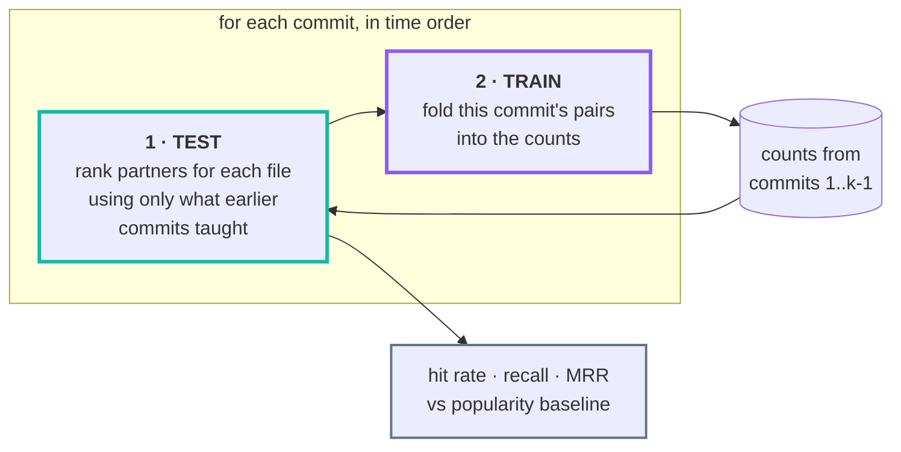

<div align="center">


# Git Synapse

**Change-coupling statistics over git history —<br>so coding agents know what else must change.**


</div>

> When you edit `resource_cluster_aws.go`, history says `resource_cluster_gcp.go` changes
> too — **74% of the time, across 49 shared commits.**

Git Synapse computes that from the commit history of an entire GitHub organisation and
serves it to coding agents over **MCP**, to humans over an **interactive web UI**, and to
scripts over **REST**.

It never parses your code. The atomic fact is *this commit touched this file*, and
everything else is derived from it — which is why it works on any language, in any
repository, with no per-language support to add.

<picture>
  <source media="(prefers-color-scheme: dark)" srcset="docs/benchmark-dark.svg">
  
</picture>

<div align="center"><sub><b>Backtested, not asserted.</b> Every prediction scored against
only the commits that preceded it — <a href="#does-it-actually-help">how this is measured</a>.</sub></div>

### Contents

| | |
|---|---|
| [What it does](#what-it-does) · [The 29 measures](#the-29-measures) | the idea, and the statistics behind it |
| [**Does it actually help?**](#does-it-actually-help) | the backtest that judges the product, not the corpus |
| [Quick start](#quick-start) · [Which repositories get scanned](#which-repositories-get-scanned) | running it |
| [Using it from a coding agent](#using-it-from-a-coding-agent-mcp) · [The web UI](#the-web-ui) | the interfaces |
| [CLI](#cli) · [Configuration](#configuration) · [Development](#development) | operating it |
| [**DESIGN.md**](DESIGN.md) | how it works inside: the schema, every table, the trade-offs |

---

## What it does

Git Synapse mirrors every repository in a GitHub organisation, reduces their histories
to a single atomic fact table — *this commit touched this file* — and derives
coupling at three levels:

| Level | Question | Unit of co-occurrence |
|---|---|---|
| **File** | "I'm editing `auth.go`, what else?" | the same commit |
| **Cross-repo** | "I'm changing `runtime`, where does this really belong?" | a declared dependency |
| **Transitive** | "does `signer` reach `runtime`, and how?" | composed path over declared edges |

### The 29 measures

Every measure is a pure function of the same 2×2 contingency table. For two items
A and B over N observations: **a** = both changed, **b** = only A, **c** = only B,
**d** = neither.

| Family | Measures |
|---|---|
| **Similarity & overlap** | Jaccard, Dice, Sørensen, Ochiai, Simpson (overlap), Braun-Blanquet, Kulczynski, Fager |
| **Matching coefficients** | Russell-Rao, Sokal-Michener, Rogers-Tanimoto, Hamann, Faith |
| **Information theoretic** | Mutual Information, PMI, NPMI, PPMI |
| **Significance tests** | Chi-square, Log-likelihood ratio (G²), T-score, Z-score, Poisson, Hypergeometric (Fisher exact) |
| **Correlation** | Phi, Cramér's V, Yule's Q, Yule's Y, Michael |
| **Probability & lift** | Association strength |

Plus two directional extras — `P(B|A)` and `P(A|B)` — which are not symmetric and
are usually the most actionable numbers of all.

The same 31 columns are computed at every level, because widening the unit of
co-occurrence is all that changes. Cross-repository relationships do not use them
at all: they come from what a manifest declares, which is provable rather than
inferred.

**They disagree, and that is the point.** On a real repository, ranked by each:

```
npmi                   ->   1.000  (n_ab=  3)  50-testing.md <-> 03-resource-patterns.md
jaccard                ->   1.000  (n_ab=  3)  50-testing.md <-> 03-resource-patterns.md
association_strength   -> 347.500  (n_ab=  2)  cluster_cloudstack.md.tmpl <-> resource.tf
log_likelihood_ratio   -> 668.946  (n_ab=177)  go.sum <-> go.mod
fager                  ->   0.923  (n_ab=177)  go.sum <-> go.mod
```

The first three show textbook **rare-item bias**: a pair seen twice, always
together, maxes out any unpenalised measure. Log-likelihood and Fager — which
weight evidence — find the real answer. The UI labels every biased measure.

Which of them actually predicts is not a matter of opinion here: the
[backtest](#does-it-actually-help) measures it against history, and `P(B|A)`
won every repository tested, which is why it is the default.

## Does it actually help?

Every other number here describes your corpus. This one describes **the product**,
and it is the honest one to look at first:

```bash
docker compose run --rm cli backtest
```

It replays history commit by commit. Before each commit is revealed it asks
*"given one file this commit touched, would we have named the others?"* — scoring
against only the counts accumulated from **earlier** commits, then folding that
commit in. A pair never contributes evidence to its own prediction, which is the
entire difficulty in evaluating a co-change model.



The arrow only ever points forwards: commit *k* is scored before it is learned
from, so no pair can vouch for itself.

```
              backtest: 70,835 prompts over 17,332 commits (top-5)
 measure            hit rate       95% CI   lift  recall    MRR
 Most-changed          14.8%  14.6%-15.1%      -   0.036      -
 files (baseline)
 confidence_ab         49.8%  49.4%-50.2%  3.36x   0.234  0.379
 log_likelihood_r…     48.6%  48.2%-49.0%  3.28x   0.233  0.372
 jaccard               45.7%  45.4%-46.1%  3.08x   0.216  0.338
 npmi                  40.0%  39.6%-40.3%  2.70x   0.190  0.293
 association_stre…     30.9%  30.5%-31.2%  2.08x   0.144  0.195  rare-item bias
```

### Measured result

Backtested over **184,000 commits** — 409,354 prompts, every one scored only
against earlier history ([chart above](#git-synapse)):

| Corpus | Commits | Prompts | Baseline | `P(B\|A)` | Lift |
|---|---:|---:|---:|---:|---:|
| **38 repos from the `google` org** | 89,121 | 240,734 | 38.0% | **61.7%** | **1.62x** |
| django | 33,992 | 70,835 | 14.8% | **49.8%** | **3.36x** |
| scikit-learn | 30,873 | 52,475 | 14.2% | **55.1%** | **3.88x** |
| pytest | 13,071 | 26,966 | 34.7% | **53.4%** | **1.54x** |
| fastapi | 7,594 | 8,380 | 28.3% | **41.2%** | **1.45x** |
| flask | 3,821 | 6,115 | 48.6% | **60.5%** | **1.24x** |
| requests | 4,856 | 3,849 | 40.8% | **64.6%** | **1.58x** |

**Across 38 Google repositories, naming five files gets at least one right 62%
of the time, against 38% for guessing that repository's busiest files.**

Counts are kept per repository, never pooled. Two files in different
repositories cannot co-occur, so a shared population hands the baseline
candidates it can never hit — which does not weaken the baseline honestly, it
breaks it. Pooling the same 38 repositories drove the baseline to 9% and
reported 6.84x, four times the real figure. Confidence intervals do not overlap in any
repository, so these are differences the sample supports.

Two things the benchmark settled that opinion had not:

- **`P(B|A)` wins every repository**, which is why it is the default. It is the
  quantity the question actually asks for — *given A changed, how often did B?*
  The symmetric measures answer "is this association surprising", a better
  question for discovery and a worse one for prediction. `npmi` was the previous
  default and places fourth to ninth, losing outright on flask (0.84x).
- **Lift grows with codebase size and modularity.** The smallest repository
  (flask, 3.8k commits) gains least, and on a *tiny* repository every measure
  loses to the baseline — where two files always move together, guessing wins.

Three things are reported next to the hit rate, because recall alone is a vanity
metric:

| | Why it is there |
|---|---|
| **Lift over a popularity baseline** | A baseline that ignores coupling and just names the busiest files. Where `go.mod` and `go.sum` always move together, guessing wins. **Lift ≤ 1.0 means the statistics earned nothing.** |
| **95% confidence interval** | So a gap between two measures is not mistaken for a real difference when the sample cannot support it. |
| **`rare-item bias` flag** | Some measures top the table *because* they are biased. The registry knows which, and says so. |

Below 300 prompts the run refuses to draw a conclusion and labels itself
*indicative only*. Intervals assume independent prompts; several prompts drawn
from one commit are not independent, so the true interval is a little wider than
the one printed.

Why the materialised tables cannot be used for this: `file_pair_metric` is computed
over **all** history, so any query against it has already seen the future. The
backtest recomputes from the atomic `commit_file` rows with a time cutoff — which
is exactly what ["store the atom, derive the rest"](DESIGN.md#store-the-atom-derive-the-rest)
buys you.

```bash
cli backtest --repo my-service        # one repository
cli backtest --measure npmi,jaccard   # specific measures
cli backtest --top 10 --min-support 3 # 10 suggestions, stronger evidence
```

## Quick start

Requires only a container runtime. No host Python, git, or Postgres.

```bash
cp .env.example .env      # add a GITHUB_TOKEN with `repo` scope
docker compose up -d      # postgres + api + scheduler + mcp
```

Then open **http://localhost** (or `:8080`) and add the organisations or user
accounts to scan on the **Accounts** page — or from the CLI:

```bash
docker compose run --rm cli account add my-org
docker compose run --rm cli account add my-org --no-forks --no-archived
docker compose run --rm cli account add someone --kind user
docker compose run --rm cli ingest --all
```

### Which repositories get scanned

Accounts live in the database, not the environment, so onboarding one is a write
rather than a redeploy. Any number can be added, and each carries its own
filters — the reason to skip forks in one org rarely applies to the next.

| Per account | Effect |
|---|---|
| `only_repos` | Allowlist. When set, **overrides every filter below**. |
| `skip_repos` | Denylist, applied after the include filters. |
| include forks / archived / private | Default on; private needs a token with `repo` scope. |
| enabled | Pause an account without deleting what it has already produced. |

Removing an account **keeps** its repositories and everything mined from them —
the statistics are the expensive part, and they stay valid whether or not the
account that discovered them is still listed. Those repositories simply stop
being refreshed.

`GITHUB_ORG` still exists, but only as a seed: if it is set and no accounts are
configured yet, it is adopted once on first discovery so an existing deployment
keeps working after upgrading. It is ignored thereafter.

### Nicer URL, and keeping it running (macOS)

```bash
make hostname-install     # maps http://git-synapse -> 127.0.0.1  (asks for sudo)
make daemon-install       # LaunchAgent: starts Colima + the stack at login
make daemon-status        # agent state, recent log, next scheduled runs
```

`hostname-install` appends one line to `/etc/hosts`, so the UI is just
**http://git-synapse** — the API publishes port 80 as well as 8080.

`daemon-install` matters more than it looks. Compose's `restart: unless-stopped`
brings containers back whenever the Docker daemon returns, but **Colima is a
per-user VM that does not start at login**, so after a reboot the whole stack —
scheduler included — stays down. The LaunchAgent starts Colima, waits for the
Docker socket, brings the stack up, and confirms the API answers. It re-checks
every 5 minutes and exits silently when everything is already healthy, so it also
recovers from Colima being stopped by hand. Verified by stopping all four
containers: restored and healthy in 8 seconds.

| Service | Port | Purpose |
|---|---|---|
| `api` | 80, 8080 | REST API + web UI (`/api/docs` for OpenAPI) |
| `mcp` | 8081 | MCP server over streamable HTTP at `/mcp` |
| `postgres` | 55432 | Database |
| `scheduler` | — | Two-tier refresh, see below |

### Refresh schedule

| Tier | Default | What it does |
|---|---|---|
| **fast** (`REFRESH_CRON`) | `*/15 * * * *` | Fetch known repos, rebuild whatever moved. ~60 s. No GitHub API calls. |
| **discovery** (`DISCOVER_CRON`) | `0 3 * * *` | Additionally re-list the org to pick up new, renamed or archived repos. |

Split because the two halves cost very differently: the fast tier is almost
entirely git fetches, while discovery is the only part that spends API quota — and
new repositories do not appear every quarter hour. A tick is skipped outright if
the previous one is still running, so a slow run can never overlap the next.

Set `REFRESH_CRON=*/5 * * * *` for near-real-time, or `0 * * * *` to be gentler.

### Measured on a 272-repository organisation

| | |
|---|---|
| Repositories ingested | **272 / 272**, 0 failures |
| Initial full ingest | **337 s** (8 workers) |
| Nightly incremental run (everything) | **216 s** |
| Commits analysed | 298,800+ |
| Atomic `(commit × file)` facts | 4,274,784 |
| Files tracked | 1,177,848 (124,774 renames followed) |
| File coupling pairs scored | 1,629,560 × 31 measures |
|||| Manifest-bump ground truth | 6,388 edges, 4,074 resolved to an exact commit |
| Declared dependency edges | 532 across 29 ecosystems |
|| De-facto modules | 4,394 (1,389 cross-directory) |
| Risk-scored files | 1,147,836 |
| Mirrors on disk | 11.1 GB |
| Database | 8.5 GB |
| API latency | 10–70 ms typical, 220 ms worst |
|
---

## How it works

The atomic fact is one row per `(commit, file)`; everything else — marginals,
joint counts, all 29 measures, cross-repo pairs, the dependency graph — is
derived from it and can be dropped and rebuilt.

**→ [DESIGN.md](DESIGN.md)** covers the pipeline, all 34 tables with entity
diagrams, why cross-repo needs a different unit of co-occurrence, what is
incremental, and the choices that materially change the numbers.

## Teaching an agent to use it

A model handed the MCP tools does not automatically know when to reach for them,
or — more importantly — **when not to act on a result**. Naive use of coupling
data makes an agent worse, not better.

One standalone file covers it: **`skills/git-synapse-mcp/SKILL.md`**. Plain markdown,
visible folder, no companions.

```bash
make skills-install     # symlink into ~/.claude/skills so it loads in every repo
make skills-uninstall
```

A symlink, not a copy, so editing `skills/` updates it everywhere. This matters
because a skill only loads when the agent starts in a directory that can see it —
and the point is to use it while coding in `telemetry` or `runtime`, not here.

The same guidance is also embedded in the MCP server's own `instructions`, which
clients receive on `initialize`. That covers an agent that has only wired up the
MCP server and never sees this repository at all.

Every tool name, parameter and response field the file cites is checked against
the live server, and every statistic in it against the live database.

## Using it from a coding agent (MCP)

The MCP server runs on port 8081. Register it with Claude Code:

```bash
claude mcp add --transport http git-synapse http://localhost:8081/mcp
```

Or run it as a subprocess over stdio:

```json
{
  "mcpServers": {
    "git-synapse": {
      "command": "docker",
      "args": ["compose", "-f", "/abs/path/to/git-synapse/docker-compose.yml",
               "run", "--rm", "-T", "cli",
               "python", "-m", "git_synapse.mcp.server", "--transport", "stdio"]
    }
  }
}
```

### Twelve tools

**Within a repository**

| Tool | Purpose |
|---|---|
| `coupled_files` | What changes with this file, ranked, with confidence. |
| `explain_pair` | Full 2×2 table, all 29 measures, and the commits as evidence. |
| `file_history` | Recent commits and top authors for a file. |
| `search_files` | Find a file by path substring. |
| `repo_hotspots` | Churn leaders — how to orient in an unfamiliar repo. |

**Across repositories**

| Tool | Purpose |
|---|---|
| `upstream_repos` | **The one that prevents incomplete changes.** Repos whose changes *precede* this one — where a fix may actually belong. |
| `impact_of_change` | The forward direction: what a change here forces others to update. |
| `coupling_chain` | Multi-hop paths, e.g. `signer → packager → runtime`, with composed confidence. |
| `explain_repo_pair` | Declared status, every observed bump with exact upstream commits, propagation lag. |
| `list_repositories` | What is in the corpus. |
| `list_measures` | The catalogue, with caveats on each measure. |

### The workflow it exists for

An agent asked to fix a registry bug opens `runtime`, finds the symptom, and
patches it there. The defect was actually in `signer`, two hops upstream. That
was a real occurrence, and it is what these tools prevent:

```
upstream_repos("runtime") ->
   0.912  packager    declared   85 bumps   lag=0.11d
   0.872  signer    declared   18 bumps   lag=1.01d

coupling_chain("runtime", direction="upstream") ->
   runtime <- packager <- signer     confidence 0.600

explain_repo_pair("signer", "packager") ->
   packager declares signer in go.mod; has bumped it 29 times
   bump dcc6bc6092 <- signer@5fc63d6f3055   lag 0.02d
```

That last line is the ground truth: `dcc6bc6092` is packager's merge commit and
`5fc63d6f3055` is signer's — the two PRs that actually fixed the bug, recovered
from the pseudo-version in a `go.mod` diff.

Responses carry an explicit `evidence` field (`declared` / `bump-backed` /
`discovery`) and a plain-language `interpretation`, because a model acts more
reliably on *"changes together 74% of the time — very likely needs updating too"*
than on a bare float, and needs to be told which tier it can trust.

## The web UI

Real paths (History API), not hash fragments — `/insights` is bookmarkable and
survives a refresh. Everything is clickable; every table sorts on every column.

| View | What it shows |
|---|---|
| **Overview** | Corpus stats across all layers, strongest couplings, recent jobs. |
| **Repositories** | Filter by language, visibility, status; drill into any repo. |
| **Repository** | Hotspots, coupled pairs, files, directories, **cross-repo impact**, **de-facto modules**, **risk**, full metadata. |
| **File** | Ranked partners with directional probabilities, history, authors. |
| **Pair** | The 2×2 table as a grid, all 29 measures with bars, and the commits behind them. |
| **Impact** | Upstream/downstream per repo with evidence tiers, transitive chains, declared deps and observed bumps. |
| **Cross-repo** | The declared dependency graph: who depends on whom, with bump history. |
| **Insights** | Risk & bus factor, coupling drift (emerging vs decaying), de-facto modules. |
| **Graph** | Force-directed coupling network, at file level or repository level. |
| **Measures** | The catalogue with formula, guidance and caveats. |

The measure selector in the header is global: pick Log-likelihood and every
ranking re-sorts. Press `/` to focus search.

No build step, no framework, no CDN — three static files served by FastAPI.

## CLI

```bash
docker compose run --rm cli <command>
```

| Command | Purpose |
|---|---|
| `account add LOGIN` | Add an org (`--kind user` for a user). `--no-forks`, `--no-archived`, `--no-private`, `--only`, `--skip`. |
| `account list` / `remove ID` / `enable ID [--off]` | Inspect, drop or pause an account. |
| `discover` | List every configured account's repos and the mirror mode each would use. Clones nothing. |
| `ingest --all` | Full pipeline. `--repo NAME` to limit, `-j N` for concurrency, `--force-full` to ignore watermarks. |
| `aggregate` | Rebuild pair tables from the atomic facts. |
| `score` | Recompute the 29 measures. Run this after adding a measure. |
| `coupled REPO PATH` | The core query, from the shell. `-m` to pick a measure. |
| `measures` | Print the catalogue. |
| `status` | Corpus summary and recent runs. |
| `reset --yes` | Drop ingested data, keep the schema and the mirrors. |
| `depbump` | Extract manifest-bump edges; prints observed propagation lags. |
| `impact REPO` | What else to look at when changing a repo (`-d upstream\|downstream`). |
| `chains REPO` | Transitive coupling chains. |
| `xcoupled REPO` | Which other repositories change together with this one. |
| `mine` | Rebuild de-facto modules, coupling drift and file risk. |
| `backtest` | Replay history and report whether the suggestions would have helped. |

```
$ docker compose run --rm cli coupled terraform-provider-acme \
    acme/resource_cluster_aws.go -m log_likelihood_ratio

  log_likelihood_ratio  P(also|this)  n_ab      G2  file
                237.24           74%    49  237.2  acme/resource_cluster_gcp.go
                211.36           76%    50  211.4  acme/resource_cluster_azure.go
                181.63           74%    49  181.6  acme/resource_cluster_vsphere.go
```

---

### Housekeeping targets

| Target | Purpose |
|---|---|
| `make skills-install` / `-uninstall` | Symlink `skills/git-synapse-mcp` into `~/.claude/skills` |
| `make hooks-install` / `-uninstall` | Date every new commit to the nearest weekend ([below](#weekend-commit-dates)) |
| `make hostname-install` / `-uninstall` | Map / unmap `http://git-synapse` in `/etc/hosts` |
| `make daemon-install` / `-uninstall` | Install / remove the macOS LaunchAgent |
| `make daemon-status` | Agent state, daemon log tail, next scheduled runs |
| `make logs` | Tail all service logs |
| `make psql` | Open a psql shell |
| `make nuke` | Stop everything and delete the database and mirrors |

### Weekend commit dates

`make hooks-install` points `core.hooksPath` at `scripts/hooks`, whose
`post-commit` hook re-dates each new commit to the nearest weekend. Commit on a
Wednesday afternoon and it lands on the preceding Sunday, same clock time; both
the author and committer dates move together.

| You commit | It is dated |
|---|---|
| Mon / Tue / Wed | the preceding Sunday |
| Thu / Fri | the preceding Sunday |
| Sat / Sun | unchanged |

A hook cannot set `GIT_AUTHOR_DATE` for the commit that invoked it — the
environment it exports dies with the hook process — so it amends instead. That is
safe because the commit is local and unpushed at that point, and it means the
date is settled before a push ever happens: **when you push makes no difference.**

Two details worth knowing:

- **Never the future.** Thursday's *nearest* weekend is the coming Saturday, but
  dating a commit ahead of the moment it was made is worse than moving it further,
  so the hook falls back to the preceding weekend.
- **Replays are left alone.** During a rebase, cherry-pick or revert the hook
  exits immediately; those commits already have settled dates.

Skip it for one commit with `GIT_SYNAPSE_NO_WEEKEND=1 git commit ...`, or turn it
off entirely with `make hooks-uninstall`. Neither changes existing history.

## Configuration

All configuration is environment variables; see `.env.example` for the annotated list.
The ones that change the numbers:

| Variable | Default | Effect |
|---|---|---|
| `MAX_FILES_PER_COMMIT` | 60 | Fan-out cap for pair eligibility. |
| `MIN_PAIR_SUPPORT` | 2 | Co-changes required to persist a pair. |
| `INCLUDE_MERGES` | false | Merge commits restate their parents' changes. |
| `RENAME_SIMILARITY` | 50 | Rename threshold (%) for fully-cloned repos. |
| `BLOBLESS_THRESHOLD_KB` | 2 GiB | Above this, mirror without blobs. |
| `RECENCY_HALF_LIFE_DAYS` | 365 | Half-life for the recency-weighted `w_ab`. |
| `REFRESH_CRON` | `0 3 * * *` | Daily refresh schedule. |
| `INGEST_CONCURRENCY` | 8 | Repositories processed in parallel. |
| `LAG_BIN_HOURS` | 6 | Time-bin width for directional analysis. |
| `CHAIN_MIN_CONFIDENCE` | 0.15 | Per-hop floor when following chains. |

After changing an ingest knob: `docker compose run --rm cli aggregate`.
After changing a dependency knob: `depbump`, then `impact`.

---

## Development

```bash
python3.12 -m venv .venv && .venv/bin/pip install -r requirements.txt pytest
docker compose up -d postgres
POSTGRES_HOST=127.0.0.1 POSTGRES_PORT=55432 PYTHONPATH=src .venv/bin/python -m pytest -q
```

Integration tests skip cleanly when no database is reachable.

| Test file | Covers |
|---|---|
| `test_measures.py` | All 29 measures against hand-computed values, plus bounds, symmetry, degenerate tables, and independence limits. |
| `test_store.py` | Loader: flush boundaries, idempotent re-ingest, rename identity, fan-out cap. |
| `test_analysis.py` | The whole pipeline: a synthetic history with a known answer, aggregated and scored through real SQL, compared against the measures computed directly. |
| `test_backtest.py` | The backtest itself, most of it pinning down leakage: a pair first seen in the commit being scored must be unpredictable, and predictable once taught. |
| `test_manifests.py` | Dependency references across 29 ecosystems, each classified at its true strength, and prose never read as a dependency. |
| `tests/ui/` | Optional headless UI smoke test — boots the real front-end in jsdom against a running API and drives all 18 routes. Needs Node; see its README. |

Adding a measure, and the reasoning behind the schema, are in **[DESIGN.md](DESIGN.md)**.
