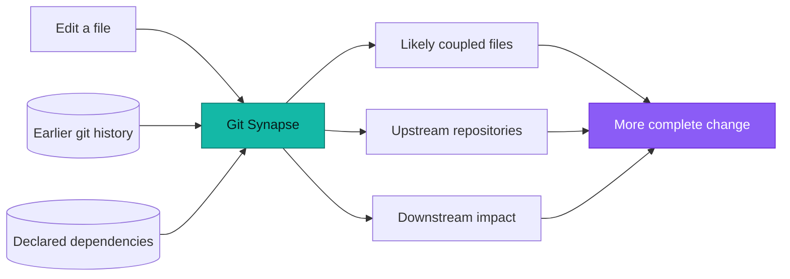
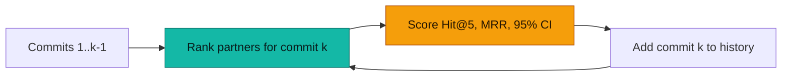
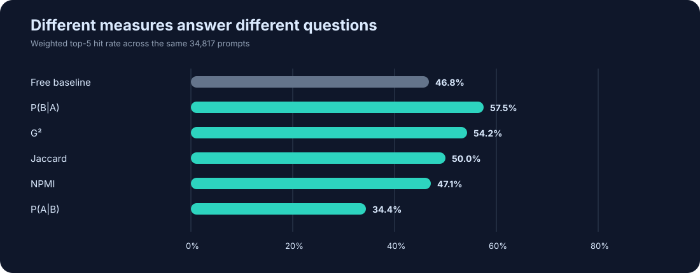

<div align="center">


# Git Synapse

**Change-coupling history for coding agents.**

See what else is likely to need changing before you open a pull request.


**[Read the introduction and set it up →](https://kirankn8.github.io/git-synapse/)**

</div>

Git Synapse learns from the files that changed together in real commits. It does
not parse a particular programming language: the base fact is simply
**“this commit touched this file.”** From that, it builds file, module,
cross-repository, and transitive impact graphs.

## License

Git Synapse is licensed under the [GNU Affero General Public License v3.0](LICENSE).
Commercial use is permitted under the AGPL when its terms are followed. A separate
commercial license, hosted service, and enterprise support are available for
organizations that need proprietary modifications, closed redistribution, or
managed operation.

## Why it helps

An agent reads the checkout in front of it. It cannot see that this file has
moved together with three others for two years, or that two services in other
repositories follow it within the week. That is not in the code — it is in the
commits.

<p align="center">
  
</p>

Six places needed the change and the checkout named one of them. Git Synapse
reads the other five out of commits you already have: files that repeatedly
changed together, the upstream repository that usually needs the fix first, and
the downstream repositories that later consume it.

**How it gets there, from git alone.** There is no language server, no AST and
no build. Inside a repository the only fact used is *this commit touched this
file*, so pairs that keep appearing in the same commit accumulate support, and
each pair is scored by several measures — conditional probability, G², Jaccard,
NPMI — because one probability is not universal. Very large commits are capped
so a sweeping rename cannot invent a relationship, renames are followed so a
file keeps its history, and rebased or cherry-picked duplicates are dropped by
patch id rather than counted twice.

Across repositories it reads the manifests *out of the history itself* — go.mod,
package.json, Cargo.toml, pom.xml, Gemfile.lock, Chart.yaml, docker-compose.yml
and about thirty other formats, at each commit that changed them. A manifest in
one repository naming another is a **declared** edge. Every time that pin moves
is an **observed** bump, and because both sides are commits, the gap between
them is measurable: the lag is the time from the upstream commit to the
downstream commit that adopted it, and the median of those lags is how "usually
follows within three days" is known. Bumps whose upstream commit is newer than
the consumer's are thrown out rather than believed.



Each answer carries the evidence behind it — support, directional confidence,
and the underlying relationship — so an agent or a human can decide whether it
matters. It is evidence, not a rule.

## OSS benchmark

The benchmark replays real history in time order. For each commit, it hides one
file, ranks the five likely partners using only earlier commits, scores the
answer, and only then teaches the model about that commit.



The current run uses an obscure seed, top-5 predictions, minimum pair support 2,
and compares several measures instead of treating one probability as universal.
It covers **71,439 commits and 34,817 prompts** from six public projects.

<p align="center">
  
</p>

<p align="center">
  
</p>

| Project | Prompts | Free baseline | `P(B\|A)` | G² | Jaccard | NPMI | `P(A\|B)` |
|---|---:|---:|---:|---:|---:|---:|---:|
| [google/guava](https://github.com/google/guava) | 5,236 | **73.8%** | 55.3% | 54.7% | 51.2% | 50.3% | 40.5% |
| [laravel/framework](https://github.com/laravel/framework) | 12,087 | 30.3% | **55.0%** | 52.5% | 48.7% | 46.3% | 35.2% |
| [pallets/flask](https://github.com/pallets/flask) | 1,548 | **56.6%** | 56.0% | 40.4% | 37.4% | 28.7% | 23.0% |
| [prometheus/prometheus](https://github.com/prometheus/prometheus) | 7,720 | 51.8% | **64.7%** | 62.0% | 57.4% | 53.7% | 32.9% |
| [tokio-rs/tokio](https://github.com/tokio-rs/tokio) | 2,555 | 37.9% | **45.0%** | 41.6% | 36.6% | 33.2% | 26.7% |
| [vuejs/core](https://github.com/vuejs/core) | 5,671 | 51.8% | **61.4%** | 56.4% | 51.4% | 48.2% | 35.6% |

Weighted top-5 hit rates are: free baseline **46.8%**, `P(B|A)` **57.5%**,
G² **54.2%**, Jaccard **50.0%**, NPMI **47.1%**, and `P(A|B)` **34.4%**.
The result is intentionally mixed: history loses to local conventions in Guava
and is effectively tied in Flask. The useful claim is narrower—historical
coupling adds signal when layout and naming do not reveal the relationship.

### The baseline ladder

Every baseline is deterministic and data-driven from the same earlier history;
none uses Git Synapse scores. The New Hire is the only sampled baseline because
content search is much more expensive than the other rules.

| Nickname | One-line definition |
|---|---|
| **Tourist** | Rank the repository's busiest files; use no path or code context. |
| **Intern** | Rank files in the seed file's directory by earlier change count. |
| **Apprentice** | Try the seed's test/name neighbours, then fall back to its directory. |
| **New Hire** | Search the parent checkout using the seed's path and symbols, then widen the search. |

The **free baseline** in the table is the strongest of Tourist, Intern, and
Apprentice for that repository. The New Hire is reported separately because its
400 prompts per project are a uniform sample, not the full replay. The detailed
chart above shows every rung beside Git Synapse, including the cases where the
history signal loses.

| Project | Tourist | Intern | Apprentice | New Hire* | Git Synapse | Hardest free rung |
|---|---:|---:|---:|---:|---:|---|
| google/guava | 13.8% | 22.3% | **73.8%** | 68.5% | 55.3% | Apprentice |
| laravel/framework | 14.9% | 21.6% | 30.3% | 46.0% | **55.0%** | Apprentice |
| pallets/flask | **56.6%** | 38.0% | 43.7% | 26.0% | 56.0% | Tourist |
| prometheus/prometheus | 25.4% | 51.8% | 47.2% | 39.5% | **64.7%** | Intern |
| tokio-rs/tokio | 30.3% | **37.9%** | 29.0% | 33.8% | **45.0%** | Intern |
| vuejs/core | 30.0% | 28.1% | 51.8% | 50.5% | **61.4%** | Apprentice |

\* New Hire is a 400-prompt content-search sample per project; its values are
not pooled with the full-replay rates. The full replay scores each prompt only
against commits that came before it and reports Wilson 95% confidence intervals.

Run the benchmark yourself:

```bash
docker compose run --rm -v "$PWD:/repo" --entrypoint python cli /repo/scripts/backtest.py \
  --measure confidence_ab,confidence_ba,jaccard,npmi,log_likelihood_ratio \
  --top 5 --min-support 2 --seeding obscure
```

## Install

### Local Docker

The installer offers to install Docker when needed, selects the latest release
(falling back to `main`), starts the stack, waits for health, and prints the
setup instructions:

```bash
curl -fsSL https://raw.githubusercontent.com/kirankn8/git-synapse/main/scripts/install.sh | bash
```

Windows PowerShell:

```powershell
irm https://raw.githubusercontent.com/kirankn8/git-synapse/main/scripts/install.ps1 | iex
```

Manual Docker setup:

```bash
cp .env.example .env
# Set GITHUB_TOKEN in .env when scanning private repositories.
docker compose up -d
```

Open `http://localhost`. There is nothing else to do: with no account configured
the dashboard is there immediately, and a banner says the deployment is open.

### Requiring a sign-in

Access comes from `.env` and nowhere else. Set both:

```bash
ADMIN_EMAIL=you@example.com
ADMIN_PASSWORD=something-long-and-unguessable
```

and restart. The account is created on start and everyone signs in; the
administrator adds other people from the **People** page. Editing the password
here and restarting resets it, which is how a forgotten one is recovered.

Leave them unset and the deployment answers every request without asking who is
calling — fine on a laptop, not on anything others can reach.

### Kubernetes

The Helm chart creates the API, scheduler, MCP server, migration hook, health
checks, persistent storage, and bundled Postgres:

```bash
helm upgrade --install git-synapse \
  oci://ghcr.io/kirankn8/charts/git-synapse \
  --namespace git-synapse --create-namespace
```

A cluster is shared, so the chart always requires a sign-in. It creates the
Kubernetes Secret `git-synapse` holding `ADMIN_EMAIL` and a generated
`ADMIN_PASSWORD`:

```bash
kubectl -n git-synapse get secret git-synapse \
  -o jsonpath='{.data.ADMIN_PASSWORD}' | base64 -d; echo
```

Set `secrets.adminEmail` to your own address. The password is not printed into
application logs. See
[`charts/git-synapse/README.md`](charts/git-synapse/README.md) for external
Postgres, storage, ingress, upgrades, and rollback settings.

The beginner-friendly setup page is published at
**<https://kirankn8.github.io/git-synapse/>**, which introduces the project and
leads into the guide. The same pages live in the repository as
[`docs/index.html`](docs/index.html) and [`docs/setup.html`](docs/setup.html).

## Use it

Add repositories from the **Sources** page, or from the CLI:

```bash
docker compose run --rm cli account add my-org
```

The scheduler picks them up on its next refresh; **Run now** on the Jobs page
starts one immediately.

The web UI shows coupling graphs, evidence, repository impact, feedback, and
ingestion status. GitHub, GitLab, Bitbucket, SSH remotes, and ordinary internal
Git URLs are supported; public repositories need no credential.

### MCP

The MCP server runs on port 8081. For Claude Code:

```bash
claude mcp add --transport http git-synapse http://localhost:8081/mcp
```

When authentication is enabled, add an API token with an Authorization header.
The fourteen tools are:

### Fourteen tools

| Tool | Use |
|---|---|
| `coupled_files` | Find files that commonly change with this file. |
| `explain_pair` | Inspect the full evidence and all measures for a pair. |
| `file_history` | Inspect recent commits and authors for a file. |
| `search_files` | Find a file by path substring. |
| `repo_hotspots` | Find the repository's highest-churn files. |
| `coupled_directories` | Find directories that change with a directory. |
| `module_context` | Resolve a monorepo file through its manifest graph. |
| `upstream_repos` | Find repositories where a change may belong first. |
| `impact_of_change` | Find downstream repositories likely to need updates. |
| `coupling_chain` | Follow multi-hop upstream or downstream impact. |
| `explain_repo_pair` | Explain a declared dependency and its observed bumps. |
| `list_repositories` | List repositories in the indexed corpus. |
| `list_measures` | List measures and their caveats. |
| `report_gap` | Report missing or incorrect data for review. |

Treat results as review guidance. Evidence tiers distinguish declared
dependencies, bump-backed relationships, and historical discovery.

### The workflow

An agent typically calls `coupled_files` while editing, then checks
`upstream_repos` and `impact_of_change` before opening a pull request. Use
`explain_pair` when a suggestion needs evidence.

## CLI and development

The CLI does the two things the server cannot do for itself: choose which
sources are scanned, and empty the database. The first administrator comes from
`ADMIN_EMAIL` and `ADMIN_PASSWORD` in `.env`, not from a command.
Discovery, ingest, scoring and mining are the scheduler's job and need no
command.

```bash
docker compose run --rm cli account add my-org       # start scanning a source
docker compose run --rm cli account list
docker compose run --rm cli account enable 3 --off   # pause, keeping its data
docker compose run --rm cli account remove 3
docker compose run --rm cli reset --yes              # drop ingested data
```

`account add` also takes `--kind user`, `--no-private`, `--no-archived`, and
`--only`/`--skip` for an allowlist or denylist of repository names. Sources can
equally be added and edited on the **Sources** page.

Replaying history to measure whether the suggestions would have helped is a
script rather than a command; see [OSS benchmark](#oss-benchmark) above.

The atomic facts and derived tables are documented in
[`DESIGN.md`](DESIGN.md). Configuration is in [`.env.example`](.env.example).

Run the test suite, which has a 100% coverage gate:

```bash
docker compose up -d postgres
docker compose run --rm --no-deps -v "$PWD:/repo" \
  -e POSTGRES_HOST=postgres --entrypoint sh cli \
  -c 'cd /repo && PYTHONPATH=src python -m pytest -q --cov=git_synapse'
```

The pre-push hook runs that gate, Ruff, and the two UI suites. Point git at the
repository's hooks to enable it:

```bash
git config core.hooksPath scripts/hooks
```
