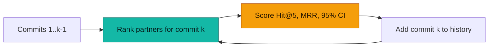

# How well does it actually predict?

The short version lives in the [README](../README.md#does-it-actually-work). This is the whole method and every number.

## The method

The benchmark replays real history in time order. For each commit, it hides one
file, ranks the five likely partners using only earlier commits, scores the
answer, and only then teaches the model about that commit.



The current run uses an obscure seed, top-5 predictions, minimum pair support 2,
and compares several measures instead of treating one probability as universal.
It covers **71,439 commits and 34,817 prompts** from six public projects.

<p align="center">
  
</p>

<p align="center">
  
</p>

| Project | Prompts | Free baseline | `P(B\|A)` | G² | Jaccard | NPMI | `P(A\|B)` |
|---|---:|---:|---:|---:|---:|---:|---:|
| [google/guava](https://github.com/google/guava) | 5,236 | **73.8%** | 55.3% | 54.7% | 51.2% | 50.3% | 40.5% |
| [laravel/framework](https://github.com/laravel/framework) | 12,087 | 30.3% | **55.0%** | 52.5% | 48.7% | 46.3% | 35.2% |
| [pallets/flask](https://github.com/pallets/flask) | 1,548 | **56.6%** | 56.0% | 40.4% | 37.4% | 28.7% | 23.0% |
| [prometheus/prometheus](https://github.com/prometheus/prometheus) | 7,720 | 51.8% | **64.7%** | 62.0% | 57.4% | 53.7% | 32.9% |
| [tokio-rs/tokio](https://github.com/tokio-rs/tokio) | 2,555 | 37.9% | **45.0%** | 41.6% | 36.6% | 33.2% | 26.7% |
| [vuejs/core](https://github.com/vuejs/core) | 5,671 | 51.8% | **61.4%** | 56.4% | 51.4% | 48.2% | 35.6% |

Weighted top-5 hit rates are: free baseline **46.8%**, `P(B|A)` **57.5%**,
G² **54.2%**, Jaccard **50.0%**, NPMI **47.1%**, and `P(A|B)` **34.4%**.
The result is intentionally mixed: history loses to local conventions in Guava
and is effectively tied in Flask. The useful claim is narrower—historical
coupling adds signal when layout and naming do not reveal the relationship.

### The baseline ladder

Every baseline is deterministic and data-driven from the same earlier history;
none uses Git Synapse scores. The New Hire is the only sampled baseline because
content search is much more expensive than the other rules.

| Nickname | One-line definition |
|---|---|
| **Tourist** | Rank the repository's busiest files; use no path or code context. |
| **Intern** | Rank files in the seed file's directory by earlier change count. |
| **Apprentice** | Try the seed's test/name neighbours, then fall back to its directory. |
| **New Hire** | Search the parent checkout using the seed's path and symbols, then widen the search. |

The **free baseline** in the table is the strongest of Tourist, Intern, and
Apprentice for that repository. The New Hire is reported separately because its
400 prompts per project are a uniform sample, not the full replay. The detailed
chart above shows every rung beside Git Synapse, including the cases where the
history signal loses.

| Project | Tourist | Intern | Apprentice | New Hire* | Git Synapse | Hardest free rung |
|---|---:|---:|---:|---:|---:|---|
| google/guava | 13.8% | 22.3% | **73.8%** | 68.5% | 55.3% | Apprentice |
| laravel/framework | 14.9% | 21.6% | 30.3% | 46.0% | **55.0%** | Apprentice |
| pallets/flask | **56.6%** | 38.0% | 43.7% | 26.0% | 56.0% | Tourist |
| prometheus/prometheus | 25.4% | 51.8% | 47.2% | 39.5% | **64.7%** | Intern |
| tokio-rs/tokio | 30.3% | **37.9%** | 29.0% | 33.8% | **45.0%** | Intern |
| vuejs/core | 30.0% | 28.1% | 51.8% | 50.5% | **61.4%** | Apprentice |

\* New Hire is a 400-prompt content-search sample per project; its values are
not pooled with the full-replay rates. The full replay scores each prompt only
against commits that came before it and reports Wilson 95% confidence intervals.

Run the benchmark yourself:

```bash
docker compose run --rm -v "$PWD:/repo" --entrypoint python cli /repo/scripts/backtest.py \
  --measure confidence_ab,confidence_ba,jaccard,npmi,log_likelihood_ratio \
  --top 5 --min-support 2 --seeding obscure
```
